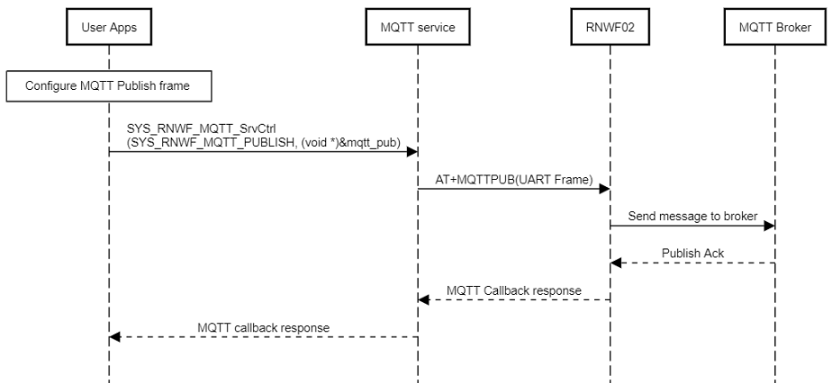
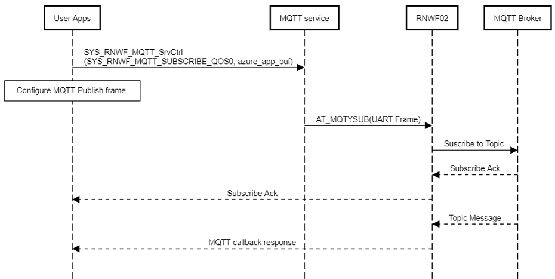

# MQTT Service

The Cloud service provides an Application Programming Interface (API) to manage MQTT functionalities. These functionalities include, configuring the MQTT settings, connecting, disconnecting and reconnecting to the MQTT broker, publishing, subscribing and setting callbacks.

**MQTT System Service Configuration in MCC**


This section allows MQTT service basic configuration as mentioned below:

-   **MQTT Protocol version:** Configure MQTT protocol version, either 3.1.1 or 5
    - **Session Expiry interval:** Configure Session Expiry interval time in seconds for MQTT v5.
-   **Cloud URL:** Configure Cloud provider endpoint / MQTT Broker URL.
-   **Cloud Port** : Configure Cloud/MQTT port.
-   **Client ID:** Device ID registered with cloud provider.
-   **User Name and Password:** Configure cloud client credentials.
-   **Keep Alive:** Select to enable Keep Alive MQTT specific option.
    -   **Keep Alive Interval:** Configure the field in the range of 1-1000 \(in seconds\)
-   **Last Will Testament()LWT:**  Select to enable the last will message. If enabled provice the last will message. 
    -   **LWT message :** Enter  the Last will message.
-   **Subscribe:** Select to enable MQTT Subscribe option. If enabled, it provides subscribe specific configurations such as Total Subscribe Topics, Table for Subscribe Topics, Sub. QoS
-    **Publish:** Select to enable/ MQTT Publish option. If enabled, it offers related configurations such as Publish Topic Name, Pub QoS, Retain Flag.
        -  **Msg Transmit Properties:** Select to set the MQTT transmit properties.
        -  **Payload Format Indicator:** Drop down to select the format of message payload. Un-specified or UTF8-encoded.
        -  **Message Expiry Interval:** Message Expiry Interval in seconds for each PUBLISH message.
        -  **Content type:** Type of the payload.
        -  **User Property:** Key-value pairs.
-   **TLS:** Select to enable TLS Configuration option. If enabled, it will further prompt to enter details as below:
    -   **Peer authentication**
        -   **Root CA/Server Certificate**
    -   **Device Certificate**
    -   **Device Key**
    -   **Device Key Password**
    -   **Server Name**
    -   **Domain Name Verify**
        -   **Domain Name**


The MQTT service API example is as follows:

``` {#CODEBLOCK_OLC_5TV_XYB .language-c}
SYS_RNWF_RESULT_t SYS_RNWF_MQTT_SrvCtrl( SYS_RNWF_MQTT_SERVICE_t request, SYS_RNWF_MQTT_HANDLE_t );
```

It handles following services and reports the result to application over the return code or through the registered callback:

|Service|Input|Description|
|-------|-----|-----------|
|`SYS_RNWF_MQTT_CONFIG`|[Broker URL, Port, Client ID, Username, TLS configuration](GUID-C83AB35B-80E7-47A9-BE31-AA8721DEFC14.md)|Configures the MQTT server details along with the corresponding TLS configurations|
|`SYS_RNWF_MQTT_CONNECT`|None|Initiates the MQTT connection to the configured MQTT broker|
|`SYS_RNWF_MQTT_RECONNECT`|None|Triggers the re-connection to the configured MQTT broker|
|`SYS_RNWF_MQTT_DISCONNECT`|None|Disconnects from the connected MQTT broker|
|`SYS_RNWF_MQTT_SUBSCRIBE_QOS`|Subscribe topic \(String\)|Subscribes to the given subscribe topic with QoS|
|`SYS_RNWF_MQTT_PUBLISH`|[New, QOS, Retain, topic, message](GUID-C83AB35B-80E7-47A9-BE31-AA8721DEFC14.md)|Publish the message on given publish topic and configuration|
|`SYS_RNWF_MQTT_SET_CALLBACK`|Callback Function Handler|Registers the MQTT callback to report the status to user application|
| `SYS_RNWF_MQTT_TX_CONFIG` | SYS_RNWF_MQTT_TX_CFG_t structure | Configure the MQTT v5 tx properties |
| `SYS_RNWF_MQTT_LWT_CONFIG` | SYS_RNWF_MQTT_LWT_CFG_t structure | Configure the MQTT Broker parameters|
|


The following list captures the MQTT callback event codes and their arguments

|Event|Response Components|Comments|
|-----|-------------------|--------|
|`SYS_RNWF_MQTT_CONNECTED`|None|Reported once connected to MQTT broker|
|`SYS_RNWF_MQTT_DISCONNECTED`|None|Event to report the MQTT broker disconnection|
|`SYS_RNWF_MQTT_SUBCRIBE_MSG`|[dup, QoS, retain, topic, payload](GUID-C83AB35B-80E7-47A9-BE31-AA8721DEFC14.md)|Reports the received payload for the subscribed topic|
|`SYS_RNWF_MQTT_SUBCRIBE_ACK`|Integer string|Subscribe ack return code|
|`SYS_RNWF_MQTT_DPS_STATUS`|Integer|Azure DPS status :-  1 for success and 0 for failure |
| `SYS_RNWF_MQTT_SUBCRIBE_ACK` | topic name, Max QOS |  Reports the received payload for the subscribed topic |
| `SYS_RNWF_MQTT_PUBLIC_ACK` | Packet ID | Reports the received payload for the published topic |
|

The sequence chart below explains this process.

 Connection Sequence")

MQTT Publish

<br />

User application can publish to the MQTT broker by creating the MQTT frame and then sending the frame using the API. The sequence chart is illustrated below.

``` {#CODEBLOCK_QX4_WDX_MZB .language-c}
SYS_RNWF_MQTT_SrvCtrl(SYS_RNWF_MQTT_PUBLISH, (SYS_RNWF_MQTT_HANDLE_t)&mqtt_pub);
```

<br />



<br />

<br />

MQTT Subscribe

The sequence for subscribing to a topic from the MQTT Broker is illustrated below. The user application needs to use the API to subscribe to the topic with the appropriate QoS value.

``` {#CODEBLOCK_LWS_F2X_MZB .language-c}
SYS_RNWF_MQTT_SrvCtrl(SYS_RNWF_MQTT_SUBSCRIBE_QOS, mqtt_sub);
```

<br />



<br />

An example of the MQTT application provided below showcases the use of MQTT service<br /> API's:

Some of the configurations con be configured by the user by MCC.<br />

``` {#CODEBLOCK_LSY_D4K_JYB .language-c}
/*
   Basic MQTT application
*/
// *****************************************************************************
// *****************************************************************************
// Section: Included Files
// *****************************************************************************
// *****************************************************************************

#include <stddef.h>                     // Defines NULL
#include <stdbool.h>                    // Defines true
#include <stdlib.h>                 // Defines EXIT_FAILURE
#include <string.h>
#include "definitions.h"                // SYS function prototypes
#include "app_rnwf02.h"
#include "configuration.h"
#include "system/debug/sys_debug.h"
#include "system/wifi/sys_rnwf_wifi_service.h"
#include "system/inf/sys_rnwf_interface.h"
#include "system/mqtt/sys_rnwf_mqtt_service.h"
#include "system/net/sys_rnwf_net_service.h"
#include "system/sys_rnwf_system_service.h"

// *****************************************************************************
// *****************************************************************************
// Section: Global Data Definitions
// *****************************************************************************
// *****************************************************************************

static volatile bool isUARTTxComplete = true,isUART0TxComplete = true;

uint8_t app_buf[SYS_RNWF_BUF_LEN_MAX];

SYS_RNWF_MQTT_CFG_t mqtt_cfg = {
    .url = SYS_RNWF_MQTT_CLOUD_URL,        
    .clientid = SYS_RNWF_MQTT_CLIENT_ID,    
    .username = SYS_RNWF_MQTT_CLOUD_USER_NAME,    
    .password = SYS_RNWF_MQTT_PASSWORD,
    .port = SYS_RNWF_MQTT_CLOUD_PORT,    
    .tls_idx = 0,  
};


SYS_RNWF_MQTT_SUB_FRAME_t sub_cfg = {
    .topic = SYS_RNWF_MQTT_SUB_TOPIC_0,
    .qos = SYS_RNWF_MQTT_SUB_TOPIC_0_QOS,
};

/* Keeps the device IP address */
//static char g_DevIp[16];


// *****************************************************************************


/* Application MQTT Callback Handler function *//
SYS_RNWF_RESULT_t APP_MQTT_Callback(SYS_RNWF_MQTT_EVENT_t event,SYS_RNWF_MQTT_HANDLE_t mqttHandle )
{
    uint8_t *p_str = (uint8_t *)mqttHandle;
    switch(event)
    {
        case SYS_RNWF_MQTT_CONNECTED:
        {    
            SYS_CONSOLE_PRINT("MQTT : Connected\r\n");
            SYS_RNWF_MQTT_SrvCtrl(SYS_RNWF_MQTT_SUBSCRIBE_QOS, (void *)&sub_cfg);
        }
        break;
        
        case SYS_RNWF_MQTT_SUBCRIBE_ACK:
        {
            SYS_CONSOLE_PRINT("Subscribed to topic %s\r\n\r\n",SYS_RNWF_MQTT_SUB_TOPIC_0);
        }
        break;
        
        case SYS_RNWF_MQTT_SUBCRIBE_MSG:
        {   
            SYS_CONSOLE_PRINT("RNWF_MQTT_SUBCRIBE_MSG <- %s\r\n", p_str);
        }
        break;
        
        case SYS_RNWF_MQTT_DISCONNECTED:
        {            
            SYS_CONSOLE_PRINT("MQTT - Reconnecting...\r\n");
            SYS_RNWF_MQTT_SrvCtrl(SYS_RNWF_MQTT_CONNECT, NULL);            
        }
        break; 
        
        default:
        break;
    }
    return SYS_RNWF_PASS;
}

/* Application WiFi Callback Handler function */
void APP_WIFI_Callback(SYS_RNWF_WIFI_EVENT_t event, SYS_RNWF_WIFI_HANDLE_t wifiHandle)
{
    uint8_t *p_str = (uint8_t *)wifiHandle;
            
    switch(event)
    {
        case SYS_RNWF_WIFI_SNTP_UP:
        {            
            static uint8_t flag =1;
            if(flag==1)
            {
                SYS_CONSOLE_PRINT("SNTP UP:%s\r\n", &p_str[2]);
                SYS_CONSOLE_PRINT("Connecting to the MQTT Server\r\n");
                SYS_RNWF_MQTT_SrvCtrl(SYS_RNWF_MQTT_SET_CALLBACK, APP_MQTT_Callback);
                SYS_RNWF_MQTT_SrvCtrl(SYS_RNWF_MQTT_CONFIG, (void *)&mqtt_cfg);
                SYS_RNWF_MQTT_SrvCtrl(SYS_RNWF_MQTT_CONNECT, NULL);
                flag=0;
            }
        }
        break;
        
        case SYS_RNWF_WIFI_CONNECTED:
        {
            SYS_CONSOLE_PRINT("Wi-Fi Connected    \r\n");
        
        }
        break;
        
        case SYS_RNWF_WIFI_DISCONNECTED:
        {
           SYS_CONSOLE_PRINT("Wi-Fi Disconnected\nReconnecting... \r\n");
           SYS_RNWF_WIFI_SrvCtrl(SYS_RNWF_WIFI_STA_CONNECT, NULL); 
        }
        break;
            
        /* Wi-Fi DHCP complete event code*/
        case SYS_RNWF_WIFI_DHCP_IPV4_COMPLETE:
        {
            SYS_CONSOLE_PRINT("DHCP Done...%s \r\n",&p_str[2]);
            break;
        }
        
        /* Wi-Fi IPv6 Local DHCP complete event code*/
        case SYS_RNWF_WIFI_DHCP_IPV6_LOCAL_COMPLETE:
        {
            SYS_CONSOLE_PRINT("IPv6 Local DHCP Done...%s \r\n",&p_str[2]); 
            
            /*Local IPv6 address code*/     
            break;
        }
        
        /* Wi-Fi IPv6 Global DHCP complete event code*/
        case SYS_RNWF_WIFI_DHCP_IPV6_GLOBAL_COMPLETE:
        {
            SYS_CONSOLE_PRINT("IPv6 Global DHCP Done...%s \r\n",&p_str[2]); 
            
            /*Global IPv6 address code*/     
            break;
        }
        
        case SYS_RNWF_WIFI_SCAN_INDICATION:
            break;
            
        case SYS_RNWF_WIFI_SCAN_DONE:
            break;
            
        default:
            break;
                    
    }    
}

/* TODO:  Add any necessary local functions.
*/

// *****************************************************************************
// *****************************************************************************
// Section: Application Initialization and State Machine Functions
// *****************************************************************************
// *****************************************************************************

/******************************************************************************
  Function:
    void APP_Tasks ( void )

  Remarks:
    See prototype in app.h.
 */

void APP_RNWF02_Tasks ( void )
{

    /* Check the application's current state. */
    switch(appData.state)
    {
        case APP_STATE_INITIALIZE:
        {
            DMAC_ChannelCallbackRegister(DMAC_CHANNEL_0, usartDmaChannelHandler, 0);
            SYS_RNWF_IF_Init();
            
            appData.state = APP_STATE_REGISTER_CALLBACK;
            SYS_CONSOLE_PRINT("APP_STATE_INITIALIZE\r\n");
            break;
        }
        case APP_STATE_REGISTER_CALLBACK:
        {
                
            SYS_RNWF_SYSTEM_SrvCtrl(SYS_RWWF_SYSTEM_GET_WIFI_INFO, app_buf);    
            SYS_CONSOLE_PRINT("Wi-Fi Info:- \r\n%s\r\n\r\n", app_buf);
            
            SYS_RNWF_SYSTEM_SrvCtrl(SYS_RNWF_SYSTEM_GET_CERT_LIST, app_buf);    
            SYS_CONSOLE_PRINT("Certs on RNWF02:- \r\n%s\r\n\r\n", app_buf);
            
            SYS_RNWF_SYSTEM_SrvCtrl(SYS_RNWF_SYSTEM_GET_KEY_LIST, app_buf);    
            SYS_CONSOLE_PRINT("Keys on RNWF02:- \r\n%s\r\n\r\n", app_buf);
            
            char sntp_url[] =  SYS_RNWF_SNTP_ADDRESS;
            SYS_RNWF_SYSTEM_SrvCtrl(SYS_RNWF_SYSTEM_SET_SNTP, sntp_url);
            
            SYS_RNWF_SYSTEM_SrvCtrl(SYS_RNWF_SYSTEM_SW_REV, app_buf);    
            SYS_CONSOLE_PRINT("Software Revision:- %s\r\n", app_buf);
            
              
            /* RNWF Application Callback register */
            SYS_RNWF_WIFI_SrvCtrl(SYS_RNWF_WIFI_SET_CALLBACK, APP_WIFI_Callback);
          
            /* Set Regulatory domain/Country Code */
            const char *regDomain = SYS_RNWF_COUNTRYCODE;
            SYS_CONSOLE_PRINT("\r\nSetting regulatory domain : %s\r\n",regDomain);
            SYS_RNWF_WIFI_SrvCtrl(SYS_RNWF_WIFI_SET_REGULATORY_DOMAIN, (void *)regDomain);
            
            /* Wi-Fi Connectivity */
            SYS_CONSOLE_PRINT("Connecting to : %s\r\n",SYS_RNWF_WIFI_STA_SSID);
            SYS_RNWF_WIFI_PARAM_t wifi_sta_cfg = {SYS_RNWF_WIFI_MODE_STA, SYS_RNWF_WIFI_STA_SSID, SYS_RNWF_WIFI_STA_PWD, SYS_RNWF_STA_SECURITY, SYS_RNWF_WIFI_STA_AUTOCONNECT};        
            SYS_RNWF_WIFI_SrvCtrl(SYS_RNWF_SET_WIFI_PARAMS, &wifi_sta_cfg);

            appData.state = APP_STATE_TASK;
            break;
        }
        case APP_STATE_TASK:
        {
            SYS_RNWF_IF_EventHandler();
            break;
        }
        default:
        {
            break;
        }
    }
}


/*******************************************************************************
 End of File
 */

```
