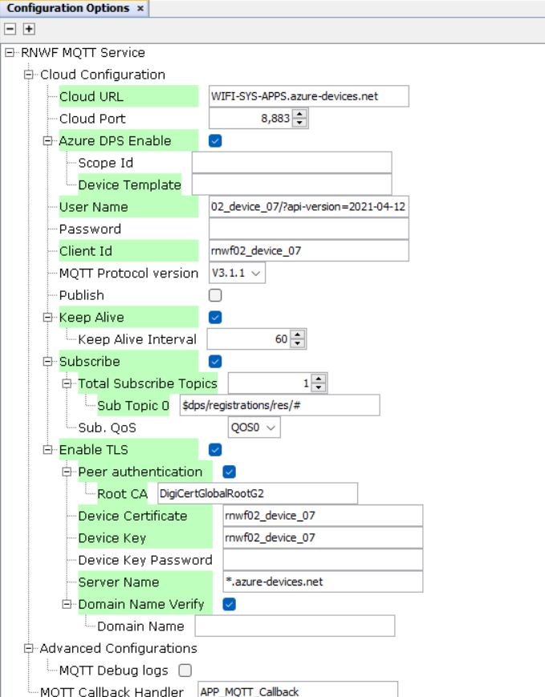
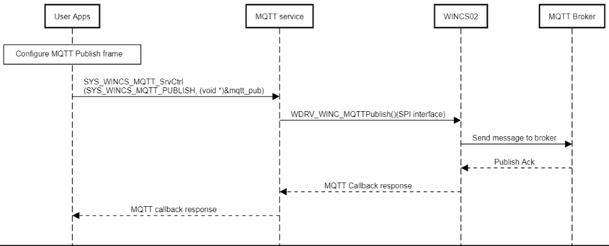
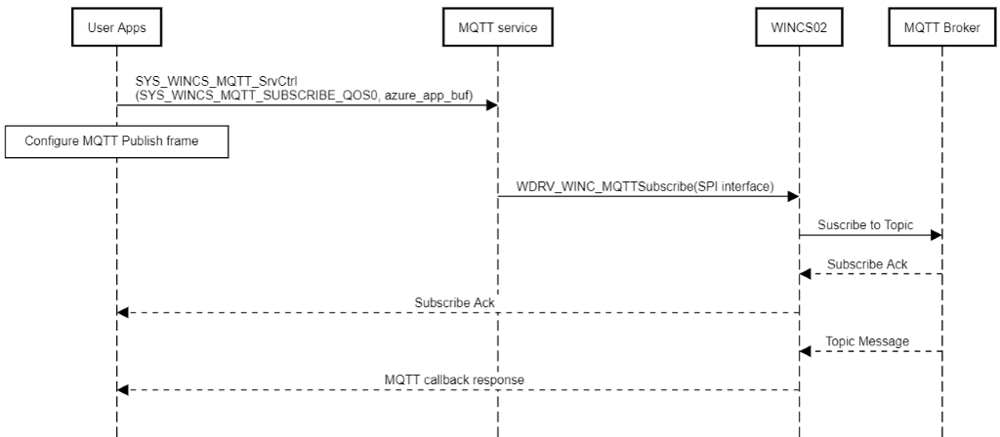

# MQTT Service

The Cloud service provides an Application Programming Interface (API) to manage MQTT functionalities. These functionalities include, configuring the MQTT settings, connecting, disconnecting and reconnecting to the MQTT broker, publishing, subscribing and setting callbacks.

**MQTT System Service Configuration in MCC**



<br />

This section allows MQTT service basic configuration as mentioned below:

-   **Cloud URL:** Configure Cloud provider endpoint / MQTT Broker URL.
-   **Cloud Port** : Configure Cloud/MQTT port.
-   **Azure DPS:** Select to enable Azure DPS option \(applicable only when Azure endpoint is used\)
    -   **Scope ID:** Provide Scope ID from Azure IoT Central portal for registered device
    -   **Device Template:** Configure Azure DPS specific device template

-   **User Name and Password:** Configure cloud client credentials.
-   **Client ID:** Device ID registered with cloud provider.
-   **Publish:** Select to enable/ MQTT Publish option. If enabled, it<br /> offers related configurations such as Publish Topic Name, Pub QoS,<br /> Retain Flag.

-   **Keep Alive:** Select to enable Keep Alive MQTT specific option.
    -   **Keep Alive Interval:** Configure the field in the range of 1-1000 \(in seconds\)
-   **Subscribe:** Select to enable MQTT Subscribe option. If enabled, it provides subscribe specific configurations such as Total Subscribe Topics, Table for Subscribe Topics, Sub. QoS
-   **TLS:** Select to enable TLS Configuration option. If enabled, it will further prompt to enter details as below:
    -   **Peer Authentication**
        -   **Root CA/Server Certificate**
    -   **Device Certificate**
    -   **Device Key**
    -   **Device Key Password**
    -   **Server Name**
    -   **Domain Name Verify**
        -   **Domain Name**

The MQTT service API example is as follows:

``` {#GUID-DD648E0B-2B4D-45AA-9A19-A8A1849D5FC9_CODEBLOCK_OLC_5TV_XYB}
SYS_WINCS_RESULT_t SYS_WINCS_MQTT_SrvCtrl( SYS_WINCS_MQTT_SERVICE_t request, void *input);
```

It handles following services and reports the result to application over the return code or through the registered callback:

|Service|Input|Description|
|-------|-----|-----------|
|`SYS_WINCS_MQTT_CONFIG`|[Broker URL, Port, Client ID, Username, TLS configuration](https://onlinedocs.microchip.com/oxy/GUID-92FEB3A1-C10F-47DF-BF88-C06521800526-en-US-1/GUID-C83AB35B-80E7-47A9-BE31-AA8721DEFC14.html)|Configures the MQTT server details along with the<br /> corresponding TLS configurations|
|`SYS_WINCS_MQTT_LWT_CONFIG`| |Configure the MQTT Broker parameters|
|`SYS_WINCS_MQTT_CONNECT`|None|Initiates the MQTT connection to the configured MQTT<br /> broker|
|`SYS_WINCS_MQTT_RECONNECT`|None|Triggers the re-connection to the configured MQTT<br /> broker|
|`SYS_WINCS_MQTT_DISCONNECT`|None|Disconnects from the connected MQTT broker|
|`SYS_WINCS_MQTT_SUBSCRIBE_QOS0`|Subscribe topic \(String\)|Subscribes to the given subscribe topic with QoS0|
|`SYS_WINCS_MQTT_SUBSCRIBE_QOS1`|Subscribe topic \(String\)|Subscribes to the given subscribe topic with QoS1|
|`SYS_WINCS_MQTT_SUBSCRIBE_QOS2`|Subscribe topic \(String\)|Subscribes to the given subscribe topic with QoS2|
|`SYS_WINCS_MQTT_UNSUBSCRIBE`| |UnSubscribe to Topic|
|`SYS_WINCS_MQTT_PUBLISH`|[New, QOS, Retain, topic, message](https://onlinedocs.microchip.com/oxy/GUID-92FEB3A1-C10F-47DF-BF88-C06521800526-en-US-1/GUID-C83AB35B-80E7-47A9-BE31-AA8721DEFC14.html)|Publish the message on given publish topic and<br /> configuration|
|`SYS_WINCS_MQTT_SET_CALLBACK`|Callback Function Handler|Registers the MQTT callback to report the status to user<br /> application|
|`SYS_WINCS_MQTT_SET_SRVC_CALLBACK`| |Configure the MQTT Application Callback|
|`SYS_WINCS_MQTT_GET_CALLBACK`| |Get Callback Function data|

The following list captures the MQTT callback event codes and their arguments

|Event|Response Components|Comments|
|-----|-------------------|--------|
|`SYS_WINCS_MQTT_CONNECTED`|None|Reported once connected to MQTT broker|
|`SYS_WINCS_MQTT_DISCONNECTED`|None|Event to report the MQTT broker disconnection|
|`SYS_WINCS_MQTT_SUBCRIBE_MSG`|[dup, QoS, retain, topic, payload](https://onlinedocs.microchip.com/oxy/GUID-92FEB3A1-C10F-47DF-BF88-C06521800526-en-US-1/GUID-C83AB35B-80E7-47A9-BE31-AA8721DEFC14.html)|Reports the received payload for the subscribed topic|
|`SYS_WINCS_MQTT_SUBCRIBE_ACK`|Integer string|Subscribe ack return code|
|`SYS_WINCS_MQTT_PUBLISH_ACK`| |MQTT Publish ACK|
|`SYS_WINCS_MQTT_PUBLISH_MSG_RECV`| |MQTT Publish acknowledgement and completion received|
|`SYS_WINCS_MQTT_UNSUBSCRIBED`| |MQTT A topic has been un-subscribed|
|`SYS_WINCS_MQTT_DPS_STATUS`|Integer|Azure DPS status:  1 for success, 0 for failure|
|`SYS_WINCS_MQTT_ERROR`| |MQTT ERROR|


MQTT Publish

User application can publish to the MQTT broker by creating the MQTT frame<br /> and then sending the frame using the API. The sequence chart is illustrated<br /> below.

``` {#GUID-DD648E0B-2B4D-45AA-9A19-A8A1849D5FC9_CODEBLOCK_QX4_WDX_MZB}
SYS_WINCS_MQTT_SrvCtrl(SYS_WINCS_MQTT_PUBLISH, (void *)&mqtt_pub) 
```

<br />



<br />

MQTT Subscribe

The sequence for subscribing to a topic from the MQTT Broker is illustrated<br /> below. The user application needs to use the API to subscribe to the topic<br /> with the appropriate QoS value.

``` {#GUID-DD648E0B-2B4D-45AA-9A19-A8A1849D5FC9_CODEBLOCK_LWS_F2X_MZB}
SYS_WINCS_MQTT_SrvCtrl(SYS_WINCS_MQTT_SUBSCRIBE_QOS0, azure_app_buf)
```

<br />



<br />

An example of the MQTT application provided below showcases the use of MQTT<br /> service API's:

Some of the configurations can be configured by the user by MCC.

``` {#GUID-DD648E0B-2B4D-45AA-9A19-A8A1849D5FC9_CODEBLOCK_LSY_D4K_JYB}
*/\*
    Basic MQTT application
\*/*
#include <stdint.h>
#include <stdbool.h>
#include <stddef.h>
#include <stdlib.h>
#include <time.h>
#include "configuration.h"
#include "driver/driver_common.h"

#include "app_wincs02.h"
#include "system/system_module.h"
#include "system/console/sys_console.h"
#include "system/wifi/sys_wincs_wifi_service.h"
#include "system/sys_wincs_system_service.h"
#include "system/net/sys_wincs_net_service.h"
#include "system/mqtt/sys_wincs_mqtt_service.h"


APP_DATA appData;


SYS_WINCS_MQTT_CFG_t mqtt_cfg = {
    .url =      SYS_WINCS_MQTT_CLOUD_URL,        
    .clientid = SYS_WINCS_MQTT_CLIENT_ID,    
    .username = SYS_WINCS_MQTT_CLOUD_USER_NAME,    
    .password = SYS_WINCS_MQTT_PASSWORD,
    .port =     SYS_WINCS_MQTT_CLOUD_PORT,    
    .tls_idx =  SYS_WINCS_MQTT_TLS_ENABLE,
    .protoVer = SYS_WINCS_MQTT_PROTO_VERSION,
    .clean_session = true,
    .keep_alive_time = SYS_WINCS_MQTT_KEEP_ALIVE_TIME,
  
};

SYS_WINCS_MQTT_FRAME_t mqtt_frame = {
    .qos = SYS_WINCS_MQTT_QOS_TYPE,
    .topic = SYS_WINCS_MQTT_TOPIC_NAME
};

/* Application NET socket Callback Handler function */
void SYS_WINCS_NET_SockCallbackHandler(uint32_t socket, SYS_WINCS_NET_SOCK_EVENT_t event, uint8_t *p_str)
{
    switch(event)
    {
        /* Net socket connected event code*/
        case SYS_WINCS_NET_SOCK_EVENT_CONNECTED:    
        {
            SYS_CONSOLE_PRINT("[APP] : Connected to Server!\r\n" );
            break;
        }
          
        /* Net socket disconnected event code*/
        case SYS_WINCS_NET_SOCK_EVENT_DISCONNECTED:
        {
            SYS_CONSOLE_PRINT("[APP] : DisConnected!\r\n");
            SYS_WINCS_NET_SockSrvCtrl(SYS_WINCS_NET_SOCK_CLOSE, &socket);
            break;
        }
         
        /* Net socket error event code*/
        case SYS_WINCS_NET_SOCK_EVENT_ERROR:
        {
            SYS_CONSOLE_PRINT("ERROR : Socket\r\n");
            break;
        }
            
        /* Net socket read event code*/
        case SYS_WINCS_NET_SOCK_EVENT_READ:
        {         
            uint8_t rx_data[64];
            int16_t rcvd_len = 64;
            memset(rx_data,0,64);
            if((rcvd_len = SYS_WINCS_NET_TcpSockRead(socket, SYS_WINCS_NET_SOCK_RCV_BUF_SIZE, rx_data)) > 0)
            {
                rcvd_len = strlen((char *)rx_data);
                rx_data[rcvd_len] = '\n';
                SYS_CONSOLE_PRINT("Received ->%s\r\n", rx_data);
                SYS_WINCS_NET_TcpSockWrite(socket, rcvd_len, rx_data); 
            }    
            
            break; 
        }
        
        case SYS_WINCS_NET_SOCK_EVENT_CLOSED:
        {
            SYS_CONSOLE_PRINT("[APP] : Socket CLOSED -> socketID: %d\r\n",socket);
            break;
        }
        
        case SYS_WINCS_NET_SOCK_EVENT_TLS_DONE:    
        {
            SYS_CONSOLE_PRINT("[APP] : TLS ->Connected to Server!\r\n" );
            break;
        }
        
        default:
            break;                  
    }    
    
}


SYS_WINCS_RESULT_t APP_MQTT_Callback(SYS_WINCS_MQTT_EVENT_t event, uint8_t *p_str)
{
    switch(event)
    {
        case SYS_WINCS_MQTT_CONNECTED:
        {    
            SYS_CONSOLE_PRINT("MQTT : Connected\r\n");
            
            SYS_WINCS_MQTT_SrvCtrl(SYS_WINCS_MQTT_SUBS_TOPIC, (void *)&mqtt_frame);
        }
        break;
        
        case SYS_WINCS_MQTT_SUBCRIBE_ACK:
        {
            SYS_CONSOLE_PRINT( "MQTT : Subscribe has ben acknowledged. \r\n");
            break;
        }
        
        case SYS_WINCS_MQTT_SUBCRIBE_MSG:
        {   
            SYS_CONSOLE_PRINT( "MQTT : New data has been received <- %s\r\n",p_str);
            break;
        }
        
        case SYS_WINCS_MQTT_UNSUBSCRIBED:
        {
            SYS_CONSOLE_PRINT( "MQTT : A topic has been un-subscribed. \r\n");
            break;
        }
        
        case SYS_WINCS_MQTT_PUBLISH_ACK:
        {
            SYS_CONSOLE_PRINT( "MQTT : Publish has been sent. \r\n");
            break;
        }
        
        case SYS_WINCS_MQTT_PUBLISH_MSG_RECV:
        {
            SYS_CONSOLE_PRINT( "MQTT : Publish acknowledgement and completion received. \r\n");
            break;
        }
        case SYS_WINCS_MQTT_DISCONNECTED:
        {            
            SYS_CONSOLE_PRINT("MQTT - Reconnecting...\r\n");
            SYS_WINCS_MQTT_SrvCtrl(SYS_WINCS_MQTT_CONNECT, NULL);
            break;            
        }
        
        case SYS_WINCS_MQTT_ERROR:
        {
            SYS_CONSOLE_PRINT("MQTT - ERROR\r\n");
            break;
        }
        
        default:
        break;
    }
    return SYS_WINCS_PASS;
}


void SYS_WINCS_WIFI_CallbackHandler(SYS_WINCS_WIFI_EVENT_t event, uint8_t *p_str)
{
            
    switch(event)
    {
        /* SNTP UP event code*/
        case SYS_WINCS_SNTP_UP:
        {            
            SYS_CONSOLE_PRINT("[APP] : SNTP UP \r\n"); 
            SYS_CONSOLE_PRINT("Connecting to the Cloud\r\n");
            SYS_WINCS_MQTT_SrvCtrl(SYS_WINCS_MQTT_SET_CALLBACK, APP_MQTT_Callback);
            SYS_WINCS_MQTT_SrvCtrl(SYS_WINCS_MQTT_CONFIG, (void *)&mqtt_cfg);
            SYS_WINCS_MQTT_SrvCtrl(SYS_WINCS_MQTT_CONNECT, &mqtt_cfg);
            break;
        }
        break;

        /* Wi-Fi connected event code*/
        case SYS_WINCS_CONNECTED:
        {
            SYS_CONSOLE_PRINT("[APP] : Wi-Fi Connected    \r\n");
            break;
        }
        
        /* Wi-Fi disconnected event code*/
        case SYS_WINCS_DISCONNECTED:
        {
            SYS_CONSOLE_PRINT("[APP] : Wi-Fi Disconnected\nReconnecting... \r\n");
            SYS_WINCS_WIFI_SrvCtrl(SYS_WINCS_WIFI_STA_CONNECT, NULL);
            break;
        }
        
        /* Wi-Fi DHCP complete event code*/
        case SYS_WINCS_DHCP_DONE:
        {         
            SYS_CONSOLE_PRINT("[APP] : DHCP IPv4 : %s\r\n", p_str);
            SYS_WINCS_WIFI_SrvCtrl(SYS_WINCS_WIFI_GET_TIME, NULL);
            
            break;
        }
        
        case SYS_WINCS_DHCP_IPV6_LOCAL_DONE:
        {
            //SYS_CONSOLE_PRINT("[APP] : DHCP IPv6 Local : %s\r\n", p_str);
            break;
        }
        
        case SYS_WINCS_DHCP_IPV6_GLOBAL_DONE:
        {
            //SYS_CONSOLE_PRINT("[APP] : DHCP IPv6 Global: %s\r\n", p_str);
            break;
        }
        
        /* Wi-Fi scan indication event code*/
        case SYS_WINCS_SCAN_INDICATION:
        {
            break;
        } 
        
        /* Wi-Fi scan complete event code*/
        case SYS_WINCS_SCAN_DONE:
        {
            break;
        }
        
        default:
        {
            break;
        }
    }    
}

void APP_WINCS02_Initialize ( void )
{
    /* Place the App state machine in its initial state. */
    appData.state = APP_STATE_WINCS_INIT;
}


void APP_WINCS02_Tasks ( void )
{

    /* Check the application's current state. */
    switch ( appData.state )
    {
        /* Application's initial state. */
       case APP_STATE_WINCS_INIT:
        {
            SYS_STATUS status;
            SYS_WINCS_WIFI_SrvCtrl(SYS_WINCS_WIFI_GET_DRV_STATUS, &status);

            if (SYS_STATUS_READY == status)
            {
                appData.state = APP_STATE_WINCS_OPEN_DRIVER;
            }
            
            break;
        }
        
        case APP_STATE_WINCS_OPEN_DRIVER:
        {
            DRV_HANDLE wdrvHandle = DRV_HANDLE_INVALID;
            SYS_WINCS_WIFI_SrvCtrl(SYS_WINCS_WIFI_OPEN_DRIVER, &wdrvHandle);
            
            SYS_WINCS_WIFI_SrvCtrl(SYS_WINCS_WIFI_GET_DRV_HANDLE, &wdrvHandle);
            appData.state = APP_STATE_WINCS_DEVICE_INFO;
            break;
        }
        
        case APP_STATE_WINCS_DEVICE_INFO:
        {
            APP_DRIVER_VERSION_INFO drvVersion;
            APP_FIRMWARE_VERSION_INFO fwVersion;
            APP_DEVICE_INFO devInfo;
            SYS_WINCS_RESULT_t status = SYS_WINCS_BUSY;
            
            status = SYS_WINCS_SYSTEM_SrvCtrl(SYS_WINCS_SYSTEM_SW_REV,&fwVersion);
            
            if(status == SYS_WINCS_PASS)
            {
                status = SYS_WINCS_SYSTEM_SrvCtrl(SYS_WINCS_SYSTEM_DEV_INFO, &devInfo);
            }
            
            if(status == SYS_WINCS_PASS)
            {
                status = SYS_WINCS_SYSTEM_SrvCtrl (SYS_WINCS_SYSTEM_DRIVER_VER, &drvVersion);
            }
            
            if(status == SYS_WINCS_PASS)
            {
                char buff[30];
                SYS_CONSOLE_PRINT("WINC: Device ID = %08x\r\n", devInfo.id);
                for (int i=0; i<devInfo.numImages; i++)
                {
                    SYS_CONSOLE_PRINT("%d: Seq No = %08x, Version = %08x, Source Address = %08x\r\n", i, devInfo.image[i].seqNum, devInfo.image[i].version, devInfo.image[i].srcAddr);
                }
                
                SYS_CONSOLE_PRINT("Firmware Version: %d.%d.%d ", fwVersion.version.major, fwVersion.version.minor, fwVersion.version.patch);
                strftime(buff, sizeof(buff), "%X %b %d %Y", localtime((time_t*)&fwVersion.build.timeUTC));
                SYS_CONSOLE_PRINT(" [%s]\r\n", buff);
                SYS_CONSOLE_PRINT("Driver Version: %d.%d.%d\r\n", drvVersion.version.major, drvVersion.version.minor, drvVersion.version.patch);
                
                appData.state = APP_STATE_WINCS_SET_WIFI_PARAMS;
            }
            break;
        }
        
        case APP_STATE_WINCS_SET_WIFI_PARAMS:
        {
            char sntp_url[] =  "129.154.46.154";
            SYS_WINCS_WIFI_SrvCtrl(SYS_WINCS_WIFI_SET_SNTP, sntp_url);
                
            SYS_WINCS_WIFI_PARAM_t wifi_sta_cfg = {SYS_WINCS_WIFI_MODE_STA, SYS_WINCS_WIFI_STA_SSID, 
            SYS_WINCS_WIFI_STA_PWD, SYS_WINCS_STA_SECURITY, SYS_WINCS_WIFI_STA_AUTOCONNECT};        
            SYS_WINCS_WIFI_SrvCtrl(SYS_WINCS_WIFI_SET_PARAMS, &wifi_sta_cfg);
            SYS_WINCS_WIFI_SrvCtrl(SYS_WINCS_WIFI_SET_CALLBACK, SYS_WINCS_WIFI_CallbackHandler); 
            
            SYS_WINCS_NET_SockSrvCtrl(SYS_WINCS_NET_SOCK_SET_CALLBACK, SYS_WINCS_NET_SockCallbackHandler);
            
            SYS_CONSOLE_PRINT("\r\n\r\n[APP] : Wi-Fi Connecting to : %s\r\n",SYS_WINCS_WIFI_STA_SSID);
            
            appData.state = APP_STATE_WINCS_SERVICE_TASKS;
            break;
        }
        
        case APP_STATE_WINCS_SERVICE_TASKS:
        {

            break;
        }

        /* The default state should never be executed. */
        default:
        {
            /* TODO: Handle error in application's state machine. */
            break;
        }
    }
}


/*******************************************************************************
 End of File
 */
```

<br />


