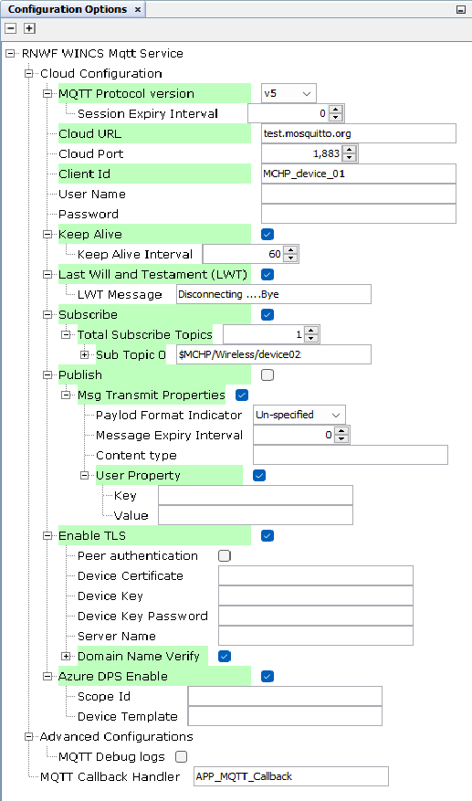
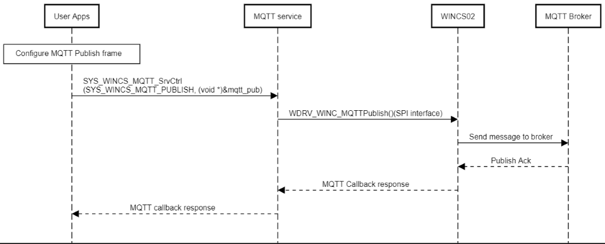
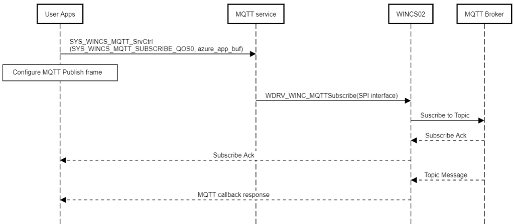

# MQTT Service

The Cloud service provides an Application Programming Interface (API) to manage MQTT functionalities. These functionalities include, configuring the MQTT settings, connecting, disconnecting and reconnecting to the MQTT broker, publishing, subscribing and setting callbacks.

**MQTT System Service Configuration in MCC**



<br />

This section allows MQTT service basic configuration as mentioned below:

-   **MQTT Protocol version:** Configure MQTT protocol version, either 3.1.1 or 5
    - **Session Expiry interval:** Configure Session Expiry interval time in seconds for MQTT v5.
-   **Cloud URL:** Configure Cloud provider endpoint / MQTT Broker URL.
-   **Cloud Port** : Configure Cloud/MQTT port.
-   **Client ID:** Device ID registered with cloud provider.
-   **User Name and Password:** Configure cloud client credentials.
-   **Keep Alive:** Select to enable Keep Alive MQTT specific option.
    -   **Keep Alive Interval:** Configure the field in the range of 1-1000 \(in seconds\)
-   **Last Will Testament()LWT:**  Select to enable the last will message. If enabled provice the last will message. 
    -   **LWT message :** Enter  the Last will message.
-   **Subscribe:** Select to enable MQTT Subscribe option. If enabled, it provides subscribe specific configurations such as Total Subscribe Topics, Table for Subscribe Topics, Sub. QoS
-    **Publish:** Select to enable/ MQTT Publish option. If enabled, it offers related configurations such as Publish Topic Name, Pub QoS, Retain Flag.
        -  **Msg Transmit Properties:** Select to set the MQTT transmit properties.
        -  **Payload Format Indicator:** Drop down to select the format of message payload. Un-specified or UTF8-encoded.
        -  **Message Expiry Interval:** Message Expiry Interval in seconds for each PUBLISH message.
        -  **Content type:** Type of the payload.
        -  **User Property:** Key-value pairs.
-   **TLS:** Select to enable TLS Configuration option. If enabled, it will further prompt to enter details as below:
    -   **Peer authentication**
        -   **Root CA/Server Certificate**
    -   **Device Certificate**
    -   **Device Key**
    -   **Device Key Password**
    -   **Server Name**
    -   **Domain Name Verify**
        -   **Domain Name**

The MQTT service API example is as follows:

``` {#GUID-DD648E0B-2B4D-45AA-9A19-A8A1849D5FC9_CODEBLOCK_OLC_5TV_XYB}
SYS_WINCS_RESULT_t SYS_WINCS_MQTT_SrvCtrl( SYS_WINCS_MQTT_SERVICE_t request, SYS_WINCS_MQTT_HANDLE_t mqttHandle);
```

It handles following services and reports the result to application over the return code or through the registered callback:

|Service|Input|Description|
|-------|-----|-----------|
|`SYS_WINCS_MQTT_CONFIG`|[SYS_WINCS_MQTT_CFG_t structure](https://onlinedocs.microchip.com/oxy/GUID-B7A95EBE-7BB2-4AF4-A525-700FB718E47A-en-US-1/GUID-6B615B51-05EC-477B-B634-2E5198B28E4E.html)|Configures the MQTT server details along with the corresponding TLS configurations|
|`SYS_WINCS_MQTT_LWT_CONFIG`|  [SYS_WINCS_MQTT_LWT_CFG_t structure](https://onlinedocs.microchip.com/oxy/GUID-B7A95EBE-7BB2-4AF4-A525-700FB718E47A-en-US-1/GUID-6B615B51-05EC-477B-B634-2E5198B28E4E.html) |Configure the MQTT Broker parameters|
|`SYS_WINCS_MQTT_CONNECT`| [SYS_WINCS_MQTT_CFG_t structure](https://onlinedocs.microchip.com/oxy/GUID-B7A95EBE-7BB2-4AF4-A525-700FB718E47A-en-US-1/GUID-6B615B51-05EC-477B-B634-2E5198B28E4E.html) |Initiates the MQTT connection to the configured MQTT broker|
|`SYS_WINCS_MQTT_RECONNECT`|None|Triggers the re-connection to the configured MQTT broker|
|`SYS_WINCS_MQTT_DISCONNECT`|None|Disconnects from the connected MQTT broker|
|`SYS_WINCS_MQTT_SUBS_TOPIC`|Topic Name|Subscribes to the given subscribe topic with |
|`SYS_WINCS_MQTT_UNSUBSCRIBE`| Topic name |UnSubscribe to Topic|
|`SYS_WINCS_MQTT_PUBLISH`|Topic Name |Publish the message on given publish topic and configuration|
|`SYS_WINCS_MQTT_SET_CALLBACK`|Callback Function Handler|Registers the MQTT callback to report the status to user application|
|`SYS_WINCS_MQTT_SET_SRVC_CALLBACK`| Callback Function Handler |Configure the MQTT Application Callback|
|`SYS_WINCS_MQTT_GET_CALLBACK`| None |Get Callback Function data|

The following list captures the MQTT callback event codes and their arguments

|Event|Response Components|Comments|
|-----|-------------------|--------|
|`SYS_WINCS_MQTT_CONNECTED`|[SYS_WINC_MQTT_CONN_ACK_PROP  structure](https://onlinedocs.microchip.com/oxy/GUID-B7A95EBE-7BB2-4AF4-A525-700FB718E47A-en-US-1/GUID-6B615B51-05EC-477B-B634-2E5198B28E4E.html)|Reported once connected to MQTT broker|
|`SYS_WINCS_MQTT_DISCONNECTED`|None|Event to report the MQTT broker disconnection|
|`SYS_WINCS_MQTT_SUBCRIBE_MSG`|[SYS_WINCS_MQTT_FRAME_t structure](https://onlinedocs.microchip.com/oxy/GUID-B7A95EBE-7BB2-4AF4-A525-700FB718E47A-en-US-1/GUID-6B615B51-05EC-477B-B634-2E5198B28E4E.html)|Reports the received payload for the subscribed topic|
|`SYS_WINCS_MQTT_SUBCRIBE_ACK`|None|Subscribe ack return code|
|`SYS_WINCS_MQTT_PUBLISH_ACK`| None|MQTT Publish ACK|
|`SYS_WINCS_MQTT_PUBLISH_MSG_ACK`| None |MQTT Publish acknowledgement and completion received|
|`SYS_WINCS_MQTT_UNSUBSCRIBED`| None|MQTT A topic has been un-subscribed|
|`SYS_WINCS_MQTT_ERROR`| None |MQTT ERROR| 


MQTT Publish

User application can publish to the MQTT broker by creating the MQTT frame and then sending the frame using the API. The sequence chart is illustrated below.

``` {#GUID-DD648E0B-2B4D-45AA-9A19-A8A1849D5FC9_CODEBLOCK_QX4_WDX_MZB}
SYS_WINCS_MQTT_SrvCtrl(SYS_WINCS_MQTT_PUBLISH, (SYS_WINCS_MQTT_HANDLE_t)&mqtt_pub) 
```

<br />



<br />

MQTT Subscribe

The sequence for subscribing to a topic from the MQTT Broker is illustrated below. The user application needs to use the API to subscribe to the topic with the appropriate QoS value.

``` {#GUID-DD648E0B-2B4D-45AA-9A19-A8A1849D5FC9_CODEBLOCK_LWS_F2X_MZB}
SYS_WINCS_MQTT_SrvCtrl(SYS_WINCS_MQTT_SUBS_TOPIC, (SYS_WINCS_MQTT_HANDLE_t)&mqtt_frame);
```

<br />



<br />

An example of the MQTT application provided below showcases the use of MQTT service API's:

Some of the configurations can be configured by the user by MCC.

``` {#GUID-DD648E0B-2B4D-45AA-9A19-A8A1849D5FC9_CODEBLOCK_LSY_D4K_JYB}
/*******************************************************************************
  MPLAB Harmony Application Source File

  Company:
    Microchip Technology Inc.

  File Name:
    app_wincs02.c

  Summary:
    This file contains the source code for the MPLAB Harmony application.

  Description:
    This file contains the source code for the MPLAB Harmony application.  It
    implements the logic of the application's state machine and it may call
    API routines of other MPLAB Harmony modules in the system, such as drivers,
    system services, and middleware.  However, it does not call any of the
    system interfaces (such as the "Initialize" and "Tasks" functions) of any of
    the modules in the system or make any assumptions about when those functions
    are called.  That is the responsibility of the configuration-specific system
    files.
 *******************************************************************************/

// *****************************************************************************
// *****************************************************************************
// Section: Included Files
// *****************************************************************************
// *****************************************************************************

#include <stdint.h>
#include <stdbool.h>
#include <stddef.h>
#include <stdlib.h>
#include <time.h>
#include "configuration.h"
#include "driver/driver_common.h"

#include "app_wincs02.h"
#include "system/system_module.h"
#include "system/console/sys_console.h"
#include "system/wifi/sys_wincs_wifi_service.h"
#include "system/sys_wincs_system_service.h"
#include "system/net/sys_wincs_net_service.h"
#include "system/mqtt/sys_wincs_mqtt_service.h"
// *****************************************************************************
// *****************************************************************************
// Section: Global Data Definitions
// *****************************************************************************
// *****************************************************************************

// *****************************************************************************
/* Application Data

  Summary:
    Holds application data

  Description:
    This structure holds the application's data.

  Remarks:
    This structure should be initialized by the APP_Initialize function.

    Application strings and buffers are be defined outside this structure.
*/
APP_DATA                g_appData;


// MQTT configuration settings for connecting to Broker
SYS_WINCS_MQTT_CFG_t    g_mqttCfg = {
    .url                    = SYS_WINCS_MQTT_CLOUD_URL,
    .username               = SYS_WINCS_MQTT_CLOUD_USER_NAME,
    .clientId               = SYS_WINCS_MQTT_CLIENT_ID,
    .password               = SYS_WINCS_MQTT_PASSWORD,
    .port                   = SYS_WINCS_MQTT_CLOUD_PORT,
    .tlsIdx                 = SYS_WINCS_MQTT_TLS_ENABLE,
    .protoVer               = SYS_WINCS_MQTT_PROTO_VERSION,
    .keepAliveTime          = SYS_WINCS_MQTT_KEEP_ALIVE_TIME,
    .cleanSession           = SYS_WINCS_MQTT_CLEAN_SESSION,
    .sessionExpiryInterval  = SYS_WINCS_MQTT_KEEP_ALIVE_TIME,
};

// MQTT frame settings for subscribing to a topic
SYS_WINCS_MQTT_FRAME_t  g_mqttSubsframe = {
    .qos                    = SYS_WINCS_MQTT_SUB_TOPIC_0_QOS,
    .topic                  = SYS_WINCS_MQTT_SUB_TOPIC_0,
    .protoVer               = SYS_WINCS_MQTT_PROTO_VERSION
};


// *****************************************************************************
// *****************************************************************************
// Section: Application Callback Functions
// *****************************************************************************
// *****************************************************************************

/* TODO:  Add any necessary callback functions.
*/

// *****************************************************************************
// Application NET Socket Callback Handler
//
// Summary:
//    Handles NET socket events.
//
// Description:
//    This function handles various NET socket events and performs appropriate actions.
//
// Parameters:
//    socket - The socket identifier
//    event - The type of socket event
//    netHandle - Additional data or message associated with the event
//
// Returns:
//    None.
//
// Remarks:
//    None.
// *****************************************************************************
void SYS_WINCS_NET_SockCallbackHandler
(
    uint32_t socket,                    // The socket identifier
    SYS_WINCS_NET_SOCK_EVENT_t event,   // The type of socket event
    SYS_WINCS_NET_HANDLE_t netHandle    // Additional data or message associated with the event
) 
{
    switch(event)
    {
        /* Net socket connected event code*/
        case SYS_WINCS_NET_SOCK_EVENT_CONNECTED:    
        {
            SYS_CONSOLE_PRINT("[APP] : Connected to Server!\r\n" );
            break;
        }
          
        /* Net socket disconnected event code*/
        case SYS_WINCS_NET_SOCK_EVENT_DISCONNECTED:
        {
            SYS_CONSOLE_PRINT("[APP] : Socket - %d DisConnected!\r\n",socket);
            SYS_WINCS_NET_SockSrvCtrl(SYS_WINCS_NET_SOCK_CLOSE, &socket);
            break;
        }
         
        /* Net socket error event code*/
        case SYS_WINCS_NET_SOCK_EVENT_ERROR:
        {
            SYS_CONSOLE_PRINT("ERROR : Socket\r\n");
            break;
        }
            
        /* Net socket read event code*/
        case SYS_WINCS_NET_SOCK_EVENT_READ:
        {         
            uint8_t rx_data[64];
            int16_t rcvd_len = 64;
            memset(rx_data,0,64);
            
            // Read data from the TCP socket
            if((rcvd_len = SYS_WINCS_NET_TcpSockRead(socket, SYS_WINCS_NET_SOCK_RCV_BUF_SIZE, rx_data)) > 0)
            {
                rcvd_len = strlen((char *)rx_data);
                rx_data[rcvd_len] = '\n';
                SYS_CONSOLE_PRINT("Received ->%s\r\n", rx_data);
                
                // Write the received data back to the TCP socket
                SYS_WINCS_NET_TcpSockWrite(socket, rcvd_len, rx_data); 
            }    
            break; 
        }
        
        case SYS_WINCS_NET_SOCK_EVENT_CLOSED:
        {
            SYS_CONSOLE_PRINT("[APP] : Socket CLOSED -> socketID: %d\r\n",socket);
            break;
        }
        
        case SYS_WINCS_NET_SOCK_EVENT_TLS_DONE:    
        {
            SYS_CONSOLE_PRINT("[APP] : TLS ->Connected to Server!\r\n" );
            break;
        }
        
        default:
            break;                  
    }    
    
}


// *****************************************************************************
// Application MQTT Callback Handler
//
// Summary:
//    Handles MQTT events.
//
// Description:
//    This function handles various MQTT events and performs appropriate actions.
//
// Parameters:
//    event - The type of MQTT event
//    mqttHandle - The MQTT handle associated with the event
//
// Returns:
//    SYS_WINCS_RESULT_t - The result of the callback handling
//
// Remarks:
//    None.
// *****************************************************************************

SYS_WINCS_RESULT_t APP_MQTT_Callback
(
    SYS_WINCS_MQTT_EVENT_t event,
    SYS_WINCS_MQTT_HANDLE_t mqttHandle
)
{
    switch(event)
    {
        case SYS_WINCS_MQTT_CONNECTED:
        {    
            SYS_CONSOLE_PRINT(TERM_GREEN"\r\n[APP] : MQTT : Connected to broker\r\n"TERM_RESET);
            SYS_CONSOLE_PRINT("[APP] : Subscribing to %s\r\n",SYS_WINCS_MQTT_SUB_TOPIC_0);
            
            //Subscribe to topic 
            SYS_WINCS_MQTT_SrvCtrl(SYS_WINCS_MQTT_SUBS_TOPIC, (SYS_WINCS_MQTT_HANDLE_t)&g_mqttSubsframe);
            break;
        }
        
        
        case SYS_WINCS_MQTT_SUBCRIBE_ACK:
        {
            SYS_CONSOLE_PRINT(TERM_GREEN"[APP] : MQTT Subscription has been acknowledged. \r\n"TERM_RESET);
            break;
        }
        
        case SYS_WINCS_MQTT_SUBCRIBE_MSG:
        {   
            SYS_WINCS_MQTT_FRAME_t *mqttRxFrame = (SYS_WINCS_MQTT_FRAME_t *)mqttHandle;
            SYS_CONSOLE_PRINT(TERM_YELLOW"[APP] : MQTT RX: From Topic : %s ; Msg -> %s\r\n"TERM_RESET,
                    mqttRxFrame->topic, mqttRxFrame->message);
            break;
        }
        
        case SYS_WINCS_MQTT_UNSUBSCRIBED:
        {
            SYS_CONSOLE_PRINT("[APP] : MQTT- A topic has been un-subscribed. \r\n");
            break;
        }
        
        case SYS_WINCS_MQTT_PUBLISH_ACK:
        {
            SYS_CONSOLE_PRINT("[APP] : MQTT- Publish has been sent. \r\n");
            break;
        }
        
        case SYS_WINCS_MQTT_DISCONNECTED:
        {            
            SYS_CONSOLE_PRINT("[APP] :MQTT-  Reconnecting...\r\n");
            SYS_WINCS_MQTT_SrvCtrl(SYS_WINCS_MQTT_CONNECT, NULL);
            break;            
        }
        
        case SYS_WINCS_MQTT_ERROR:
        {
            SYS_CONSOLE_PRINT("[APP] : MQTT - ERROR\r\n");
            break;
        }
        
        default:
        break;
    }
    return SYS_WINCS_PASS;
}


// *****************************************************************************
// Application Wi-Fi Callback Handler
//
// Summary:
//    Handles Wi-Fi events.
//
// Description:
//    This function handles various Wi-Fi events and performs appropriate actions.
//
// Parameters:
//    event - The type of Wi-Fi event
//    wifiHandle - Handle to the Wi-Fi event data
//
// Returns:
//    None.
//
// Remarks:
//    None.
// *****************************************************************************
void SYS_WINCS_WIFI_CallbackHandler
(
    SYS_WINCS_WIFI_EVENT_t event,         // The type of Wi-Fi event
    SYS_WINCS_WIFI_HANDLE_t wifiHandle    // Handle to the Wi-Fi event data
)
{
            
    switch(event)
    {
        /* Set regulatory domain Acknowledgment */
        case SYS_WINCS_WIFI_REG_DOMAIN_SET_ACK:
        {
            // The driver generates this event callback twice, hence the if condition 
            // to ignore one more callback. This will be resolved in the next release.
            static bool domainFlag = false;
            if( domainFlag == false)
            {
                SYS_CONSOLE_PRINT("Set Reg Domain -> SUCCESS\r\n");
                g_appData.state = APP_STATE_WINCS_SET_WIFI_PARAMS;
                domainFlag = true;
            }
            
            break;
        }  
        
        /* SNTP UP event code*/
        case SYS_WINCS_WIFI_SNTP_UP:
        {            
            uint32_t *timeUTC = (uint32_t *)&wifiHandle;
            SYS_CONSOLE_PRINT(TERM_YELLOW"[APP] : SNTP UP - Time UTC : %d\r\n"TERM_RESET,*timeUTC); 
            SYS_CONSOLE_PRINT("[APP] : Connecting to the Cloud\r\n");
            
            // Set the callback function for MQTT events
            SYS_WINCS_MQTT_SrvCtrl(SYS_WINCS_MQTT_SET_CALLBACK, APP_MQTT_Callback);

            // Configure the MQTT service with the provided configuration
            SYS_WINCS_MQTT_SrvCtrl(SYS_WINCS_MQTT_CONFIG, (SYS_WINCS_MQTT_HANDLE_t)&g_mqttCfg);

            // Connect to the MQTT broker using the specified configuration
            SYS_WINCS_MQTT_SrvCtrl(SYS_WINCS_MQTT_CONNECT, &g_mqttCfg);

            break;
        }
        break;

        /* Wi-Fi connected event code*/
        case SYS_WINCS_WIFI_CONNECTED:
        {
            SYS_CONSOLE_PRINT(TERM_GREEN"[APP] : Wi-Fi Connected    \r\n"TERM_RESET);
            break;
        }
        
        /* Wi-Fi disconnected event code*/
        case SYS_WINCS_WIFI_DISCONNECTED:
        {
            SYS_CONSOLE_PRINT(TERM_RED"[APP] : Wi-Fi Disconnected\nReconnecting... \r\n"TERM_RESET);
            SYS_WINCS_WIFI_SrvCtrl(SYS_WINCS_WIFI_STA_CONNECT, NULL);
            break;
        }
        
        /* Wi-Fi DHCP complete event code*/
        case SYS_WINCS_WIFI_DHCP_IPV4_COMPLETE:
        {         
            SYS_CONSOLE_PRINT("[APP] : DHCP IPv4 : %s\r\n", (uint8_t *)wifiHandle);
            break;
        }
        
        case SYS_WINCS_WIFI_DHCP_IPV6_LOCAL_COMPLETE:
        {
            SYS_CONSOLE_PRINT("[APP] : DHCP IPv6 Local : %s\r\n", (uint8_t *)wifiHandle);
            break;
        }
        
        case SYS_WINCS_WIFI_DHCP_IPV6_GLOBAL_COMPLETE:
        {
            SYS_CONSOLE_PRINT("[APP] : DHCP IPv6 Global: %s\r\n", (uint8_t *)wifiHandle);
            
            // Retrieve the current time from the Wi-Fi service
            SYS_WINCS_WIFI_SrvCtrl(SYS_WINCS_WIFI_GET_TIME, NULL);
            break;
        }
        
        default:
        {
            break;
        }
    }    
}


// *****************************************************************************
// *****************************************************************************
// Section: Application Local Functions
// *****************************************************************************
// *****************************************************************************


/* TODO:  Add any necessary local functions.
*/


// *****************************************************************************
// *****************************************************************************
// Section: Application Initialization and State Machine Functions
// *****************************************************************************
// *****************************************************************************
// *****************************************************************************
// Application Initialization Function
//
// Summary:
//    Initializes the application.
//
// Description:
//    This function initializes the application's state machine and other
//    parameters.
//
// Parameters:
//    None.
//
// Returns:
//    None.
//
// Remarks:
//    None.
// *****************************************************************************
void APP_WINCS02_Initialize ( void )
{
    /* Place the App state machine in its initial state. */
    g_appData.state = APP_STATE_WINCS_PRINT;

    /* TODO: Initialize your application's state machine and other
     * parameters.
     */
}


// *****************************************************************************
// Application Tasks Function
//
// Summary:
//    Executes the application's tasks.
//
// Description:
//    This function implements the application's state machine and performs
//    the necessary actions based on the current state.
//
// Parameters:
//    None.
//
// Returns:
//    None.
//
// Remarks:
//    None.
// *****************************************************************************
void APP_WINCS02_Tasks ( void )
{
    /* Check the application's current state. */
    switch ( g_appData.state )
    {
        // State to print Message 
        case APP_STATE_WINCS_PRINT:
        {
            SYS_CONSOLE_PRINT(TERM_YELLOW"########################################\r\n"TERM_RESET);
            SYS_CONSOLE_PRINT(TERM_CYAN"        WINCS02 Basic Cloud demo\r\n"TERM_RESET);
            SYS_CONSOLE_PRINT(TERM_YELLOW"########################################\r\n"TERM_RESET);
            
            g_appData.state = APP_STATE_WINCS_INIT;
            break;
        }
        
        /* Application's initial state. */
        case APP_STATE_WINCS_INIT:
        {
            SYS_STATUS status;
            // Get the driver status
            SYS_WINCS_WIFI_SrvCtrl(SYS_WINCS_WIFI_GET_DRV_STATUS, &status);

            // If the driver is ready, move to the next state
            if (SYS_STATUS_READY == status)
            {
                g_appData.state = APP_STATE_WINCS_OPEN_DRIVER;
            }

            break;
        }

        case APP_STATE_WINCS_OPEN_DRIVER:
        {
            DRV_HANDLE wdrvHandle = DRV_HANDLE_INVALID;
            // Open the Wi-Fi driver
            if (SYS_WINCS_FAIL == SYS_WINCS_WIFI_SrvCtrl(SYS_WINCS_WIFI_OPEN_DRIVER, &wdrvHandle))
            {
                g_appData.state = APP_STATE_WINCS_ERROR;
                break;
            }

            // Get the driver handle
            SYS_WINCS_WIFI_SrvCtrl(SYS_WINCS_WIFI_GET_DRV_HANDLE, &wdrvHandle);
            g_appData.state = APP_STATE_WINCS_DEVICE_INFO;
            break;
        }

        case APP_STATE_WINCS_DEVICE_INFO:
        {
            APP_DRIVER_VERSION_INFO drvVersion;
            APP_FIRMWARE_VERSION_INFO fwVersion;
            APP_DEVICE_INFO devInfo;
            SYS_WINCS_RESULT_t status = SYS_WINCS_BUSY;

            // Get the firmware version
            status = SYS_WINCS_SYSTEM_SrvCtrl(SYS_WINCS_SYSTEM_SW_REV, &fwVersion);

            if(status == SYS_WINCS_PASS)
            {
                // Get the device information
                status = SYS_WINCS_SYSTEM_SrvCtrl(SYS_WINCS_SYSTEM_DEV_INFO, &devInfo);
            }

            if(status == SYS_WINCS_PASS)
            {
                // Get the driver version
                status = SYS_WINCS_SYSTEM_SrvCtrl(SYS_WINCS_SYSTEM_DRIVER_VER, &drvVersion);
            }

            if(status == SYS_WINCS_PASS)
            {
                char buff[30];
                // Print device information
                SYS_CONSOLE_PRINT("WINC: Device ID = %08x\r\n", devInfo.id);
                for (int i = 0; i < devInfo.numImages; i++)
                {
                    SYS_CONSOLE_PRINT("%d: Seq No = %08x, Version = %08x, Source Address = %08x\r\n", 
                            i, devInfo.image[i].seqNum, devInfo.image[i].version, devInfo.image[i].srcAddr);
                }

                // Print firmware version
                SYS_CONSOLE_PRINT(TERM_CYAN "Firmware Version: %d.%d.%d ", fwVersion.version.major,
                        fwVersion.version.minor, fwVersion.version.patch);
                strftime(buff, sizeof(buff), "%X %b %d %Y", localtime((time_t*)&fwVersion.build.timeUTC));
                SYS_CONSOLE_PRINT(" [%s]\r\n", buff);

                // Print driver version
                SYS_CONSOLE_PRINT("Driver Version: %d.%d.%d\r\n"TERM_RESET, drvVersion.version.major, 
                        drvVersion.version.minor, drvVersion.version.patch);

                g_appData.state = APP_STATE_WINCS_SET_REG_DOMAIN;
            }
            break;
        }

        case APP_STATE_WINCS_SET_REG_DOMAIN:
        {
            // Set the callback handler for Wi-Fi events
            SYS_WINCS_WIFI_SrvCtrl(SYS_WINCS_WIFI_SET_CALLBACK, SYS_WINCS_WIFI_CallbackHandler);

            SYS_CONSOLE_PRINT(TERM_YELLOW"Setting REG domain to " TERM_UL "%s\r\n"TERM_RESET ,SYS_WINCS_WIFI_COUNTRYCODE);
            // Set the regulatory domain
            if (SYS_WINCS_FAIL == SYS_WINCS_WIFI_SrvCtrl(SYS_WINCS_WIFI_SET_REG_DOMAIN, SYS_WINCS_WIFI_COUNTRYCODE))
            {
                g_appData.state = APP_STATE_WINCS_ERROR;
                break;
            }

            g_appData.state = APP_STATE_WINCS_SERVICE_TASKS;
            break;
        }

        case APP_STATE_WINCS_SET_WIFI_PARAMS:
        {
            char sntp_url[] =  SYS_WINCS_WIFI_SNTP_ADDRESS;
            if (SYS_WINCS_FAIL == SYS_WINCS_WIFI_SrvCtrl(SYS_WINCS_WIFI_SET_SNTP, sntp_url))
            {
                g_appData.state = APP_STATE_WINCS_ERROR;
                break;
            }
            
            // Configuration parameters for Wi-Fi station mode
            SYS_WINCS_WIFI_PARAM_t wifi_sta_cfg = {
                .mode        = SYS_WINCS_WIFI_MODE_STA,        // Set Wi-Fi mode to Station (STA)
                .ssid        = SYS_WINCS_WIFI_STA_SSID,        // Set the SSID (network name) for the Wi-Fi connection
                .passphrase  = SYS_WINCS_WIFI_STA_PWD,         // Set the passphrase (password) for the Wi-Fi connection
                .security    = SYS_WINCS_WIFI_STA_SECURITY,    // Set the security type (e.g., WPA2) for the Wi-Fi connection
                .autoConnect = SYS_WINCS_WIFI_STA_AUTOCONNECT  // Enable or disable auto-connect to the Wi-Fi network
            }; 

            // Set the Wi-Fi parameters
            if (SYS_WINCS_FAIL == SYS_WINCS_WIFI_SrvCtrl(SYS_WINCS_WIFI_SET_PARAMS, &wifi_sta_cfg))
            {
                g_appData.state = APP_STATE_WINCS_ERROR;
                break;
            }
            SYS_CONSOLE_PRINT("\r\n\r\n[APP] : Wi-Fi Connecting to : %s\r\n", SYS_WINCS_WIFI_STA_SSID);
            g_appData.state = APP_STATE_WINCS_SERVICE_TASKS;
            break;
        }
        
        case APP_STATE_WINCS_SERVICE_TASKS:
        {

            break;
        }
        
        case APP_STATE_WINCS_ERROR:
        {
            SYS_CONSOLE_PRINT(TERM_RED"[APP_ERROR] : ERROR in Application "TERM_RESET);
            g_appData.state = APP_STATE_WINCS_SERVICE_TASKS;
            break;
        }

        /* The default state should never be executed. */
        default:
        {
            /* TODO: Handle error in application's state machine. */
            break;
        }
    }
}


/*******************************************************************************
 End of File
 */

```

<br />


