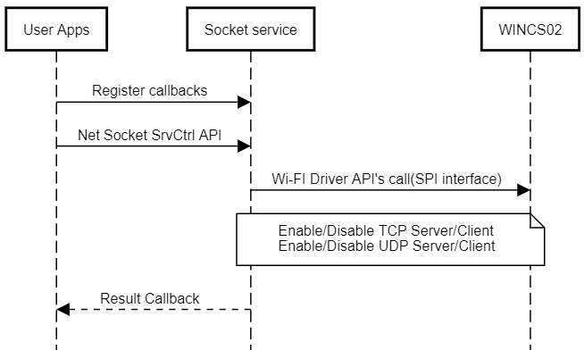

# Net Socket Service Functions

The basic net socket service sequence chart is provided below:

<br />



<br />

Socket open sequence is provided below

<br />


<br />

The socket binding sequence chart is provided below:

<br />


<br />

Socket closing sequence chart is provided below

<br />


<br />

Socket callback finctions :

<br />

``` {#CODEBLOCK_VHX_31Z_RBC}
/* Application NET socket Callback Handler function */
void SYS_WINCS_NET_SockCallbackHandler(uint32_t socket, SYS_WINCS_NET_SOCK_EVENT_t event, uint8_t *p_str)
{
    switch(event)
    {
        /* Net socket connected event code*/
        case SYS_WINCS_NET_SOCK_EVENT_CONNECTED:    
        {
            SYS_CONSOLE_PRINT("[APP] : Connected to Server!\r\n" );
            break;
        }
          
        /* Net socket disconnected event code*/
        case SYS_WINCS_NET_SOCK_EVENT_DISCONNECTED:
        {
            SYS_CONSOLE_PRINT("[APP] : DisConnected!\r\n");
            SYS_WINCS_NET_SockSrvCtrl(SYS_WINCS_NET_SOCK_CLOSE, &socket);
            break;
        }
         
        /* Net socket error event code*/
        case SYS_WINCS_NET_SOCK_EVENT_ERROR:
        {
            SYS_CONSOLE_PRINT("ERROR : Socket\r\n");
            break;
        }
            
        /* Net socket read event code*/
        case SYS_WINCS_NET_SOCK_EVENT_READ:
        {         
            uint8_t rx_data[64];
            int16_t rcvd_len = 64;
            memset(rx_data,0,64);
            if((rcvd_len = SYS_WINCS_NET_TcpSockRead(socket, SYS_WINCS_NET_SOCK_RCV_BUF_SIZE, rx_data)) > 0)
            {
                rcvd_len = strlen((char *)rx_data);
                rx_data[rcvd_len] = '\n';
                SYS_CONSOLE_PRINT("Received ->%s\r\n", rx_data);
                SYS_WINCS_NET_TcpSockWrite(socket, rcvd_len, rx_data); 
            }    
            
            break; 
        }
        
        case SYS_WINCS_NET_SOCK_EVENT_CLOSED:
        {
            SYS_CONSOLE_PRINT("[APP] : Socket CLOSED -> socketID: %d\r\n",socket);
            break;
        }
        
        case SYS_WINCS_NET_SOCK_EVENT_TLS_DONE:    
        {
            SYS_CONSOLE_PRINT("[APP] : TLS ->Connected to Server!\r\n" );
            break;
        }
        
        default:
            break;                  
    }    
    
}


void SYS_WINCS_WIFI_CallbackHandler(SYS_WINCS_WIFI_EVENT_t event, uint8_t *p_str)
{
            
    switch(event)
    {
        /* SNTP UP event code*/
        case SYS_WINCS_SNTP_UP:
        {            
            SYS_CONSOLE_PRINT("[APP] : SNTP UP \r\n"); 
            break;
        }
        break;

        /* Wi-Fi connected event code*/
        case SYS_WINCS_CONNECTED:
        {
            SYS_CONSOLE_PRINT("[APP] : Wi-Fi Connected    \r\n");
            break;
        }
        
        /* Wi-Fi disconnected event code*/
        case SYS_WINCS_DISCONNECTED:
        {
            SYS_CONSOLE_PRINT("[APP] : Wi-Fi Disconnected\nReconnecting... \r\n");
            SYS_WINCS_WIFI_SrvCtrl(SYS_WINCS_WIFI_STA_CONNECT, NULL);
            break;
        }
        
        /* Wi-Fi DHCP complete event code*/
        case SYS_WINCS_DHCP_DONE:
        {         
            SYS_CONSOLE_PRINT("[APP] : DHCP IPv4 : %s\r\n", p_str);
            SYS_WINCS_NET_SockSrvCtrl(SYS_WINCS_NET_SOCK_SET_CALLBACK, SYS_WINCS_NET_SockCallbackHandler);
            SYS_WINCS_NET_SockSrvCtrl(SYS_WINCS_NET_SOCK_TCP_OPEN, &g_tcpClientSocket);
            break;
        }
        
        case SYS_WINCS_DHCP_IPV6_LOCAL_DONE:
        {
            //SYS_CONSOLE_PRINT("[APP] : DHCP IPv6 Local : %s\r\n", p_str);
            break;
        }
        
        case SYS_WINCS_DHCP_IPV6_GLOBAL_DONE:
        {
            //SYS_CONSOLE_PRINT("[APP] : DHCP IPv6 Global: %s\r\n", p_str);
            break;
        }
        
        /* Wi-Fi scan indication event code*/
        case SYS_WINCS_SCAN_INDICATION:
        {
            break;
        } 
        
        /* Wi-Fi scan complete event code*/
        case SYS_WINCS_SCAN_DONE:
        {
            break;
        }
        
        default:
        {
            break;
        }
    }    
}

```

<br />


