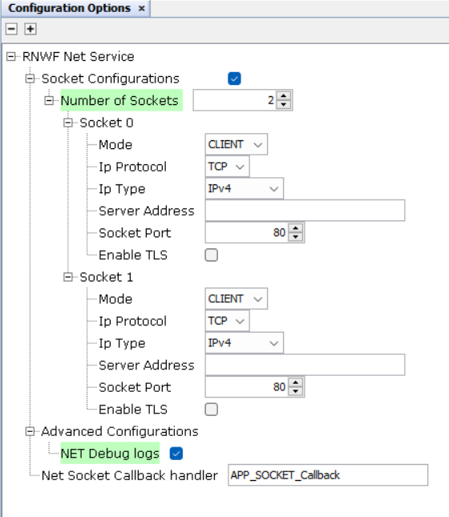
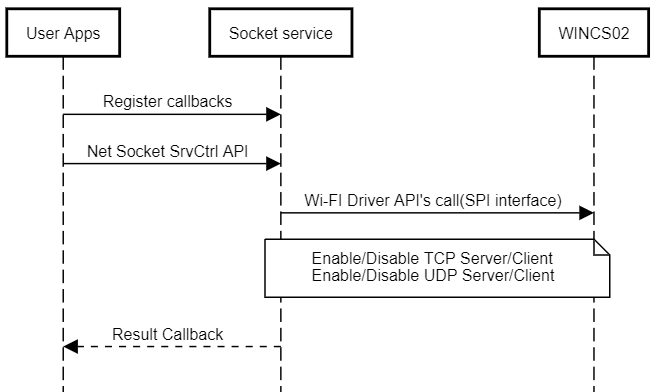

# Net Socket Service

<br />

The Net Socket service provides network and socket services to the user application. It includes DHCP server configuration for the Wi-Fi interface and API's for socket operations such as open, read, write and close. It also provides 2 simultaneous TLS configuration instances which can be used with a given socket communication tunnel. The Net service API call syntax is provided below:

``` {#GUID-834E84DC-609A-4A37-853F-3552166E1009_CODEBLOCK_JKQ_PVT_TYB}
SYS_WINCS_RESULT_t SYS_WINCS_NET_SockSrvCtrl( SYS_WINCS_NET_SOCK_SERVICE_t request, void *input);
```

**Net System Service Configuration in MCC**



This section allows NET service basic configuration as mentioned below:

<br />

-   **Number of Sockets:**Configure this field in the range of 1-2.
-   **Mode:** Server/Client Mode Selection
-   **Ip Protocol:** TCP/UDP protocol selection.
-   **IP Type :** Select IP type : IPv4 / IPv6 Local / IPv6 Global.
-   **Server address:** Enter the respective server IP address.
-   **Socket Port:** Socket port number.
-   **Enable TLS:** Select to enable TLS Configuration option.
    -   **Peer authentication**
        -   **Root CA / Server Certificate**
    -   **Device Certificate**
    -   **Device Key**
    -   **Device Key Password**
    -   **Server Name**
    -   **Domain Name Verify**
        -   **Domain Name**

<br />

The Net service provides the following services for the<br /> user:

**Net Socket Services**

<br />

|Services/Options|Input Parameters|Description|
|----------------|----------------|-----------|
|`SYS_WINCS_NET_TLS_CONFIG_1`|TLS configuration list: CA name, Certificate name, Key<br /> name, Key password, server name|Use the TLS configuration 1|
|`SYS_WINCS_NET_TLS_CONFIG_2`|TLS configuration list: CA name, Certificate name, Key<br /> name, Key password, server name|Use the TLS configuration 2|
|`SYS_WINCS_NET_IF_CONFIG`| |Network Interface configuration|
|`SYS_WINCS_NET_DHCP_SERVER_ENABLE`|DHCP Configuration: Set IP, Pool start,Parameter ID \(Int\)Parameter value<br /> \(String\)|Enable the DHCP server|
|`SYS_WINCS_NET_DHCP_SERVER_DISABLE`|None|Disable the DHCP server|
|`SYS_WINCS_NET_SOCK_TCP_OPEN`|None|Open TCP socket. Returns socket ID.|
|`SYS_WINCS_NET_SOCK_UDP_OPEN`|None|Open UDP socket. Returns socket ID.|
|`SYS_WINCS_NET_SOCK_CLOSE`|None|Close the socket|
|`SYS_WINCS_NET_SOCK_CONFIG`|Socket IDNo delay, Keep<br /> alive|Configures the socket settings|
|`SYS_WINCS_NET_SOCK_SET_CALLBACK`|Callback function handler|Register application callback for socket|
|`SYS_WINCS_NET_SOCK_SET_SRVC_CALLBACK`|Callback function handler|Register application callback for socket|
|`SYS_WINCS_NET_SOCK_GET_CALLBACK`| | |
|`SYS_WINCS_NET_OPEN_TLS_CTX`| | |
|`SYS_WINCS_NET_GET_TLS_CTX_HANDLE`| | |

<br />

The events that are returned in the Net socket service are provided<br /> below:

<br />

|**Events**|**Response Components**|**Description**|
|----------|-----------------------|---------------|
|`SYS_WINCS_NET_SOCK_EVENT_CONNECTED`|Socket ID \(Integer\), Local Address \(String\), Local port<br /> \(Integer\), Remote address \(String\), Remote port<br /> \(Integer\)|Reports the socket connected event|
|`SYS_WINCS_NET_SOCK_EVENT_TLS_DONE`|Socket ID \(Integer\)|TLS handshake done, on this event the TLS configuration<br /> instance can be re used for other TLS sessions|
|`SYS_WINCS_NET_SOCK_EVENT_DISCONNECTED`|Socket ID \(Integer\)|Socket disconnected|
|`SYS_WINCS_NET_SOCK_EVENT_READ`|Socket ID \(Integer\)Length \(Integer\)|Reports the length of data available on the given socket<br /> ID|
|`SYS_WINCS_NET_SOCK_EVENT_ERROR`|Socket ID \(Integer\)Error code\(Integer\)|Reports the socket error events|
|`SYS_WINCS_NET_SOCK_EVENT_UNDEFINED`| | |
|`SYS_WINCS_NET_SOCK_EVENT_CLOSED`| | |

<br />

<br />

The basic net socket service sequence chart is provided below:

<br />



<br />

<br />

**Socket Write**

The socket service provides the write API for the TCP and UDP sockets. Following are the API prototypes:

``` {#GUID-834E84DC-609A-4A37-853F-3552166E1009_CODEBLOCK_LBW_HXW_XYB}
SYS_WINCS_RESULT_t SYS_WINCS_NET_TcpSockWrite( uint32_t socket, uint16_t length, uint8_t *input);
```

``` {#GUID-834E84DC-609A-4A37-853F-3552166E1009_CODEBLOCK_LLV_1DW_XYB}
SYS_WINCS_RESULT_t SYS_WINCS_NET_UdpSockWrite( uint32_t socket, uint8_t *addr, uint32_t port, uint16_t length, uint8_t *input);
```

**Socket Read**

The socket service provides the read API for the TCP and UDP sockets.<br /> Following are the API<br /> prototypes:

``` {#GUID-834E84DC-609A-4A37-853F-3552166E1009_CODEBLOCK_MPN_CDW_XYB}
int16_t SYS_WINCS_NET_TcpSockRead( uint32_t socket, uint16_t length, uint8_t *input);
```

``` {#GUID-834E84DC-609A-4A37-853F-3552166E1009_CODEBLOCK_GDQ_HDW_XYB}
int16_t SYS_WINCS_NET_UdpSockRead( uint32_t socket, uint16_t length, uint8_t *input);
```

The<br /> sample TCP socket example is provided below:

Some of the configurations can be configured by MCC.

``` {#GUID-834E84DC-609A-4A37-853F-3552166E1009_CODEBLOCK_M13_QYW_XYB}
*/\*
    Net socket application
\*/*
#include <stdint.h>
#include <stdbool.h>
#include <stddef.h>
#include <stdlib.h>
#include <time.h>
#include "configuration.h"
#include "driver/driver_common.h"

#include "app_wincs02.h"
#include "system/system_module.h"
#include "system/console/sys_console.h"
#include "system/wifi/sys_wincs_wifi_service.h"
#include "system/sys_wincs_system_service.h"
#include "system/net/sys_wincs_net_service.h"

APP_DATA appData;

SYS_WINCS_NET_SOCKET_t g_tcpClientSocket = {
    .bind_type = SYS_WINCS_NET_BIND_TYPE0,
    .sock_addr = SYS_WINCS_NET_SOCK_SERVER_ADDR0,
    .sock_type = SYS_WINCS_NET_SOCK_TYPE0,
    .sock_port = SYS_WINCS_NET_SOCK_PORT0,
    .tls_conf = SYS_WINCS_TLS_ENABLE0,
    .ip_type  = SYS_WINCS_NET_IPV4,
 };

/* Application NET socket Callback Handler function */
void SYS_WINCS_NET_SockCallbackHandler(uint32_t socket, SYS_WINCS_NET_SOCK_EVENT_t event, uint8_t *p_str)
{
    switch(event)
    {
        /* Net socket connected event code*/
        case SYS_WINCS_NET_SOCK_EVENT_CONNECTED:    
        {
            SYS_CONSOLE_PRINT("[APP] : Connected to Server!\r\n" );
            break;
        }
          
        /* Net socket disconnected event code*/
        case SYS_WINCS_NET_SOCK_EVENT_DISCONNECTED:
        {
            SYS_CONSOLE_PRINT("[APP] : DisConnected!\r\n");
            SYS_WINCS_NET_SockSrvCtrl(SYS_WINCS_NET_SOCK_CLOSE, &socket);
            break;
        }
         
        /* Net socket error event code*/
        case SYS_WINCS_NET_SOCK_EVENT_ERROR:
        {
            SYS_CONSOLE_PRINT("ERROR : Socket\r\n");
            break;
        }
            
        /* Net socket read event code*/
        case SYS_WINCS_NET_SOCK_EVENT_READ:
        {         
            uint8_t rx_data[64];
            int16_t rcvd_len = 64;
            memset(rx_data,0,64);
            if((rcvd_len = SYS_WINCS_NET_TcpSockRead(socket, SYS_WINCS_NET_SOCK_RCV_BUF_SIZE, rx_data)) > 0)
            {
                rcvd_len = strlen((char *)rx_data);
                rx_data[rcvd_len] = '\n';
                SYS_CONSOLE_PRINT("Received ->%s\r\n", rx_data);
                SYS_WINCS_NET_TcpSockWrite(socket, rcvd_len, rx_data); 
            }    
            
            break; 
        }
        
        case SYS_WINCS_NET_SOCK_EVENT_CLOSED:
        {
            SYS_CONSOLE_PRINT("[APP] : Socket CLOSED -> socketID: %d\r\n",socket);
            break;
        }
        
        case SYS_WINCS_NET_SOCK_EVENT_TLS_DONE:    
        {
            SYS_CONSOLE_PRINT("[APP] : TLS ->Connected to Server!\r\n" );
            break;
        }
        
        default:
            break;                  
    }    
    
}


void SYS_WINCS_WIFI_CallbackHandler(SYS_WINCS_WIFI_EVENT_t event, uint8_t *p_str)
{
            
    switch(event)
    {
        /* SNTP UP event code*/
        case SYS_WINCS_SNTP_UP:
        {            
            SYS_CONSOLE_PRINT("[APP] : SNTP UP \r\n"); 
            break;
        }
        break;

        /* Wi-Fi connected event code*/
        case SYS_WINCS_CONNECTED:
        {
            SYS_CONSOLE_PRINT("[APP] : Wi-Fi Connected    \r\n");
            break;
        }
        
        /* Wi-Fi disconnected event code*/
        case SYS_WINCS_DISCONNECTED:
        {
            SYS_CONSOLE_PRINT("[APP] : Wi-Fi Disconnected\nReconnecting... \r\n");
            SYS_WINCS_WIFI_SrvCtrl(SYS_WINCS_WIFI_STA_CONNECT, NULL);
            break;
        }
        
        /* Wi-Fi DHCP complete event code*/
        case SYS_WINCS_DHCP_DONE:
        {         
            SYS_CONSOLE_PRINT("[APP] : DHCP IPv4 : %s\r\n", p_str);
            SYS_WINCS_NET_SockSrvCtrl(SYS_WINCS_NET_SOCK_SET_CALLBACK, SYS_WINCS_NET_SockCallbackHandler);
            SYS_WINCS_NET_SockSrvCtrl(SYS_WINCS_NET_SOCK_TCP_OPEN, &g_tcpClientSocket);
            break;
        }
        
        case SYS_WINCS_DHCP_IPV6_LOCAL_DONE:
        {
            //SYS_CONSOLE_PRINT("[APP] : DHCP IPv6 Local : %s\r\n", p_str);
            break;
        }
        
        case SYS_WINCS_DHCP_IPV6_GLOBAL_DONE:
        {
            //SYS_CONSOLE_PRINT("[APP] : DHCP IPv6 Global: %s\r\n", p_str);
            break;
        }
        
        /* Wi-Fi scan indication event code*/
        case SYS_WINCS_SCAN_INDICATION:
        {
            break;
        } 
        
        /* Wi-Fi scan complete event code*/
        case SYS_WINCS_SCAN_DONE:
        {
            break;
        }
        
        default:
        {
            break;
        }
    }    
}


void APP_WINCS02_Initialize ( void )
{
    /* Place the App state machine in its initial state. */
    appData.state = APP_STATE_WINCS_INIT;


    /* TODO: Initialize your application's state machine and other
     * parameters.
     */
}

void APP_WINCS02_Tasks ( void )
{

    /* Check the application's current state. */
    switch ( appData.state )
    {
        /* Application's initial state. */
       case APP_STATE_WINCS_INIT:
        {
            SYS_STATUS status;
            SYS_WINCS_WIFI_SrvCtrl(SYS_WINCS_WIFI_GET_DRV_STATUS, &status);

            if (SYS_STATUS_READY == status)
            {
                appData.state = APP_STATE_WINCS_OPEN_DRIVER;
            }
            
            break;
        }
        
        case APP_STATE_WINCS_OPEN_DRIVER:
        {
            DRV_HANDLE wdrvHandle = DRV_HANDLE_INVALID;
            SYS_WINCS_WIFI_SrvCtrl(SYS_WINCS_WIFI_OPEN_DRIVER, &wdrvHandle);
            
            SYS_WINCS_WIFI_SrvCtrl(SYS_WINCS_WIFI_GET_DRV_HANDLE, &wdrvHandle);
            appData.state = APP_STATE_WINCS_DEVICE_INFO;
            break;
        }
        
        case APP_STATE_WINCS_DEVICE_INFO:
        {
            APP_DRIVER_VERSION_INFO drvVersion;
            APP_FIRMWARE_VERSION_INFO fwVersion;
            APP_DEVICE_INFO devInfo;
            SYS_WINCS_RESULT_t status = SYS_WINCS_BUSY;
            
            status = SYS_WINCS_SYSTEM_SrvCtrl(SYS_WINCS_SYSTEM_SW_REV,&fwVersion);
            
            if(status == SYS_WINCS_PASS)
            {
                status = SYS_WINCS_SYSTEM_SrvCtrl(SYS_WINCS_SYSTEM_DEV_INFO, &devInfo);
            }
            
            if(status == SYS_WINCS_PASS)
            {
                status = SYS_WINCS_SYSTEM_SrvCtrl (SYS_WINCS_SYSTEM_DRIVER_VER, &drvVersion);
            }
            
            if(status == SYS_WINCS_PASS)
            {
                char buff[30];
                SYS_CONSOLE_PRINT("WINC: Device ID = %08x\r\n", devInfo.id);
                for (int i=0; i<devInfo.numImages; i++)
                {
                    SYS_CONSOLE_PRINT("%d: Seq No = %08x, Version = %08x, Source Address = %08x\r\n", i, devInfo.image[i].seqNum, devInfo.image[i].version, devInfo.image[i].srcAddr);
                }
                
                SYS_CONSOLE_PRINT("Firmware Version: %d.%d.%d ", fwVersion.version.major, fwVersion.version.minor, fwVersion.version.patch);
                strftime(buff, sizeof(buff), "%X %b %d %Y", localtime((time_t*)&fwVersion.build.timeUTC));
                SYS_CONSOLE_PRINT(" [%s]\r\n", buff);
                SYS_CONSOLE_PRINT("Driver Version: %d.%d.%d\r\n", drvVersion.version.major, drvVersion.version.minor, drvVersion.version.patch);
                
                appData.state = APP_STATE_WINCS_SET_WIFI_PARAMS;
            }
            break;
        }
        
        case APP_STATE_WINCS_SET_WIFI_PARAMS:
        {
            SYS_WINCS_WIFI_PARAM_t wifi_sta_cfg = {SYS_WINCS_WIFI_MODE_STA, SYS_WINCS_WIFI_STA_SSID, 
            SYS_WINCS_WIFI_STA_PWD, SYS_WINCS_STA_SECURITY, SYS_WINCS_WIFI_STA_AUTOCONNECT};        
            SYS_WINCS_WIFI_SrvCtrl(SYS_WINCS_WIFI_SET_PARAMS, &wifi_sta_cfg);
            SYS_WINCS_WIFI_SrvCtrl(SYS_WINCS_WIFI_SET_CALLBACK, SYS_WINCS_WIFI_CallbackHandler); 
            SYS_CONSOLE_PRINT("\r\n\r\n[APP] : Wi-Fi Connecting to : %s\r\n",SYS_WINCS_WIFI_STA_SSID);
            
            appData.state = APP_STATE_WINCS_SERVICE_TASKS;
            break;
        }
        
        case APP_STATE_WINCS_SERVICE_TASKS:
        {

            break;
        }

        /* The default state should never be executed. */
        default:
        {
            /* TODO: Handle error in application's state machine. */
            break;
        }
    }
}


/*******************************************************************************
 End of File
 */
```

<br />

-   **[Net Socket Service Functions](GUID-C621179F-EA61-4F1C-B1E1-054026D9D87A.md)**  


