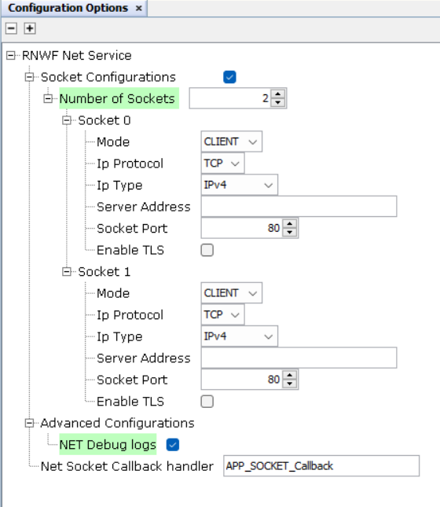
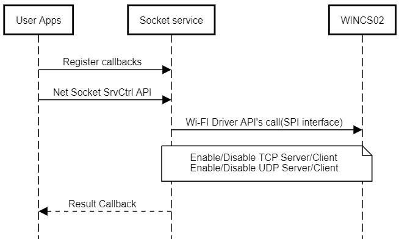

# Net Socket Service

<br />

The Net Socket service provides network and socket services to the user application. It includes DHCP server configuration for the Wi-Fi interface and API's for socket operations such as open, read, write and close. It also provides 2 simultaneous TLS configuration instances which can be used with a given socket communication tunnel. The Net service API call syntax is provided below:

``` {#GUID-834E84DC-609A-4A37-853F-3552166E1009_CODEBLOCK_JKQ_PVT_TYB}
SYS_WINCS_RESULT_t SYS_WINCS_NET_SockSrvCtrl( SYS_WINCS_NET_SOCK_SERVICE_t request, SYS_WINCS_NET_HANDLE_t netHandle);
```

**Net System Service Configuration in MCC**



This section allows NET service basic configuration as mentioned below:

<br />

-   **Number of Sockets:** Configure this field in the range of 1-2.
-   **Mode:** Server/Client Mode Selection
-   **Ip Protocol:** TCP/UDP protocol selection.
-   **IP Type :** Select IP type : IPv4 / IPv6 Local / IPv6 Global.
-   **Server address:** Enter the respective server IP address.
-   **Socket Port:** Socket port number.
-   **Enable TLS:** Select to enable TLS Configuration option.
    -   **Peer authentication**
        -   **Root CA / Server Certificate**
    -   **Device Certificate**
    -   **Device Key**
    -   **Device Key Password**
    -   **Server Name**
    -   **Domain Name Verify**
        -   **Domain Name**
```
Update the SYS_WINCS_NET_NO_OF_CLIENT_SOCKETS macro in sys_wincs_net_service.h to
reflect the number of client sockets the system can manage in server mode. (supports max 5
clients).
```
<br />

The Net service provides the following services for the user:

**Net Socket Services**

<br />

|Services/Options|Input Parameters|Description|
|----------------|----------------|-----------|
|`SYS_WINCS_NET_TLS_CONFIG`|[SYS_WINCS_NET_TLS_SOC_PARAMS structure](https://onlinedocs.microchip.com/oxy/GUID-B7A95EBE-7BB2-4AF4-A525-700FB718E47A-en-US-1/GUID-DE60DB00-C385-440A-9BB8-DF2E220B1CB2.html)|Use the TLS configuration|
|`SYS_WINCS_NET_DHCP_SERVER_ENABLE`|DHCP Configuration: Set IP, Pool start,|Enable the DHCP server|
|`SYS_WINCS_NET_DHCP_SERVER_DISABLE`|None|Disable the DHCP server|
|`SYS_WINCS_NET_SOCK_TCP_OPEN`|[SYS_WINCS_NET_SOCKET_t structure](https://onlinedocs.microchip.com/oxy/GUID-B7A95EBE-7BB2-4AF4-A525-700FB718E47A-en-US-1/GUID-DE60DB00-C385-440A-9BB8-DF2E220B1CB2.html)|Open TCP socket. Returns socket ID.|
|`SYS_WINCS_NET_SOCK_UDP_OPEN`|[SYS_WINCS_NET_SOCKET_t structure](https://onlinedocs.microchip.com/oxy/GUID-B7A95EBE-7BB2-4AF4-A525-700FB718E47A-en-US-1/GUID-DE60DB00-C385-440A-9BB8-DF2E220B1CB2.html) address|Open UDP socket. Returns socket ID.|
|`SYS_WINCS_NET_SOCK_CLOSE`|socket  ID|Close the socket|
|`SYS_WINCS_NET_SOCK_CONFIG`|Socket IDNo delay, Keep alive|Configures the socket settings|
|`SYS_WINCS_NET_SOCK_SET_CALLBACK`|Callback function handler|Register application callback for socket|
|`SYS_WINCS_NET_SOCK_SET_SRVC_CALLBACK`|Callback function handler|Register application callback for socket|
|`SYS_WINCS_NET_SOCK_GET_CALLBACK`| Callback Function Handler | Get callback information |
|`SYS_WINCS_NET_OPEN_TLS_CTX`|NULL | Open TLS Handle |
|`SYS_WINCS_NET_GET_TLS_CTX_HANDLE`|empty TLS handle | Get TLS Handle |

<br />

The events that are returned in the Net socket service are provided below:

<br />

|**Events**|**Response Components**|**Description**|
|----------|-----------------------|---------------|
|`SYS_WINCS_NET_SOCK_EVENT_CONNECTED`|NULL|Reports the socket connected event|
|`SYS_WINCS_NET_SOCK_EVENT_TLS_DONE`|NULL|TLS handshake done, on this event the TLS configuration instance can be re used for other TLS sessions|
|`SYS_WINCS_NET_SOCK_EVENT_READ`|Socket ID \(Integer\)Length \(Integer\)|Reports the length of data available on the given socket ID|
|`SYS_WINCS_NET_SOCK_EVENT_ERROR`|Socket ID \(Integer\)Error code\(Integer\)|Reports the socket error events|
|`SYS_WINCS_NET_SOCK_EVENT_UNDEFINED`| None | Socket Undefined Event |
|`SYS_WINCS_NET_SOCK_EVENT_CLIENT_CONNECTED`| Socket ID (Integer) | Client Connected Event |
|`SYS_WINCS_NET_SOCK_EVENT_ERROR`|  Socket ID (Integer),Error code(Integer) | Reports the socket error events |
|`SYS_WINCS_NET_SOCK_EVENT_CLOSED`| Socket ID (Integer)  | Disconnects to Socket |

<br />

<br />

The basic net socket service sequence chart is provided below:

<br />



<br />

<br />

**Socket Write**

The socket service provides the write API for the TCP and UDP sockets. Following are the API prototypes:

``` {#GUID-834E84DC-609A-4A37-853F-3552166E1009_CODEBLOCK_LBW_HXW_XYB}
SYS_WINCS_RESULT_t SYS_WINCS_NET_TcpSockWrite( uint32_t socket, uint16_t length, uint8_t *input);
```

``` {#GUID-834E84DC-609A-4A37-853F-3552166E1009_CODEBLOCK_LLV_1DW_XYB}
SYS_WINCS_RESULT_t SYS_WINCS_NET_UdpSockWrite( uint32_t socket, uint8_t *addr, uint32_t port, uint16_t length, uint8_t *input);
```

**Socket Read**

The socket service provides the read API for the TCP and UDP sockets.<br /> Following are the API<br /> prototypes:

``` {#GUID-834E84DC-609A-4A37-853F-3552166E1009_CODEBLOCK_MPN_CDW_XYB}
int16_t SYS_WINCS_NET_TcpSockRead( uint32_t socket, uint16_t length, uint8_t *input);
```

``` {#GUID-834E84DC-609A-4A37-853F-3552166E1009_CODEBLOCK_GDQ_HDW_XYB}
int16_t SYS_WINCS_NET_UdpSockRead( uint32_t socket, uint16_t length, uint8_t *input);
```

The sample TCP socket example is provided below:

Some of the configurations can be configured by MCC.

``` {#GUID-834E84DC-609A-4A37-853F-3552166E1009_CODEBLOCK_M13_QYW_XYB}
/*******************************************************************************
  MPLAB Harmony Application Source File

  Company:
    Microchip Technology Inc.

  File Name:
    app_wincs02.c

  Summary:
    This file contains the source code for the MPLAB Harmony application.

  Description:
    This file contains the source code for the MPLAB Harmony application.  It
    implements the logic of the application's state machine and it may call
    API routines of other MPLAB Harmony modules in the system, such as drivers,
    system services, and middleware.  However, it does not call any of the
    system interfaces (such as the "Initialize" and "Tasks" functions) of any of
    the modules in the system or make any assumptions about when those functions
    are called.  That is the responsibility of the configuration-specific system
    files.
 *******************************************************************************/

// *****************************************************************************
// *****************************************************************************
// Section: Included Files
// *****************************************************************************
// *****************************************************************************

#include <stdint.h>
#include <stdbool.h>
#include <stddef.h>
#include <stdlib.h>
#include <time.h>
#include "configuration.h"
#include "driver/driver_common.h"

#include "app_wincs02.h"
#include "system/system_module.h"
#include "system/console/sys_console.h"
#include "system/wifi/sys_wincs_wifi_service.h"
#include "system/sys_wincs_system_service.h"
#include "system/net/sys_wincs_net_service.h"

// *****************************************************************************
// *****************************************************************************
// Section: Global Data Definitions
// *****************************************************************************
// *****************************************************************************

// *****************************************************************************
/* Application Data

  Summary:
    Holds application data

  Description:
    This structure holds the application's data.

  Remarks:
    This structure should be initialized by the APP_Initialize function.

    Application strings and buffers are be defined outside this structure.
*/

APP_DATA g_appData;


// Define and initialize a TCP client socket configuration from MCC
SYS_WINCS_NET_SOCKET_t g_tcpClientSocket = {
    // Specify the type of binding for the socket
    .bindType = SYS_WINCS_NET_BIND_TYPE0,
    // Set the socket address to the predefined server address
    .sockAddr = SYS_WINCS_NET_SOCK_SERVER_ADDR0,
    // Define the type of socket (e.g., TCP, UDP)
    .sockType = SYS_WINCS_NET_SOCK_TYPE0,
    // Set the port number for the socket
    .sockPort = SYS_WINCS_NET_SOCK_PORT0,
    // Enable or disable TLS for the socket
    .tlsEnable = SYS_WINCS_TLS_ENABLE0,
    // Specify the IP type (e.g., IPv4, IPv6)
    .ipType  = SYS_WINCS_NET_SOCK_TYPE_IPv4_0,
};

// *****************************************************************************
// *****************************************************************************
// Section: Application Callback Functions
// *****************************************************************************
// *****************************************************************************


/* TODO:  Add any necessary callback functions.
*/

// *****************************************************************************
// Application NET Socket Callback Handler
//
// Summary:
//    Handles NET socket events.
//
// Description:
//    This function handles various NET socket events and performs appropriate actions.
//
// Parameters:
//    socket - The socket identifier
//    event - The type of socket event
//    netHandle - Additional data or message associated with the event
//
// Returns:
//    None.
//
// Remarks:
//    None.
// *****************************************************************************
void SYS_WINCS_NET_SockCallbackHandler
(
    uint32_t socket,                    // The socket identifier
    SYS_WINCS_NET_SOCK_EVENT_t event,   // The type of socket event
    SYS_WINCS_NET_HANDLE_t netHandle    // Additional data or message associated with the event
) 
{
    if(socket == g_tcpClientSocket.sockID)
    {
        switch(event)
        {
            /* Net socket connected event code*/
            case SYS_WINCS_NET_SOCK_EVENT_CONNECTED:    
            {
                SYS_CONSOLE_PRINT(TERM_GREEN"[APP] : Connected to Server!\r\n"TERM_RESET );
                break;
            }

            /* Net socket disconnected event code*/
            case SYS_WINCS_NET_SOCK_EVENT_DISCONNECTED:
            {
                SYS_CONSOLE_PRINT(TERM_RED"[APP] : Socket DisConnected!\r\n"TERM_RESET);
                SYS_WINCS_NET_SockSrvCtrl(SYS_WINCS_NET_SOCK_CLOSE, &socket);
                break;
            }

            /* Net socket error event code*/
            case SYS_WINCS_NET_SOCK_EVENT_ERROR:
            {
                SYS_CONSOLE_PRINT(TERM_RED"[APP ERROR] : Socket Error\r\n"TERM_RESET);
                break;
            }

            /* Net socket read event code*/
            case SYS_WINCS_NET_SOCK_EVENT_READ:
            {         
                uint8_t rx_data[64];
                int16_t rcvd_len = 64;
                memset(rx_data,0,64);

                // Read data from the TCP socket
                if((rcvd_len = SYS_WINCS_NET_TcpSockRead(socket, SYS_WINCS_NET_SOCK_RCV_BUF_SIZE, rx_data)) > 0)
                {
                    rcvd_len = strlen((char *)rx_data);
                    rx_data[rcvd_len] = '\n';
                    SYS_CONSOLE_PRINT(TERM_YELLOW"Received ->%s\r\n"TERM_RESET, rx_data);

                    // Write the received data back to the TCP socket
                    if (SYS_WINCS_FAIL == SYS_WINCS_NET_TcpSockWrite(socket, rcvd_len, rx_data))
                    {
                        g_appData.state = APP_STATE_WINCS_ERROR;
                    }
                }    
                break;
            }
            case SYS_WINCS_NET_SOCK_EVENT_CLOSED:
            {
                SYS_CONSOLE_PRINT(TERM_RED"[APP] : Socket CLOSED -> socketID: %d\r\n"TERM_RESET,socket);
                break;
            }

            case SYS_WINCS_NET_SOCK_EVENT_TLS_DONE:    
            {
                SYS_CONSOLE_PRINT("[APP] : TLS ->Connected to Server!\r\n" );
                break;
            }

            default:
                break;                  
        }   
    }
    /* TODO:  Add if conditions for any more sockets.
    */
}


// *****************************************************************************
// Application Wi-Fi Callback Handler
//
// Summary:
//    Handles Wi-Fi events.
//
// Description:
//    This function handles various Wi-Fi events and performs appropriate actions.
//
// Parameters:
//    event - The type of Wi-Fi event
//    wifiHandle - Handle to the Wi-Fi event data
//
// Returns:
//    None.
//
// Remarks:
//    None.
// *****************************************************************************
void SYS_WINCS_WIFI_CallbackHandler
(
    SYS_WINCS_WIFI_EVENT_t event,         // The type of Wi-Fi event
    SYS_WINCS_WIFI_HANDLE_t wifiHandle    // Handle to the Wi-Fi event data
)
{

    switch(event)
    {
        /* Set regulatory domain Acknowledgment */
        case SYS_WINCS_WIFI_REG_DOMAIN_SET_ACK:
        {
            // The driver generates this event callback twice, hence the if condition 
            // to ignore one more callback. This will be resolved in the next release.
            static bool domainFlag = false;
            if( domainFlag == false)
            {
                SYS_CONSOLE_PRINT("Set Reg Domain -> SUCCESS\r\n");
                g_appData.state = APP_STATE_WINCS_SET_WIFI_PARAMS;
                domainFlag = true;
            }
            
            break;
        } 
        
        /* SNTP UP event code*/
        case SYS_WINCS_WIFI_SNTP_UP:
        {            
            SYS_CONSOLE_PRINT("[APP] : SNTP UP \r\n"); 
            break;
        }
        break;

        /* Wi-Fi connected event code*/
        case SYS_WINCS_WIFI_CONNECTED:
        {
            SYS_CONSOLE_PRINT(TERM_GREEN"[APP] : Wi-Fi Connected    \r\n"TERM_RESET);
            break;
        }
        
        /* Wi-Fi disconnected event code*/
        case SYS_WINCS_WIFI_DISCONNECTED:
        {
            SYS_CONSOLE_PRINT(TERM_RED"[APP] : Wi-Fi Disconnected\nReconnecting... \r\n"TERM_RESET);
            SYS_WINCS_WIFI_SrvCtrl(SYS_WINCS_WIFI_STA_CONNECT, NULL);
            break;
        }
        
        /* Wi-Fi DHCP IPv4 complete event code*/
        case SYS_WINCS_WIFI_DHCP_IPV4_COMPLETE:
        {         
            SYS_CONSOLE_PRINT("[APP] : DHCP IPv4 : %s\r\n", (char *)wifiHandle);
            
            g_appData.state = APP_STATE_WINCS_CREATE_SOCKET;
            break;
        }
        
        case SYS_WINCS_WIFI_DHCP_IPV6_LOCAL_COMPLETE:
        {
            //SYS_CONSOLE_PRINT("[APP] : DHCP IPv6 Local : %s\r\n", (char *)wifiHandle);
            break;
        }
        
        case SYS_WINCS_WIFI_DHCP_IPV6_GLOBAL_COMPLETE:
        {
            //SYS_CONSOLE_PRINT("[APP] : DHCP IPv6 Global: %s\r\n", (char *)wifiHandle);
            break;
        }
        
        default:
        {
            break;
        }
    }    
}


// *****************************************************************************
// *****************************************************************************
// Section: Application Local Functions
// *****************************************************************************
// *****************************************************************************


/* TODO:  Add any necessary local functions.
*/


// *****************************************************************************
// *****************************************************************************
// Section: Application Initialization and State Machine Functions
// *****************************************************************************
// *****************************************************************************

/********************************************************************************/

// *****************************************************************************
// Application Initialization Function
//
// Summary:
//    Initializes the application.
//
// Description:
//    This function initializes the application's state machine and other
//    parameters.
//
// Parameters:
//    None.
//
// Returns:
//    None.
//
// Remarks:
//    None.
// *****************************************************************************

 
void APP_WINCS02_Initialize ( void )
{
    // Place the App state machine in its initial state. */
    g_appData.state = APP_STATE_WINCS_PRINT;


    /* TODO: Initialize your application's state machine and other
     * parameters.
     */
}


// *****************************************************************************
// Application Tasks Function
//
// Summary:
//    Executes the application's tasks.
//
// Description:
//    This function implements the application's state machine and performs
//    the necessary actions based on the current state.
//
// Parameters:
//    None.
//
// Returns:
//    None.
//
// Remarks:
//    None.
// *****************************************************************************

void APP_WINCS02_Tasks ( void )
{
    /* Check the application's current state. */
    switch ( g_appData.state )
    {
        // State to print Message 
        case APP_STATE_WINCS_PRINT:
        {
            SYS_CONSOLE_PRINT(TERM_YELLOW"########################################\r\n"TERM_RESET);
            SYS_CONSOLE_PRINT(TERM_CYAN"        WINCS02 TCP Client demo\r\n"TERM_RESET);
            SYS_CONSOLE_PRINT(TERM_YELLOW"########################################\r\n"TERM_RESET);
            
            g_appData.state = APP_STATE_WINCS_INIT;
            break;
        }
        
        /* Application's initial state. */
        case APP_STATE_WINCS_INIT:
        {
            SYS_STATUS status;
            // Get the driver status
            SYS_WINCS_WIFI_SrvCtrl(SYS_WINCS_WIFI_GET_DRV_STATUS, &status);

            // If the driver is ready, move to the next state
            if (SYS_STATUS_READY == status)
            {
                g_appData.state = APP_STATE_WINCS_OPEN_DRIVER;
            }

            break;
        }

        case APP_STATE_WINCS_OPEN_DRIVER:
        {
            DRV_HANDLE wdrvHandle = DRV_HANDLE_INVALID;
            // Open the Wi-Fi driver
            if (SYS_WINCS_FAIL == SYS_WINCS_WIFI_SrvCtrl(SYS_WINCS_WIFI_OPEN_DRIVER, &wdrvHandle))
            {
                g_appData.state = APP_STATE_WINCS_ERROR;
                break;
            }

            // Get the driver handle
            SYS_WINCS_WIFI_SrvCtrl(SYS_WINCS_WIFI_GET_DRV_HANDLE, &wdrvHandle);
            g_appData.state = APP_STATE_WINCS_DEVICE_INFO;
            break;
        }

        case APP_STATE_WINCS_DEVICE_INFO:
        {
            APP_DRIVER_VERSION_INFO drvVersion;
            APP_FIRMWARE_VERSION_INFO fwVersion;
            APP_DEVICE_INFO devInfo;
            SYS_WINCS_RESULT_t status = SYS_WINCS_BUSY;

            // Get the firmware version
            status = SYS_WINCS_SYSTEM_SrvCtrl(SYS_WINCS_SYSTEM_SW_REV, &fwVersion);

            if(status == SYS_WINCS_PASS)
            {
                // Get the device information
                status = SYS_WINCS_SYSTEM_SrvCtrl(SYS_WINCS_SYSTEM_DEV_INFO, &devInfo);
            }

            if(status == SYS_WINCS_PASS)
            {
                // Get the driver version
                status = SYS_WINCS_SYSTEM_SrvCtrl(SYS_WINCS_SYSTEM_DRIVER_VER, &drvVersion);
            }

            if(status == SYS_WINCS_PASS)
            {
                char buff[30];
                // Print device information
                SYS_CONSOLE_PRINT("WINC: Device ID = %08x\r\n", devInfo.id);
                for (int i = 0; i < devInfo.numImages; i++)
                {
                    SYS_CONSOLE_PRINT("%d: Seq No = %08x, Version = %08x, Source Address = %08x\r\n", 
                            i, devInfo.image[i].seqNum, devInfo.image[i].version, devInfo.image[i].srcAddr);
                }

                // Print firmware version
                SYS_CONSOLE_PRINT(TERM_CYAN "Firmware Version: %d.%d.%d ", fwVersion.version.major,
                        fwVersion.version.minor, fwVersion.version.patch);
                strftime(buff, sizeof(buff), "%X %b %d %Y", localtime((time_t*)&fwVersion.build.timeUTC));
                SYS_CONSOLE_PRINT(" [%s]\r\n", buff);

                // Print driver version
                SYS_CONSOLE_PRINT("Driver Version: %d.%d.%d\r\n"TERM_RESET, drvVersion.version.major, 
                        drvVersion.version.minor, drvVersion.version.patch);
                
                g_appData.state = APP_STATE_WINCS_SET_REG_DOMAIN;
            }
            break;
        }

        case APP_STATE_WINCS_SET_REG_DOMAIN:
        {
            // Set the callback handler for Wi-Fi events
            SYS_WINCS_WIFI_SrvCtrl(SYS_WINCS_WIFI_SET_CALLBACK, SYS_WINCS_WIFI_CallbackHandler);

            SYS_CONSOLE_PRINT(TERM_YELLOW"[APP] : Setting REG domain to " TERM_UL "%s\r\n"TERM_RESET ,SYS_WINCS_WIFI_COUNTRYCODE);
            // Set the regulatory domain
            if (SYS_WINCS_FAIL == SYS_WINCS_WIFI_SrvCtrl(SYS_WINCS_WIFI_SET_REG_DOMAIN, SYS_WINCS_WIFI_COUNTRYCODE))
            {
                g_appData.state = APP_STATE_WINCS_ERROR;
                break;
            }
            g_appData.state = APP_STATE_WINCS_SERVICE_TASKS;
            break;
        }

        case APP_STATE_WINCS_SET_WIFI_PARAMS:
        {
            // Configuration parameters for Wi-Fi station mode
            SYS_WINCS_WIFI_PARAM_t wifi_sta_cfg = {
                .mode        = SYS_WINCS_WIFI_MODE_STA,        // Set Wi-Fi mode to Station (STA)
                .ssid        = SYS_WINCS_WIFI_STA_SSID,        // Set the SSID (network name) for the Wi-Fi connection
                .passphrase  = SYS_WINCS_WIFI_STA_PWD,         // Set the passphrase (password) for the Wi-Fi connection
                .security    = SYS_WINCS_WIFI_STA_SECURITY,    // Set the security type (e.g., WPA2) for the Wi-Fi connection
                .autoConnect = SYS_WINCS_WIFI_STA_AUTOCONNECT  // Enable or disable auto-connect to the Wi-Fi network
            }; 

            // Set the Wi-Fi parameters
            if (SYS_WINCS_FAIL == SYS_WINCS_WIFI_SrvCtrl(SYS_WINCS_WIFI_SET_PARAMS, &wifi_sta_cfg))
            {
                g_appData.state = APP_STATE_WINCS_ERROR;
                break;
            }
            SYS_CONSOLE_PRINT("\r\n\r\n[APP] : Wi-Fi Connecting to : %s\r\n", SYS_WINCS_WIFI_STA_SSID);
            g_appData.state = APP_STATE_WINCS_SERVICE_TASKS;
            break;
        }

        case APP_STATE_WINCS_CREATE_SOCKET:
        {
            // Set the callback handler for NET socket events
            SYS_WINCS_NET_SockSrvCtrl(SYS_WINCS_NET_SOCK_SET_CALLBACK, SYS_WINCS_NET_SockCallbackHandler);

            // Create a TCP socket
            if (SYS_WINCS_FAIL == SYS_WINCS_NET_SockSrvCtrl(SYS_WINCS_NET_SOCK_TCP_OPEN, &g_tcpClientSocket))
            {
                g_appData.state = APP_STATE_WINCS_ERROR;
                break;
            }

            g_appData.state = APP_STATE_WINCS_SERVICE_TASKS;
            break;
        }

        case APP_STATE_WINCS_SERVICE_TASKS:
        {
            // Perform service tasks
            break;
        }
        
        case APP_STATE_WINCS_ERROR:
        {
            SYS_CONSOLE_PRINT(TERM_RED"[APP_ERROR] : ERROR in Application "TERM_RESET);
            g_appData.state = APP_STATE_WINCS_SERVICE_TASKS;
            break;
        }

        /* The default state should never be executed. */
        default:
        {
            /* TODO: Handle error in application's state machine. */
            break;
        }
    }
}


/*******************************************************************************
 End of File
 */

```

<br />

-   **[Net Socket Service Functions](GUID-C621179F-EA61-4F1C-B1E1-054026D9D87A.md)**  


