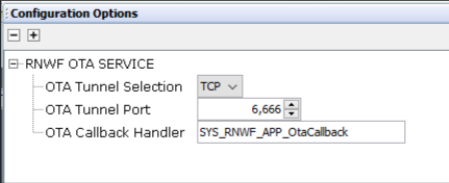
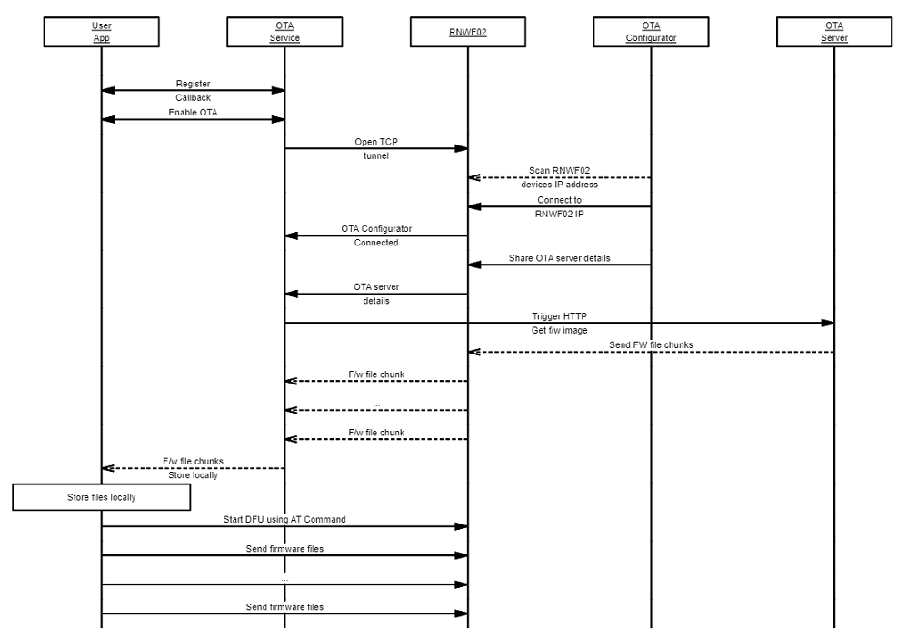

# Wi-Fi OTA Service Interface

The OTA service role is to enable the module firmware update over the network link. The OTA service has the HTTP based file download and RNWF02 Device Firmware Update \(DFU\) implementation. The OTA service open ups a TCP tunnel to receive the OTA server and firmware image details. Any device \(say PC or Mobile\) in the network can initiate the firmware download process. Once the OTA service receives all the necessary details, it starts downloading the firmware image and reports each downloaded chunk to user application over the callback. The user application needs to store the firmware in the local memory. After the successful download the user application can use the OTA service API's to flash new image into the RNWF02 module. The OTA service API call syntax is provided below:

``` {#CODEBLOCK_AJF_DVC_PYB .language-c}
SYS_RNWF_RESULT_t SYS_RNWF_OTA_SrvCtrl( SYS_RNWF_OTA_SERVICE_t request, void *input)
```

**OTA System Service Configuration in MCC**



-   **OTA Tunnel Selection:** Tunnel to receive the OTA server and Image details. Drop-down to select OTA Tunnel. Currently supports TCP only
-   **OTA Tunnel Port:** Configure OTA server port
-   **OTA Callback Handler:** Configure callback function name to handle OTA service events \(for example, downloading firmware binary from OTA server, erasing RNWF Flash before programming it with newly downloaded firmware image from server and perform RNWF Reset/Reboot with new firmware image\)

The following table provides the list of OTA services available:

<br />

|Option/Command|Input|Description|
|:-------------|:----|:----------|
|`SYS_RNWF_OTA_ENABLE`|Buffer of 4096 \(to align with DFU max write size\) bytes|Enable OTA service and opens a TCP tunnel to receive the OTA<br /> server and Image details|
|`SYS_RNWF_OTA_SET_CALLBACK`|Callback handler|Register callback function for the OTA service to report the<br /> status|
|`SYS_RNWF_OTA_DFU_INIT`|None|Generates the DFU pattern and places the RNWF module in firmware<br /> update mode|
|`SYS_RNWF_OTA_DFU_WRITE`|[chunk\_addr, chunk\_size, chunk\_ptr](GUID-D3C86805-5A5C-477E-9794-C8E14969C96D.md)|Writes the given chunk into the RNWF module. Max chunk size can<br /> be 4096 bytes.|
|`SYS_RNWF_OTA_DFU_ERASE`|[chunk\_addr, chunk\_size, chunk\_ptr](GUID-D3C86805-5A5C-477E-9794-C8E14969C96D.md)|Erases the provided size of memory \(chunk\_ptr can be<br /> NULL\)|

<br />

The following table captures the OTA Callback event codes and event data:

|Event|Response Component|Description|
|:----|:-----------------|:----------|
|`SYS_RNWF_EVENT_DWLD_START`|Total size of the image file to be downloaded|Given image file download has started|
|`SYS_RNWF_EVENT_DWLD_DONE`|Total size of downloaded Image file|Firmware download process completed, the application can<br /> initialize the DFU and start flle|
|`SYS_RNWF_EVENT_FILE_CHUNK`|[chunk\_addr, chunk\_size, chunk\_ptr](GUID-D3C86805-5A5C-477E-9794-C8E14969C96D.md)|Received image file chunk, the received data chunk should be<br /> saved in non-volatile memory|
|`SYS_RNWF_EVENT_DWLD_FAIL`|None|Firmware download failed|

The sequence chart for the OTA process is provided below:

<br />



<br />

The example code for OTA DFU is provided below:

``` {#CODEBLOCK_MKZ_CVS_CYB .language-c}

/* Wifi Callback Handler Function */
static void SYS_RNWF_WIFI_CallbackHandler
(
    SYS_RNWF_WIFI_EVENT_t event, 
    uint8_t *p_str
)
{
    switch(event)
    {
        /* Wifi Connected */
        case SYS_RNWF_CONNECTED:
        {
            SYS_CONSOLE_PRINT("Wi-Fi Connected\r\n");
            break;
        }
        
        /* Wifi Disconnected */
        case SYS_RNWF_DISCONNECTED:
        {    
            SYS_CONSOLE_PRINT("WiFi Disconnected\nReconnecting... \r\n");
            SYS_RNWF_WIFI_SrvCtrl(SYS_RNWF_STA_CONNECT, NULL);
            break;
        }
            
        /* DHCP IP allocated */
        case SYS_RNWF_DHCP_DONE:
        {
            SYS_CONSOLE_PRINT("DHCP IP:%s\r\n", &p_str[2]); 
            
            /* Enable OTA by passing the OTA buffer space */
            if(SYS_RNWF_OTA_SrvCtrl(SYS_RNWF_OTA_ENABLE, (void *)g_appBuf) == SYS_RNWF_PASS)
            {
                SYS_RNWF_OTA_DBG_MSG("Successfully Enabled the OTA\r\n");
            }
            else
            {
                SYS_RNWF_OTA_DBG_MSG("ERROR!!! Failed to enable the OTA\r\n");
            }
            break;
        }
        
        /* Wifi Scan Indication */
        case SYS_RNWF_SCAN_INDICATION:
        {
            break;
        }
            
        /* Wifi Scan Done */
        case SYS_RNWF_SCAN_DONE:
        {
            break;
        } 
        
        default:
        {
            break;
        }
    }    
}

/* OTA Callback Handler Function */
static void SYS_RNWF_OTA_CallbackHandler
(
    SYS_RNWF_OTA_EVENT_t event,
    void *p_str
)
{
    static uint32_t flash_addr = SYS_RNWF_OTA_FLASH_IMAGE_START;
    
    switch(event)
    {
        /* Change to UART mode */
        case SYS_RNWF_OTA_EVENT_MAKE_UART:
        {
            break;
        }
            
        /* FW Download start */
        case SYS_RNWF_OTA_EVENT_DWLD_START:
        {
            SYS_CONSOLE_PRINT("Total Size = %lu\r\n", *(uint32_t *)p_str); 
            SYS_CONSOLE_PRINT("Erasing the SPI Flash\r\n");
            
            SYS_RNWF_OTA_FlashErase();
            SYS_CONSOLE_PRINT("Erasing Complete!\r\n"); 
            break;
        }
        
        /* FW Download done */
        case SYS_RNWF_OTA_EVENT_DWLD_DONE:
        {       
            g_appImgSize = *(uint32_t *)p_str;  
            SYS_CONSOLE_PRINT("Download Success!= %lu bytes\r\n", g_appImgSize);  
            
            break; 
        }
              
        /* Write to SST26 */
        case SYS_RNWF_OTA_EVENT_FILE_CHUNK:
        {
            volatile SYS_RNWF_OTA_CHUNK_t *ota_chunk = (SYS_RNWF_OTA_CHUNK_t *)p_str;               
            SYS_RNWF_OTA_FlashWrite(flash_addr,ota_chunk->chunk_size ,ota_chunk->chunk_ptr);
            flash_addr += ota_chunk->chunk_size;
            break; 
        }    
                           
        default:
        {
            break;
        }
    }
    
}

// *****************************************************************************
// *****************************************************************************
// Section: Application Initialization and State Machine Functions
// *****************************************************************************
// *****************************************************************************
/*******************************************************************************
  Function:
    void APP_Initialize ( void )

  Remarks:
    See prototype in app.h.
 */

void APP_Initialize 
( 
    void 
)
{
    /* Place the App state machine in its initial state. */
    g_appData.state = APP_STATE_INITIALIZE;
}

// *****************************************************************************
// *****************************************************************************
// Section: Application Local Functions
// *****************************************************************************
// *****************************************************************************

void APP_RNWF_SwResetHandler
(
    void
)
{
    /* RNWF Reset */
    SYS_RNWF_OTA_DfuReset();
    
    /* Manual Delay to synchronise host reset. User can change according to their Host reset timing*/
    for(int i=0; i< 0xFFFFF; i++)
    {
        SYS_CONSOLE_PRINT("");
    }
    
    /* Host Reset */
    SYS_RESET_SoftwareReset();
}


/* Maintain the application's state machine. */
void APP_Tasks 
( 
    void 
)
{
    switch(g_appData.state)
    {
        /* Initialize Flash and RNWF device */
        case APP_STATE_INITIALIZE:
        {
            SYS_CONSOLE_PRINT("%s", "##############################################\r\n");
            SYS_CONSOLE_PRINT("%s", "  Welcome RNWF02 WiFi Host Assisted OTA Demo  \r\n");
            SYS_CONSOLE_PRINT("%s", "##############################################\r\n\r\n"); 
            
            if(false == SYS_RNWF_OTA_FlashInitialize())
            {
                SYS_CONSOLE_PRINT("ERROR : No valid SPI Flash found!\r\n\tConnect SPI MikroBus(SST26) to EXT2 and reset!\r\n");
                g_appData.state = APP_STATE_ERROR;
                break;
            }
            
            /* Initialize RNWF Module */
            SYS_RNWF_IF_Init();
            
            g_appData.state = APP_STATE_GET_DEV_INFO;
            break;
        }
        
        /* Get RNWF device Information */
        case APP_STATE_GET_DEV_INFO:
        {
            
            if (SYS_RNWF_SYSTEM_SrvCtrl( SYS_RNWF_SYSTEM_SW_REV, g_appBuf) != SYS_RNWF_PASS)
            {
                /* Check if Flash has the New FW pre loaded in it */
                SYS_RNWF_OTA_HDR_t otaHdr;
                SYS_RNWF_OTA_FlashRead(SYS_RNWF_OTA_FLASH_IMAGE_START, sizeof(SYS_RNWF_OTA_HDR_t), (uint8_t *)&otaHdr.seq_num);
                
                SYS_CONSOLE_PRINT("Image details in the Flash\r\n");
                SYS_CONSOLE_PRINT("Sequence Number 0x%X\r\n", (unsigned int)otaHdr.seq_num);
                SYS_CONSOLE_PRINT("Start Address 0x%X\r\n", (unsigned int)otaHdr.start_addr);
                SYS_CONSOLE_PRINT("Image Length 0x%X\r\n", (unsigned int)otaHdr.img_len);
                
                if(otaHdr.seq_num != 0xFFFFFFFF && otaHdr.start_addr != 0xFFFFFFFF && otaHdr.img_len != 0xFFFFFFFF)               
                {        
                    g_appImgSize = otaHdr.img_len;
                    /* Program RNWF with pre loaded FW in Flash*/
                    g_appData.state = APP_STATE_PROGRAM_DFU;
                    break;
                }
                SYS_CONSOLE_PRINT("Error: Module is Bricked!");
                
                g_appData.state = APP_STATE_ERROR;
                break;
            }
            else
            {
                if(g_appBuf[0] == '\0')
                {
                    SYS_CONSOLE_PRINT("ERROR : No RNWF02 module found\r\n\tConnect RNWF02 module to EXT1 and reset\r\n");
                    g_appData.state = APP_STATE_ERROR;
                    break;
                }
                
                SYS_CONSOLE_PRINT("Software Revision: %s\r\n",g_appBuf);
            }
            
            /* Get RNWF device Information */
            SYS_RNWF_SYSTEM_SrvCtrl(SYS_RNWF_SYSTEM_DEV_INFO, g_appBuf);
            SYS_CONSOLE_PRINT("Device Info: %s\r\n", g_appBuf);
            
            /* Get RNWF device Wi-Fi Information*/
            SYS_RNWF_SYSTEM_SrvCtrl(SYS_RWWF_SYSTEM_GET_WIFI_INFO, g_appBuf);
            SYS_CONSOLE_PRINT("%s\r\n\n", g_appBuf);
            
            g_appData.state = APP_STATE_REGISTER_CALLBACK;
            break;
        }
        
        /* Register the Callbacks with Services */
        case APP_STATE_REGISTER_CALLBACK:
        {
            /* Configure SSID and Password for STA mode */
            SYS_RNWF_WIFI_PARAM_t wifi_sta_cfg = {SYS_RNWF_WIFI_MODE_STA, SYS_RNWF_WIFI_STA_SSID, SYS_RNWF_WIFI_STA_PWD, SYS_RNWF_STA_SECURITY, 1};
            SYS_CONSOLE_PRINT("Connecting to %s\r\n",SYS_RNWF_WIFI_STA_SSID);
            
            /* Register Callback with Wifi Service */
            SYS_RNWF_WIFI_SrvCtrl(SYS_RNWF_WIFI_SET_CALLBACK, SYS_RNWF_WIFI_CallbackHandler);
            SYS_RNWF_WIFI_SrvCtrl(SYS_RNWF_SET_WIFI_PARAMS, &wifi_sta_cfg);
    
            /* Register Callback with OTA Service */
            SYS_RNWF_OTA_SrvCtrl(SYS_RNWF_OTA_SET_CALLBACK, (void *)SYS_RNWF_OTA_CallbackHandler);
            
            g_appData.state = APP_STATE_WAIT_FOR_DOWNLOAD;
            break;
        }
        
        /* Wait for Download to complete */
        case APP_STATE_WAIT_FOR_DOWNLOAD:
        {
            bool isDownloadDone = false;
            SYS_RNWF_OTA_SrvCtrl(SYS_RNWF_OTA_CHECK_DWLD_DONE,(void *)&isDownloadDone);
            
            if (isDownloadDone == true)
            {
                g_appData.state = APP_STATE_PROGRAM_DFU;
            }
            break;
        }
        
        /* Program the RNWF device with New FW */
        case APP_STATE_PROGRAM_DFU:
        {
            bool OtaDfuComplete = false;
            
            SYS_RNWF_OTA_ProgramDfu(); 
            SYS_RNWF_OTA_SrvCtrl ( SYS_RNWF_OTA_CHECK_DFU_DONE, (void *)&OtaDfuComplete);
            
            if(OtaDfuComplete == true )
            {
                g_appData.state = APP_STATE_RESET_DEVICE;
            }
            break;
        }
        
        /* Reset RNWF device and Host */
        case APP_STATE_RESET_DEVICE:
        {
            APP_RNWF_SwResetHandler();
            
            break;
        }
        
        /* Application Error State */
        case APP_STATE_ERROR:
        {
            SYS_CONSOLE_PRINT("ERROR : APP Error\r\n");
            g_appData.state = APP_STATE_IDLE;
            break;
        }
        
        /* Application Idle state */
        case APP_STATE_IDLE:
        {
            break;
        }
        
        /* Default state */
        default:
        {
            break;
        }
    }
    
    /* Console Tasks */
    SYS_CONSOLE_Tasks(sysObj.sysConsole0);
    
    /* Interface Event Handler */
    SYS_RNWF_IF_EventHandler();
}

```

The data types used for the OTA service are provided below:

-   [OTA Modes Enum](GUID-D3C86805-5A5C-477E-9794-C8E14969C96D.md#GUID-EA13EBB2-7D50-44B9-96EA-60C931285A12)
-   [OTA Service Enum](GUID-D3C86805-5A5C-477E-9794-C8E14969C96D.md)
-   [OTA Event Enum](GUID-D3C86805-5A5C-477E-9794-C8E14969C96D.md)
-   [OTA Chunk Header Struct](GUID-D3C86805-5A5C-477E-9794-C8E14969C96D.md#GUID-ED2A0620-6B66-4906-A029-D4B3BA9C024D)


