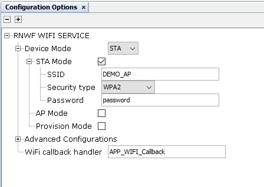
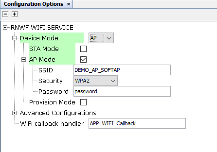
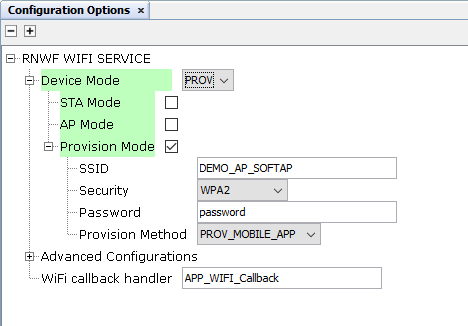
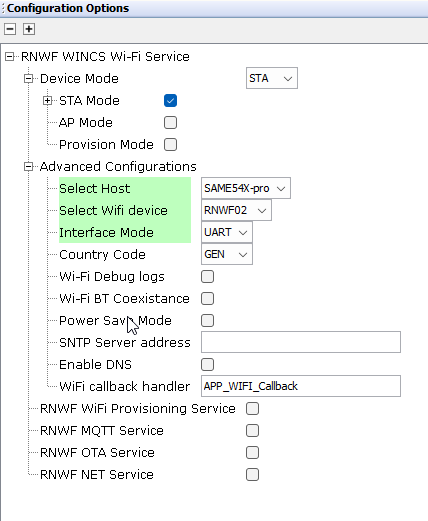
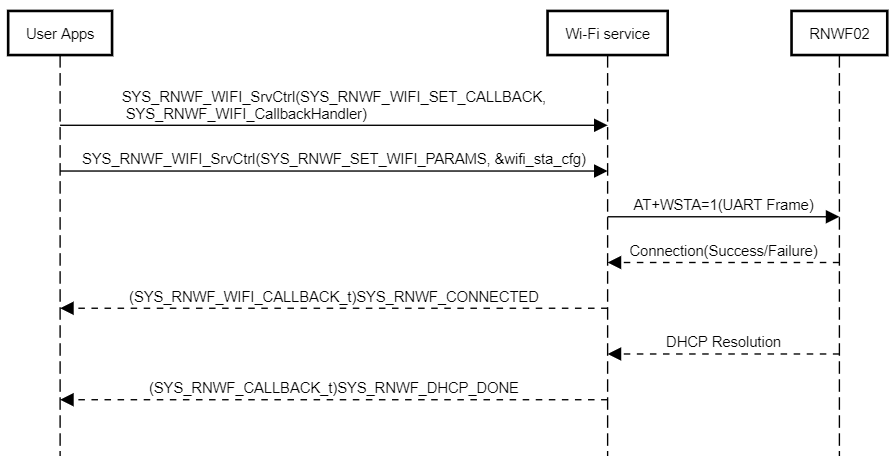
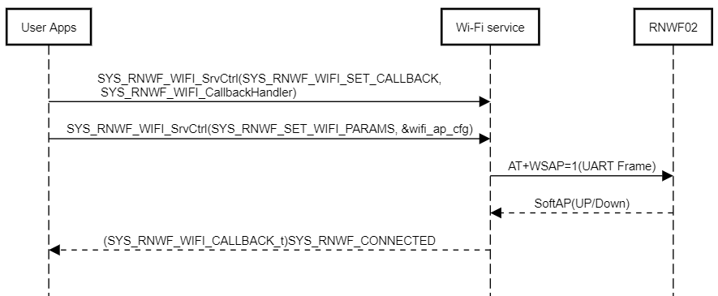
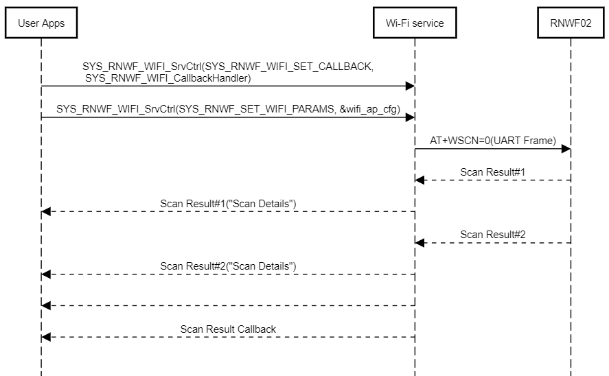

# Wi-Fi Service

The Wi-Fi service provides API’s to enable the following features:

1.  Station mode
2.  Soft AP mode

This section allows Wi-Fi service configuration as mentioned below:

-   **Wi-Fi Modes:** Drop-down to select Wi-Fi modes.

    Available options are:
    -   StationMode
    -   ProvisionMode
    -   SoftAPmode
-   **Provision Method:** Drop-down to select Wi-Fi Provisioning method.

    Available options are:
    -   Mobile App
    -   Web Server
-   **SSID:** Wi-Fi Access Point/Network Name
-   **Passphrase:** Wi-Fi Access point/Network password
-   **Security Type:** Wi-Fi security protocol
-   **Auto Connect :** Enable to automatically connect to the AP when the device is in station mode.
-   **Country code :** Drop-down to select Country code.
    -	GEN
    -	USA
    -	EMEA
-   **Wi-Fi  BT Coexistence  :** Select to enable BT/Wi-Fi coexistence arbiter.
    -  **Interface Type :** Drop-down to select Interface type
        - 	3-wire interface (BT_Act, BT_Prio, WLAN_Act)
        -   2-wire interface (BT_Prio, WLAN_Act)
    -   **WLAN Rx priority higher than BT Low Priority :** Select to give WLAN Rx higher priority.
    -   **WLAN Tx priority higher than BT Low Priority :** Select to give WLAN Tx higher priority.
    -   **Antenna type :**  Drop-down to select antenna type
        - 	Dedicated antenna
        -   Shared antenna
    -   **Power save mode :** Select to enable power save mode.
    -   **SNTP Server address :**  SNTP server IP address.
    -   **Ping :** Select to enable ping functionality.
        -   **Ping Address :** Provide IPv4 or IPv6 Ping address.
    -   **Interface Debug logs :** Select to get interface debug logs.
-   **WiFi-Callback Handler:** Configure callback function name to handle Wi-Fi service specific events \(for example, Wi-Fi STA connection and disconnection, DHCP resolution, Wi-Fi Scan indication\)

    **Wi-Fi System Service Configuration in MCC**

    <br />

    1.  <br />

        

        <br />

    2.  

    3.  

    4.  

    <br />


The Wi-Fi Service API prototype is as follows:

``` {#CODEBLOCK_C2D_2JJ_MYB .language-c}
SYS_RNWF_RESULT_t SYS_RNWF_WIFI_SrvCtrl( SYS_RNWF_WIFI_SERVICE_t request, void *input)
```

It handles following services and reports the result to application over the return code or through the registered callback.

|Option/Command|Input|Description|
|:-------------|:----|:----------|
|`SYS_RNWF_SET_WIFI_PARAMS`| Mode, SSID, Passphrase, Security, Autoenable | Configures the provided Wi-Fi details and Triggers the connection<br /> based on auto enable flag|
|`SYS_RNWF_STA_CONNECT`|None|Triggers the Wi-Fi STA connection|
|`SYS_RNWF_STA_DISCONNECT`|None|Disconnects the connection|
|`SYS_RNWF_AP_DISABLE`|None|Disables the SoftAP mode|
|`SYS_RNWF_SET_WIFI_AP_CHANNEL`|Channel number|Configure the Wi-Fi channel|
|`SYS_RNWF_SET_WIFI_BSSID`|BSSID of AP \(String\)|Configure the Access point's BSSID to which RNWF needs to connect|
| `SYS_RNWF_SET_WIFI_TIMEOUT,`|Seconds \(int\)|Configure Wi-Fi connection timeout|
|`SYS_RNWF_SET_WIFI_HIDDEN,`|true or false|Configure Hidden mode SSID in SoftAP mode|
|`SYS_RNWF_WIFI_PASSIVE_SCAN`|None|Request/Trigger Wi-Fi passive scan|
|`SYS_RNWF_WIFI_ACTIVE_SCAN`|None|Request/Trigger Wi-Fi active scan|
|`SYS_RNWF_WIFI_SET_CALLBACK`|Callback Function handler|Register the call back for async events|
|`SYS_RNWF_GET_WIFI_CONF_INFO`|None|Get WiFi config information|
|`SYS_RNWF_WIFI_SET_SRVC_CALLBACK`|Callback function handler|Register a callback for async events|
|`SYS_RNWF_WIFI_GET_CALLBACK`|Callback function handler|Get Callback function data|
|`SYS_RNWF_WIFI_SET_REGULATORY_DOMAIN`|Country Code|Set the Country Code|
|`SYS_RNWF_WIFI_ENABLE_POWERSAVE_MODE`|true/false|Enable/disable the power save mode|
|`SYS_RNWF_WIFI_BT_COEX_ENABLE`|Enable/disable,Interface type.wlan_rx_priority,wlan_tx_priority,antenna_mode|Configures the provided WiFi+BT details and enable|
|`SYS_RNWF_WIFI_PING`|Ping IP|Ping to given IP|
|`SYS_RNWF_WIFI_DNS`|URL|Resolves DNS|
||||

The following list captures the Wi-Fi callback event codes and their arguments

|Event|Response Components|Comments|
|:----|:------------------|:-------|
|`SYS_RNWF_CONNECTED`|Association ID: IntegerConnected State: Integer|Wi-Fi connected event code. Reports the connection's Association ID and connected state|
|`SYS_RNWF_DISCONNECTED`|Association ID: IntegerConnected State: Integer|Wi-Fi disconnected event code|
|`SYS_RNWF_CONNECT_FAILED`|Fail event code: Integer|Wi-Fi connection failure event code|
|`SYS_RNWF_DHCP_DONE`|DHCP IP: String|Wi-Fi DHCP complete event code|
|`SYS_RNWF_SCAN_INDICATION`|RSSI: Received signal strength Sec Type \(Int\): Recommended security type to use connecting to this AP \(10 options\)Channel \(Int\): Channel \# of device<br />BSSID \(String\): BSSID of detected device<br />SSID \(String\): SSID of detected device|Scan results to report each scan list|
|`SYS_RNWF_SCAN_DONE`|None|Scan complete event code|
|`SYS_RNWF_IPv4_DHCP_DONE`|DHCP IPv4: String|Scan complete event code|
|`SYS_RNWF_IPv6_DHCP_DONE`|DHCP IPv6: String|Scan complete event code|
|`SYS_RNWF_WIFI_PING_RESP`|IP_ADDRESS : IP address of the target,RTT: Round trip time in milliseconds|Scan complete event code|
|`SYS_RNWF_SNTP_UP`|ID : Parameter ID numberVAL: Parameter value|Scan complete event code|
|`SYS_RNWF_WIFI_DNS_RESP`|IP address|DNS Resolve Event code|
|||

The following figure illustrates the Station mode connection sequence

<br />



<br />

<br />



<br />

<br />

<br />



<br />

<br />

Following is the example of establishing connection in the Station mode

<br />

``` {#CODEBLOCK_JWD_FBL_JYB .language-c}
#include <string.h>
#include <stdio.h>
#include <stddef.h>                    
#include <stdbool.h>                  
#include <stdlib.h>   

/* This section lists the other files that are included in this file.*/
#include "app.h"
#include "user.h"
#include "definitions.h"
#include "configuration.h"
#include "system/debug/sys_debug.h"
#include "system/wifi/sys_rnwf_wifi_service.h"
#include "system/inf/sys_rnwf_interface.h"

/* Variable to check the UART transfer */
static volatile bool g_isUARTTxComplete = true,isUART0TxComplete = true;;

/*Shows the he application's current state*/
static APP_DATA g_appData;


/* DMAC Channel Handler Function */
static void APP_RNWF_usartDmaChannelHandler(DMAC_TRANSFER_EVENT event, uintptr_t contextHandle)
{
    if (event == DMAC_TRANSFER_EVENT_COMPLETE)
    {
        g_isUARTTxComplete = true;
    }
}


/* Application Wi-fi Callback Handler function */
void SYS_RNWF_WIFI_CallbackHandler(SYS_RNWF_WIFI_EVENT_t event, uint8_t *p_str)
{
            
    switch(event)
    {
        /* SNTP UP event code*/
        case SYS_RNWF_SNTP_UP:
        {            
            SYS_CONSOLE_PRINT("SNTP UP:%s\n", &p_str[0]); 
            break;
        }
        
        /* Wi-Fi connected event code*/
        case SYS_RNWF_CONNECTED:
        {
            SYS_CONSOLE_PRINT("Wi-Fi Connected    \r\n");
            break;
        }
        
        /* Wi-Fi disconnected event code*/
        case SYS_RNWF_DISCONNECTED:
        {
            SYS_CONSOLE_PRINT("Wi-Fi Disconnected\nReconnecting... \r\n");
            SYS_RNWF_WIFI_SrvCtrl(SYS_RNWF_STA_CONNECT, NULL);
            break;
        }
        
        /* Wi-Fi DHCP complete event code*/
        case SYS_RNWF_IPv4_DHCP_DONE:
        {
            SYS_CONSOLE_PRINT("DHCP Done...%s \r\n",&p_str[2]); 
            break;
        }
        
        /* Wi-Fi IPv6 DHCP complete event code*/
        case SYS_RNWF_IPv6_DHCP_DONE:
        {
            SYS_CONSOLE_PRINT("IPv6 DHCP Done...%s \r\n",&p_str[2]); 
            break;
        }
        
        /* Wi-Fi scan indication event code*/
        case SYS_RNWF_SCAN_INDICATION:
        {
            break;
        }
         
        /* Wi-Fi scan complete event code*/
        case SYS_RNWF_SCAN_DONE:
        {
            break;
        }
        default:
            break;             
    }    
}


/* Application Initialization function */
void APP_Initialize ( void )
{
    /* Place the Application state machine in its initial state. */
    g_appData.state = APP_STATE_INITIALIZE;
}

/* Maintain the application's state machine.*/
void APP_Tasks ( void )
{
    
    switch(g_appData.state)
    {
        /* Application's state machine's initial state. */
        case APP_STATE_INITIALIZE:
        {
            DMAC_ChannelCallbackRegister(DMAC_CHANNEL_0, APP_RNWF_usartDmaChannelHandler, 0);
            SYS_RNWF_IF_Init();
            
            g_appData.state = APP_STATE_REGISTER_CALLBACK;
            SYS_CONSOLE_PRINT("Start Of Application\r\n");
            break;
        }
        
        /* Register the necessary callbacks */
        case APP_STATE_REGISTER_CALLBACK:
        {      
              
            /* RNWF Application Callback register */
            SYS_RNWF_WIFI_SrvCtrl(SYS_RNWF_WIFI_SET_CALLBACK, SYS_RNWF_WIFI_CallbackHandler);      
          
            /* Wi-Fii Connectivity */
            SYS_RNWF_WIFI_PARAM_t wifi_sta_cfg = {RNWF_WIFI_DEVMODE, SYS_RNWF_WIFI_STA_SSID, SYS_RNWF_WIFI_STA_PWD, SYS_RNWF_STA_SECURITY, SYS_RNWF_WIFI_STA_AUTOCONNECT};  
            SYS_CONSOLE_PRINT("Connecting to %s\r\n",SYS_RNWF_WIFI_STA_SSID);
            SYS_RNWF_WIFI_SrvCtrl(SYS_RNWF_SET_WIFI_PARAMS, &wifi_sta_cfg);

            g_appData.state = APP_STATE_TASK;
            break;
        }
        
        /* Run Event handler */
        case APP_STATE_TASK:
        {
            SYS_RNWF_IF_EventHandler();
            break;
        }
        
        default:
        {
            break;
        }
    }
}
```

