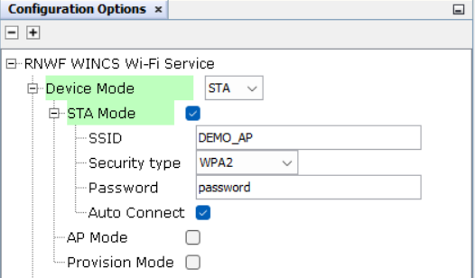
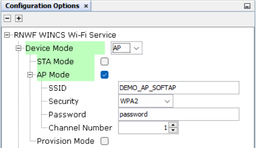
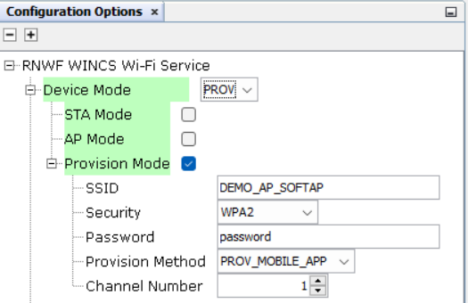
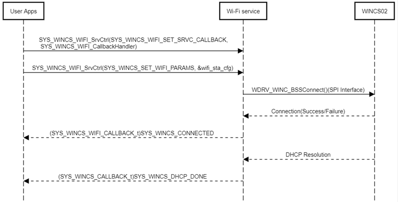
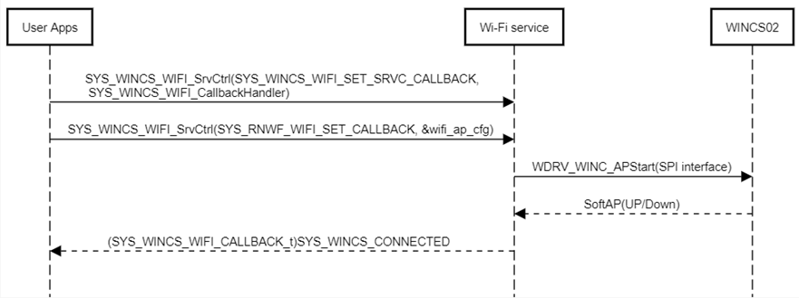
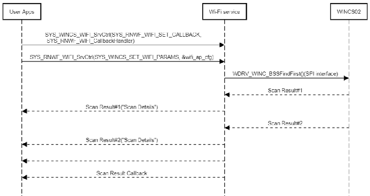

# Wi-Fi Service

<br />

The MPLAB Code Configurator \(MCC\) allows Wi-Fi service configuration as mentioned below

1.  Station mode
2.  Soft AP mode

    RNWF WINCS Wi-Fi Service 
    <br />
    

This section allows Wi-Fi service configuration as mentioned below:

-   **Wi-Fi Modes:** Drop-down to select Wi-Fi modes.

    Available<br /> options are:

    -   StationMode
    -   ProvisionMode
    -   SoftAPmode
-   **Provision Method:** Drop-down to select Wi-Fi Provisioning method.

    Available options are:

    -   Mobile App
-   **SSID:** Wi-Fi Access Point/Network Name
-   **Passphrase:** Wi-Fi Access point/Network password
-   **Security Type:** Wi-Fi security protocol
-   **Auto Connect :** Enable to automatically connect to the AP when the device is in station mode.\\
-   **Provision Callback Handler:** Configure callback function name for Wi-Fi Provisioning states \(Applicable only if selected Wi-Fi Mode is ProvisionMode\)
-   **Country code :** Drop-down to select Country code.
    -   GEN
    -   USA
    -   EMEA
    ```
    After selecting desired for country code setting, user need to call API (SYS_WINCS_WIFI_SrvCtrl) with parameter (SYS_WINCS_WIFI_SET_REG_DOMAIN) from the application code. 
    Eg. SYS_WINCS_WIFI_SrvCtrl(SYS_WINCS_WIFI_SET_REG_DOMAIN, SYS_WINCS_WIFI_COUNTRYCODE)
    ```
-   **Certificates & Key Print:** Select to print the Certificates & Keys present in device. User need to call API (SYS_WINCS_SYSTEM_SrvCtrl) with parameter (SYS_WINCS_SYSTEM_GET_CERT_LIST,NULL)for certificate and (SYS_WINCS_SYSTEM_GET_KEY_LIST,NULL) for keys from the application code.
-   **Wi-Fi BT Coexistence :** Select to enableBT/Wi-Fi coexistence arbiter
    -   **Interface Type :** Drop-down to select Interface type
        -   3-wire interface \(BT\_Act, BT\_Prio, WLAN\_Act\)
        -   2-wire interface \(BT\_Prio, WLAN\_Act\)
    -   **WLAN Rx priority higher than BT Low Priority :** Select to give WLAN Rx higher priority.
    -   **WLAN Tx priority higher than BT Low Priority :** Select to give WLAN Tx higher priority.
    -   **Antenna type :** Drop-down to select antenna type
        -   Dedicated antenna
        -   Shared antenna
-   **Power save mode :** Select to enable power save mode.
-   **SNTP Server address :** SNTP server IP address or URL.
-   **Ping :** Select to enable ping functionality.
    -   **Ping Address :** Provide IPv4 or IPv6 Ping address.
-   **Resolve DNS :** Select to enable the DNS resolve functionality.
-   **Wi-Fi Debug logs :** Enable to get Wi-Fi debug logs
-   **WiFi-Callback Handler:** Configure callback function name to handle Wi-Fi service specific events \(for example, Wi-Fi STA connection and disconnection, DHCP resolution, Wi-Fi Scan indication\)

**Wi-Fi System Service MCC Configuration**

<br />



<br />

<br />



<br />

<br />



<br />

The Wi-Fi Service API prototype is as follows:

``` {#GUID-CE9CEDFD-5FD4-4BC4-AB96-17647C430816_CODEBLOCK_C2D_2JJ_MYB}
SYS_WINCS_RESULT_t SYS_WINCS_WIFI_SrvCtrl( SYS_WINCS_WIFI_SERVICE_t request, SYS_WINCS_WIFI_HANDLE_t wifiHandle);
```

It handles following services and reports the result to application over the return code or through the registered callback.

|Option/Command|Input|Description|
|--------------|-----|-----------|
|`SYS_WINCS_SET_WIFI_PARAMS`| SYS_WINCS_WIFI_PARAM_t structure|Configures the provided Wi-Fi details and Triggers the connection based on auto enable flag|
|`SYS_WINCS_WIFI_STA_CONNECT`|None|Triggers the Wi-Fi STA connection|
|`SYS_WINCS_WIFI_STA_DISCONNECT`|None|Disconnects the connection|
|`SYS_WINCS_WIFI_AP_DISABLE`|None|Disables the SoftAP mode|
|`SYS_WINCS_WIFI_SET_WIFI_AP_CHANNEL`|Channel number|Configure the Wi-Fi channel|
|`SYS_WINCS_WIFI_SET_WIFI_BSSID`|BSSID of AP \(String\)|Configure the Access point's BSSID to which WINCS02 needs to<br /> connect|
|`SYS_WINCS_WIFI_GET_DRV_STATUS`|None|Request driver status|
|`SYS_WINCS_WIFI_OPEN_DRIVER`|Empty DRV_HANDLE|Request to open wincs02|
|`SYS_WINCS_WIFI_GET_DRV_HANDLE`|empty DRV_HANDLE|Request Driver Handle|
|`SYS_WINCS_WIFI_GET_TIME`|None|Get Time through callback event SYS_WINCS_WIFI_SNTP_UP|
|`SYS_WINCS_WIFI_SET_SNTP`|URL/ IP address|Set SNTP Conf|
|`SYS_WINCS_WIFI_BT_COEX_CONFG`|SYS_WINCS_WIFI_COEX_CFG_t structure|Set Wifi BT Confg|
|`SYS_WINCS_WIFI_BT_COEX_ENABLE`|true/false|Enable/Disable Wifi BT confg|
|`SYS_WINCS_WIFI_SET_WIFI_HIDDEN,`|true or false|Configure Hidden mode SSID in SoftAP mode|
|`SYS_WINCS_WIFI_PASSIVE_SCAN`|SYS_WINCS_WIFI_SCAN_PARAM_t  structure|Request/Trigger Wi-Fi passive scan|
|`SYS_WINCS_WIFI_ACTIVE_SCAN`|SYS_WINCS_WIFI_SCAN_PARAM_t  structure|Request/Trigger Wi-Fi active scan|
|`SYS_WINCS_WIFI_SET_REG_DOMAIN`|Country code string Ex: "GEN"|Set the country code|
|`SYS_WINCS_WIFI_SET_SRVC_CALLBACK`|Callback function handler|Register a callback for async events|
|`SYS_WINCS_WIFI_GET_CALLBACK`|Callback function handler|Get Callback function data|
|`SYS_WINCS_WIFI_PING`|Ping IP|Ping to given IP address|
|`SYS_WINCS_WIFI_DNS_RESOLVE`|URL|DNS Resolve|
|`SYS_WINCS_WIFI_SET_CALLBACK`|Callback Function handler|Register the call back for async events|

The following list captures the Wi-Fi callback event codes and their arguments

<br />

|**Event**|**Response Components**|Comments|
|---------|-----------------------|--------|
|`SYS_WINCS_WIFI_CONNECTED`|Association ID: IntegerConnected State: Integer|Wi-Fi connected event code. Reports the connection's Association ID and connected state|
|`SYS_WINCS_WIFI_DISCONNECTED`|Association ID: IntegerConnected State: Integer|Wi-Fi disconnected event code|
|`SYS_WINCS_CONNECT_FAILED`|NULL|Wi-Fi connection failure event code|
|`SYS_WINCS_WIFI_DHCP_IPV4_COMPLETE`|DHCP IPv4: String|Wi-Fi DHCP complete event|
|`SYS_WINCS_WIFI_DHCP_IPV6_LOCAL_DONE`| DHCP IPv6 local: String|Wi-Fi local DHCP complete event code|
|`SYS_WINCS_WIFI_DHCP_IPV6_GLOBAL_DONE`| DHCP IPv6 global: String|Wi-Fi global DHCP complete event code|
|`SYS_WINCS_SNTP_UP`|Time|SNTP UTC time|
|`SYS_WINCS_DNS_RESOLVED`|IP address|DNS Resolve event code|
|`SYS_WINCS_SCAN_INDICATION`|NULL|Set regulatory domain Acknowledge|
|`SYS_WINCS_SCAN_DONE`|None|Scan complete event code|

<br />

<br />

The following figure illustrates the Station mode connection sequence

<br />



<br />

<br />



<br />

<br />



<br />

Following is the example of provision mode,

<br />

``` {#CODEBLOCK_KHT_GNV_QBC}
// *****************************************************************************
// *****************************************************************************
// Section: Included Files
// *****************************************************************************
// *****************************************************************************

#include <stdint.h>
#include <stdbool.h>
#include <stddef.h>
#include <stdlib.h>
#include <time.h>
#include "configuration.h"
#include "driver/driver_common.h"

#include "app_wincs02.h"
#include "system/system_module.h"
#include "system/console/sys_console.h"
#include "system/wifi/sys_wincs_wifi_service.h"
#include "system/sys_wincs_system_service.h"
#include "system/net/sys_wincs_net_service.h"

// *****************************************************************************
// *****************************************************************************
// Section: Global Data Definitions
// *****************************************************************************
// *****************************************************************************

// *****************************************************************************
/* Application Data

  Summary:
    Holds application data

  Description:
    This structure holds the application's data.

  Remarks:
    This structure should be initialized by the APP_Initialize function.

    Application strings and buffers are be defined outside this structure.
*/

APP_DATA g_appData;


// Define and initialize a TCP client socket configuration from MCC
SYS_WINCS_NET_SOCKET_t g_tcpClientSocket = {
    // Specify the type of binding for the socket
    .bindType = SYS_WINCS_NET_BIND_TYPE0,
    // Set the socket address to the predefined server address
    .sockAddr = SYS_WINCS_NET_SOCK_SERVER_ADDR0,
    // Define the type of socket (e.g., TCP, UDP)
    .sockType = SYS_WINCS_NET_SOCK_TYPE0,
    // Set the port number for the socket
    .sockPort = SYS_WINCS_NET_SOCK_PORT0,
    // Enable or disable TLS for the socket
    .tlsEnable = SYS_WINCS_TLS_ENABLE0,
    // Specify the IP type (e.g., IPv4, IPv6)
    .ipType  = SYS_WINCS_NET_SOCK_TYPE_IPv4_0,
};

// *****************************************************************************
// *****************************************************************************
// Section: Application Callback Functions
// *****************************************************************************
// *****************************************************************************


/* TODO:  Add any necessary callback functions.
*/

// *****************************************************************************
// Application NET Socket Callback Handler
//
// Summary:
//    Handles NET socket events.
//
// Description:
//    This function handles various NET socket events and performs appropriate actions.
//
// Parameters:
//    socket - The socket identifier
//    event - The type of socket event
//    netHandle - Additional data or message associated with the event
//
// Returns:
//    None.
//
// Remarks:
//    None.
// *****************************************************************************
void SYS_WINCS_NET_SockCallbackHandler
(
    uint32_t socket,                    // The socket identifier
    SYS_WINCS_NET_SOCK_EVENT_t event,   // The type of socket event
    SYS_WINCS_NET_HANDLE_t netHandle    // Additional data or message associated with the event
) 
{
    if(socket == g_tcpClientSocket.sockID)
    {
        switch(event)
        {
            /* Net socket connected event code*/
            case SYS_WINCS_NET_SOCK_EVENT_CONNECTED:    
            {
                SYS_CONSOLE_PRINT(TERM_GREEN"[APP] : Connected to Server!\r\n"TERM_RESET );
                break;
            }

            /* Net socket disconnected event code*/
            case SYS_WINCS_NET_SOCK_EVENT_DISCONNECTED:
            {
                SYS_CONSOLE_PRINT(TERM_RED"[APP] : Socket DisConnected!\r\n"TERM_RESET);
                SYS_WINCS_NET_SockSrvCtrl(SYS_WINCS_NET_SOCK_CLOSE, &socket);
                break;
            }

            /* Net socket error event code*/
            case SYS_WINCS_NET_SOCK_EVENT_ERROR:
            {
                SYS_CONSOLE_PRINT(TERM_RED"[APP ERROR] : Socket Error\r\n"TERM_RESET);
                break;
            }

            /* Net socket read event code*/
            case SYS_WINCS_NET_SOCK_EVENT_READ:
            {         
                uint8_t rx_data[64];
                int16_t rcvd_len = 64;
                memset(rx_data,0,64);

                // Read data from the TCP socket
                if((rcvd_len = SYS_WINCS_NET_TcpSockRead(socket, SYS_WINCS_NET_SOCK_RCV_BUF_SIZE, rx_data)) > 0)
                {
                    rcvd_len = strlen((char *)rx_data);
                    rx_data[rcvd_len] = '\n';
                    SYS_CONSOLE_PRINT(TERM_YELLOW"Received ->%s\r\n"TERM_RESET, rx_data);

                    // Write the received data back to the TCP socket
                    if (SYS_WINCS_FAIL == SYS_WINCS_NET_TcpSockWrite(socket, rcvd_len, rx_data))
                    {
                        g_appData.state = APP_STATE_WINCS_ERROR;
                    }
                }    
                break;
            }
            case SYS_WINCS_NET_SOCK_EVENT_CLOSED:
            {
                SYS_CONSOLE_PRINT(TERM_RED"[APP] : Socket CLOSED -> socketID: %d\r\n"TERM_RESET,socket);
                break;
            }

            case SYS_WINCS_NET_SOCK_EVENT_TLS_DONE:    
            {
                SYS_CONSOLE_PRINT("[APP] : TLS ->Connected to Server!\r\n" );
                break;
            }

            default:
                break;                  
        }   
    }
    /* TODO:  Add if conditions for any more sockets.
    */
}


// *****************************************************************************
// Application Wi-Fi Callback Handler
//
// Summary:
//    Handles Wi-Fi events.
//
// Description:
//    This function handles various Wi-Fi events and performs appropriate actions.
//
// Parameters:
//    event - The type of Wi-Fi event
//    wifiHandle - Handle to the Wi-Fi event data
//
// Returns:
//    None.
//
// Remarks:
//    None.
// *****************************************************************************
void SYS_WINCS_WIFI_CallbackHandler
(
    SYS_WINCS_WIFI_EVENT_t event,         // The type of Wi-Fi event
    SYS_WINCS_WIFI_HANDLE_t wifiHandle    // Handle to the Wi-Fi event data
)
{

    switch(event)
    {
        /* Set regulatory domain Acknowledgment */
        case SYS_WINCS_WIFI_REG_DOMAIN_SET_ACK:
        {
            // The driver generates this event callback twice, hence the if condition 
            // to ignore one more callback. This will be resolved in the next release.
            static bool domainFlag = false;
            if( domainFlag == false)
            {
                SYS_CONSOLE_PRINT("Set Reg Domain -> SUCCESS\r\n");
                g_appData.state = APP_STATE_WINCS_SET_WIFI_PARAMS;
                domainFlag = true;
            }
            
            break;
        } 
        
        /* SNTP UP event code*/
        case SYS_WINCS_WIFI_SNTP_UP:
        {            
            SYS_CONSOLE_PRINT("[APP] : SNTP UP \r\n"); 
            break;
        }
        break;

        /* Wi-Fi connected event code*/
        case SYS_WINCS_WIFI_CONNECTED:
        {
            SYS_CONSOLE_PRINT(TERM_GREEN"[APP] : Wi-Fi Connected    \r\n"TERM_RESET);
            break;
        }
        
        /* Wi-Fi disconnected event code*/
        case SYS_WINCS_WIFI_DISCONNECTED:
        {
            SYS_CONSOLE_PRINT(TERM_RED"[APP] : Wi-Fi Disconnected\nReconnecting... \r\n"TERM_RESET);
            SYS_WINCS_WIFI_SrvCtrl(SYS_WINCS_WIFI_STA_CONNECT, NULL);
            break;
        }
        
        /* Wi-Fi DHCP IPv4 complete event code*/
        case SYS_WINCS_WIFI_DHCP_IPV4_COMPLETE:
        {         
            SYS_CONSOLE_PRINT("[APP] : DHCP IPv4 : %s\r\n", (char *)wifiHandle);
            
            g_appData.state = APP_STATE_WINCS_CREATE_SOCKET;
            break;
        }
        
        case SYS_WINCS_WIFI_DHCP_IPV6_LOCAL_COMPLETE:
        {
            //SYS_CONSOLE_PRINT("[APP] : DHCP IPv6 Local : %s\r\n", (char *)wifiHandle);
            break;
        }
        
        case SYS_WINCS_WIFI_DHCP_IPV6_GLOBAL_COMPLETE:
        {
            //SYS_CONSOLE_PRINT("[APP] : DHCP IPv6 Global: %s\r\n", (char *)wifiHandle);
            break;
        }
        
        default:
        {
            break;
        }
    }    
}


// *****************************************************************************
// *****************************************************************************
// Section: Application Local Functions
// *****************************************************************************
// *****************************************************************************


/* TODO:  Add any necessary local functions.
*/


// *****************************************************************************
// *****************************************************************************
// Section: Application Initialization and State Machine Functions
// *****************************************************************************
// *****************************************************************************

/********************************************************************************/

// *****************************************************************************
// Application Initialization Function
//
// Summary:
//    Initializes the application.
//
// Description:
//    This function initializes the application's state machine and other
//    parameters.
//
// Parameters:
//    None.
//
// Returns:
//    None.
//
// Remarks:
//    None.
// *****************************************************************************

 
void APP_WINCS02_Initialize ( void )
{
    // Place the App state machine in its initial state. */
    g_appData.state = APP_STATE_WINCS_PRINT;


    /* TODO: Initialize your application's state machine and other
     * parameters.
     */
}


// *****************************************************************************
// Application Tasks Function
//
// Summary:
//    Executes the application's tasks.
//
// Description:
//    This function implements the application's state machine and performs
//    the necessary actions based on the current state.
//
// Parameters:
//    None.
//
// Returns:
//    None.
//
// Remarks:
//    None.
// *****************************************************************************

void APP_WINCS02_Tasks ( void )
{
    /* Check the application's current state. */
    switch ( g_appData.state )
    {
        // State to print Message 
        case APP_STATE_WINCS_PRINT:
        {
            SYS_CONSOLE_PRINT(TERM_YELLOW"########################################\r\n"TERM_RESET);
            SYS_CONSOLE_PRINT(TERM_CYAN"        WINCS02 TCP Client demo\r\n"TERM_RESET);
            SYS_CONSOLE_PRINT(TERM_YELLOW"########################################\r\n"TERM_RESET);
            
            g_appData.state = APP_STATE_WINCS_INIT;
            break;
        }
        
        /* Application's initial state. */
        case APP_STATE_WINCS_INIT:
        {
            SYS_STATUS status;
            // Get the driver status
            SYS_WINCS_WIFI_SrvCtrl(SYS_WINCS_WIFI_GET_DRV_STATUS, &status);

            // If the driver is ready, move to the next state
            if (SYS_STATUS_READY == status)
            {
                g_appData.state = APP_STATE_WINCS_OPEN_DRIVER;
            }

            break;
        }

        case APP_STATE_WINCS_OPEN_DRIVER:
        {
            DRV_HANDLE wdrvHandle = DRV_HANDLE_INVALID;
            // Open the Wi-Fi driver
            if (SYS_WINCS_FAIL == SYS_WINCS_WIFI_SrvCtrl(SYS_WINCS_WIFI_OPEN_DRIVER, &wdrvHandle))
            {
                g_appData.state = APP_STATE_WINCS_ERROR;
                break;
            }

            // Get the driver handle
            SYS_WINCS_WIFI_SrvCtrl(SYS_WINCS_WIFI_GET_DRV_HANDLE, &wdrvHandle);
            g_appData.state = APP_STATE_WINCS_DEVICE_INFO;
            break;
        }

        case APP_STATE_WINCS_DEVICE_INFO:
        {
            APP_DRIVER_VERSION_INFO drvVersion;
            APP_FIRMWARE_VERSION_INFO fwVersion;
            APP_DEVICE_INFO devInfo;
            SYS_WINCS_RESULT_t status = SYS_WINCS_BUSY;

            // Get the firmware version
            status = SYS_WINCS_SYSTEM_SrvCtrl(SYS_WINCS_SYSTEM_SW_REV, &fwVersion);

            if(status == SYS_WINCS_PASS)
            {
                // Get the device information
                status = SYS_WINCS_SYSTEM_SrvCtrl(SYS_WINCS_SYSTEM_DEV_INFO, &devInfo);
            }

            if(status == SYS_WINCS_PASS)
            {
                // Get the driver version
                status = SYS_WINCS_SYSTEM_SrvCtrl(SYS_WINCS_SYSTEM_DRIVER_VER, &drvVersion);
            }

            if(status == SYS_WINCS_PASS)
            {
                char buff[30];
                // Print device information
                SYS_CONSOLE_PRINT("WINC: Device ID = %08x\r\n", devInfo.id);
                for (int i = 0; i < devInfo.numImages; i++)
                {
                    SYS_CONSOLE_PRINT("%d: Seq No = %08x, Version = %08x, Source Address = %08x\r\n", 
                            i, devInfo.image[i].seqNum, devInfo.image[i].version, devInfo.image[i].srcAddr);
                }

                // Print firmware version
                SYS_CONSOLE_PRINT(TERM_CYAN "Firmware Version: %d.%d.%d ", fwVersion.version.major,
                        fwVersion.version.minor, fwVersion.version.patch);
                strftime(buff, sizeof(buff), "%X %b %d %Y", localtime((time_t*)&fwVersion.build.timeUTC));
                SYS_CONSOLE_PRINT(" [%s]\r\n", buff);

                // Print driver version
                SYS_CONSOLE_PRINT("Driver Version: %d.%d.%d\r\n"TERM_RESET, drvVersion.version.major, 
                        drvVersion.version.minor, drvVersion.version.patch);
                
                g_appData.state = APP_STATE_WINCS_SET_REG_DOMAIN;
            }
            break;
        }

        case APP_STATE_WINCS_SET_REG_DOMAIN:
        {
            // Set the callback handler for Wi-Fi events
            SYS_WINCS_WIFI_SrvCtrl(SYS_WINCS_WIFI_SET_CALLBACK, SYS_WINCS_WIFI_CallbackHandler);

            SYS_CONSOLE_PRINT(TERM_YELLOW"[APP] : Setting REG domain to " TERM_UL "%s\r\n"TERM_RESET ,SYS_WINCS_WIFI_COUNTRYCODE);
            // Set the regulatory domain
            if (SYS_WINCS_FAIL == SYS_WINCS_WIFI_SrvCtrl(SYS_WINCS_WIFI_SET_REG_DOMAIN, SYS_WINCS_WIFI_COUNTRYCODE))
            {
                g_appData.state = APP_STATE_WINCS_ERROR;
                break;
            }
            g_appData.state = APP_STATE_WINCS_SERVICE_TASKS;
            break;
        }

        case APP_STATE_WINCS_SET_WIFI_PARAMS:
        {
            // Configuration parameters for Wi-Fi station mode
            SYS_WINCS_WIFI_PARAM_t wifi_sta_cfg = {
                .mode        = SYS_WINCS_WIFI_MODE_STA,        // Set Wi-Fi mode to Station (STA)
                .ssid        = SYS_WINCS_WIFI_STA_SSID,        // Set the SSID (network name) for the Wi-Fi connection
                .passphrase  = SYS_WINCS_WIFI_STA_PWD,         // Set the passphrase (password) for the Wi-Fi connection
                .security    = SYS_WINCS_WIFI_STA_SECURITY,    // Set the security type (e.g., WPA2) for the Wi-Fi connection
                .autoConnect = SYS_WINCS_WIFI_STA_AUTOCONNECT  // Enable or disable auto-connect to the Wi-Fi network
            }; 

            // Set the Wi-Fi parameters
            if (SYS_WINCS_FAIL == SYS_WINCS_WIFI_SrvCtrl(SYS_WINCS_WIFI_SET_PARAMS, &wifi_sta_cfg))
            {
                g_appData.state = APP_STATE_WINCS_ERROR;
                break;
            }
            SYS_CONSOLE_PRINT("\r\n\r\n[APP] : Wi-Fi Connecting to : %s\r\n", SYS_WINCS_WIFI_STA_SSID);
            g_appData.state = APP_STATE_WINCS_SERVICE_TASKS;
            break;
        }

        case APP_STATE_WINCS_CREATE_SOCKET:
        {
            // Set the callback handler for NET socket events
            SYS_WINCS_NET_SockSrvCtrl(SYS_WINCS_NET_SOCK_SET_CALLBACK, SYS_WINCS_NET_SockCallbackHandler);

            // Create a TCP socket
            if (SYS_WINCS_FAIL == SYS_WINCS_NET_SockSrvCtrl(SYS_WINCS_NET_SOCK_TCP_OPEN, &g_tcpClientSocket))
            {
                g_appData.state = APP_STATE_WINCS_ERROR;
                break;
            }

            g_appData.state = APP_STATE_WINCS_SERVICE_TASKS;
            break;
        }

        case APP_STATE_WINCS_SERVICE_TASKS:
        {
            // Perform service tasks
            break;
        }
        
        case APP_STATE_WINCS_ERROR:
        {
            SYS_CONSOLE_PRINT(TERM_RED"[APP_ERROR] : ERROR in Application "TERM_RESET);
            g_appData.state = APP_STATE_WINCS_SERVICE_TASKS;
            break;
        }

        /* The default state should never be executed. */
        default:
        {
            /* TODO: Handle error in application's state machine. */
            break;
        }
    }
}


/*******************************************************************************
 End of File
 */
```

<br />


