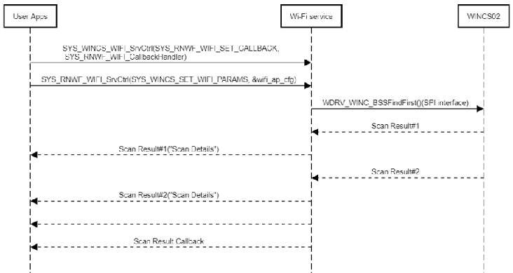

# Wi-Fi Service

<br />

The He MPLAB Code Configurator \(MCC\) allows Wi-Fi service configuration as mentioned below

1.  Station mode
2.  Soft AP mode

This section allows Wi-Fi service configuration as mentioned below:

-   **Wi-Fi Modes:** Drop-down to select Wi-Fi modes.

    Available<br /> options are:

    -   StationMode
    -   ProvisionMode
    -   SoftAPmode
-   **Provision Method:** Drop-down to select Wi-Fi Provisioning method.

    Available options are:

    -   Mobile App
    -   Web Server
-   **SSID:** Wi-Fi Access Point/Network Name
-   **Passphrase:** Wi-Fi Access point/Network password
-   **Security Type:** Wi-Fi security protocol
-   **Auto Connect :** Enable to automatically connect to the AP when the device is in station mode.\\
-   **Provision Callback Handler:** Configure callback function name for Wi-Fi Provisioning states \(Applicable only if selected Wi-Fi Mode is ProvisionMode\)
-   **Country code :** Drop-down to select Country code.
    -   GEN
    -   USA
    -   EMEA
-   **Wi-Fi BT Coexistence :** Select to enableBT/Wi-Fi coexistence arbiter
    -   **Interface Type :** Drop-down to select Interface type
        -   3-wire interface \(BT\_Act, BT\_Prio, WLAN\_Act\)
        -   2-wire interface \(BT\_Prio, WLAN\_Act\)
    -   **WLAN Rx priority higher than BT Low Priority :** Select to give WLAN Rx higher priority.
    -   **WLAN Tx priority higher than BT Low Priority :** Select to give WLAN Tx higher priority.
    -   **Antenna type :** Drop-down to select antenna type
        -   Dedicated antenna
        -   Shared antenna
-   **Power save mode :** Select to enable power save mode.
-   **SNTP Server address :** SNTP server IP address or URL.
-   **Ping :** Select to enable ping functionality.
    -   **Ping Address :** Provide IPv4 or IPv6 Ping address.
-   **Interface Debug logs :** Select to get interface debug logs.
-   **WiFi-Callback Handler:** Configure callback function name to handle Wi-Fi service specific events \(for example, Wi-Fi STA connection and disconnection, DHCP resolution, Wi-Fi Scan indication\)

**Wi-Fi System Service MCC Configuration**

<br />


<br />

<br />


<br />

<br />


<br />

The Wi-Fi Service API prototype is as<br /> follows:

``` {#GUID-CE9CEDFD-5FD4-4BC4-AB96-17647C430816_CODEBLOCK_C2D_2JJ_MYB}
SYS_WINCS_RESULT_t SYS_WINCS_WIFI_SrvCtrl( SYS_WINCS_WIFI_SERVICE_t request, void *input);
```

It<br /> handles following services and reports the result to application over the return<br /> code or through the registered callback.

|Option/Command|Input|Description|
|--------------|-----|-----------|
|`SYS_WINCS_SET_WIFI_PARAMS`|<br /> Mode,SSID,Phaspharase,Security,Autoenabke<br />|Configures the provided Wi-Fi details and Triggers the<br /> connection based on auto enable flag|
|`SYS_WINCS_STA_CONNECT`|None|Triggers the Wi-Fi STA connection|
|`SYS_WINCS_STA_DISCONNECT`|None|Disconnects the connection|
|`SYS_WINCS_AP_DISABLE`|None|Disables the SoftAP mode|
|`SYS_WINCS_SET_WIFI_AP_CHANNEL`|Channel number|Configure the Wi-Fi channel|
|`SYS_WINCS_SET_WIFI_BSSID`|BSSID of AP \(String\)|Configure the Access point's BSSID to which WINCS02 needs to<br /> connect|
|`SYS_WINCS_SET_WIFI_TIMEOUT`|Seconds \(integer\)|Configure Wi-Fi connection timeout|
|`SYS_WINCS_SET_WIFI_HIDDEN,`|true or false|Configure Hidden mode SSID in SoftAP mode|
|`SYS_WINCS_WIFI_PASSIVE_SCAN`|None|Request/Trigger Wi-Fi passive scan|
|`SYS_WINCS_WIFI_ACTIVE_SCAN`|None|Request/Trigger Wi-Fi active scan|
|`SYS_WINCS_GET_WIFI_CONF_INFO`|None|Get WiFi config information|
|`SYS_WINCS_WIFI_SET_SRVC_CALLBACK`|Callback function handler|Register a callback for async events|
|`SYS_WINCS_WIFI_GET_CALLBACK`|Callback function handler|Get Callback function data|
|`SYS_WINCS_WIFI_PING`|Ping IP|Ping to given IP address|
|`SYS_WINCS_WIFI_SET_CALLBACK`|Callback Function handler|Register the call back for async events|

The following list captures the Wi-Fi callback event codes and their<br /> arguments

<br />

|**Event**|**Response Components**|Comments|
|---------|-----------------------|--------|
|SYS\_WINCS\_CONNECTED|Association ID: IntegerConnected State: Integer|Wi-Fi connected event code. Reports the connection's<br /> Association ID and connected state|
|SYS\_WINCS\_DISCONNECTED|Association ID: IntegerConnected State: Integer|Wi-Fi disconnected event code|
|SYS\_WINCS\_CONNECT\_FAILED|Fail event code: Integer|Wi-Fi connection failure event code|
|SYS\_WINCS\_DHCP\_DONE|DHCP IP: String|Wi-Fi DHCP complete event code|
|SYS\_WINCS\_SCAN\_INDICATION|RSSI: Received signal strengthSec Type \(Int\): Recommended security type to use<br /> connecting to this AP \(10 options\)Channel \(Int\): Channel \# of deviceBSSID<br /> \(String\): BSSID of detected deviceSSID \(String\):<br /> SSID of detected device|Scan results to report each scan list|
|SYS\_WINCS\_SCAN\_DONE|None|Scan complete event code|

<br />

<br />

The following figure illustrates the Station mode connection sequence

<br />


<br />

<br />


<br />

<br />



<br />

Following is the example of provision mode,

<br />

``` {#CODEBLOCK_KHT_GNV_QBC}
#include <stdint.h>
#include <stdbool.h>
#include <stddef.h>
#include <stdlib.h>
#include <time.h>
#include "configuration.h"
#include "driver/driver_common.h"

#include "app_wincs02.h"
#include "system/system_module.h"
#include "system/console/sys_console.h"
#include "system/wifi/sys_wincs_wifi_service.h"
#include "system/sys_wincs_system_service.h"
#include "system/net/sys_wincs_net_service.h"
#include "system/wifiprov/sys_wincs_provision_service.h"

APP_DATA appData;


/* TODO:  Add any necessary callback functions.
*/

void SYS_WINCS_WIFI_CallbackHandler(SYS_WINCS_WIFI_EVENT_t event, uint8_t *p_str)
{
            
    switch(event)
    {
        /* SNTP UP event code*/
        case SYS_WINCS_SNTP_UP:
        {            
            SYS_CONSOLE_PRINT("[APP] : SNTP UP \r\n"); 
            break;
        }
        break;

        /* Wi-Fi connected event code*/
        case SYS_WINCS_CONNECTED:
        {
            SYS_CONSOLE_PRINT("[APP] : Wi-Fi Connected    \r\n");
            break;
        }
        
        /* Wi-Fi disconnected event code*/
        case SYS_WINCS_DISCONNECTED:
        {
            SYS_CONSOLE_PRINT("[APP] : Wi-Fi Disconnected\nReconnecting... \r\n");
            SYS_WINCS_WIFI_SrvCtrl(SYS_WINCS_WIFI_STA_CONNECT, NULL);
            break;
        }
        
        /* Wi-Fi DHCP complete event code*/
        case SYS_WINCS_DHCP_DONE:
        {         
            SYS_CONSOLE_PRINT("[APP] : DHCP IPv4 : %s\r\n", p_str);
            break;
        }
        
        case SYS_WINCS_DHCP_IPV6_LOCAL_DONE:
        {
            SYS_CONSOLE_PRINT("[APP] : DHCP IPv6 Local : %s\r\n", p_str);
            break;
        }
        
        case SYS_WINCS_DHCP_IPV6_GLOBAL_DONE:
        {
            SYS_CONSOLE_PRINT("[APP] : DHCP IPv6 Global: %s\r\n", p_str);
            break;
        }
        
        /* Wi-Fi scan indication event code*/
        case SYS_WINCS_SCAN_INDICATION:
        {
            break;
        } 
        
        /* Wi-Fi scan complete event code*/
        case SYS_WINCS_SCAN_DONE:
        {
            break;
        }
        
        default:
        {
            break;
        }
    }    
}


/* Application Wifi Provision Callback handler */
static void SYS_WINCS_WIFIPROV_CallbackHandler ( SYS_WINCS_PROV_EVENT_t event, uint8_t *p_str)
{
    switch(event)
    {
        /**<Provisionging complete*/
        case SYS_WINCS_PROV_COMPLTE:
        {
            SYS_WINCS_PROV_SrvCtrl(SYS_WINCS_PROV_DISABLE, NULL);
            SYS_WINCS_WIFI_SrvCtrl(SYS_WINCS_WIFI_SET_CALLBACK, SYS_WINCS_WIFI_CallbackHandler);
            
            // Application can save the configuration in NVM
            SYS_WINCS_WIFI_SrvCtrl(SYS_WINCS_WIFI_SET_PARAMS, (void *)p_str); 
            SYS_WINCS_WIFI_SrvCtrl(SYS_WINCS_WIFI_STA_CONNECT, NULL);
            break;
        }    
        
        /**<Provisionging Failure*/
        case SYS_WINCS_PROV_FAILURE:
        {
            break;
        }
        
        default:
        {
            break;
        }
    }
    
}

/* Application Initialization function */
void APP_WINCS02_Initialize ( void )
{
    /* Place the App state machine in its initial state. */
    appData.state = APP_STATE_WINCS_INIT;

}


void APP_WINCS02_Tasks ( void )
{

    /* Check the application's current state. */
    switch ( appData.state )
    {
        /* Application's initial state. */
       case APP_STATE_WINCS_INIT:
        {
            SYS_STATUS status;
            SYS_WINCS_WIFI_SrvCtrl(SYS_WINCS_WIFI_GET_DRV_STATUS, &status);

            if (SYS_STATUS_READY == status)
            {
                appData.state = APP_STATE_WINCS_OPEN_DRIVER;
            }
            
            break;
        }
        
        case APP_STATE_WINCS_OPEN_DRIVER:
        {
            DRV_HANDLE wdrvHandle = DRV_HANDLE_INVALID;
            SYS_WINCS_WIFI_SrvCtrl(SYS_WINCS_WIFI_OPEN_DRIVER, &wdrvHandle);
            
            SYS_WINCS_WIFI_SrvCtrl(SYS_WINCS_WIFI_GET_DRV_HANDLE, &wdrvHandle);
            appData.state = APP_STATE_WINCS_DEVICE_INFO;
            break;
        }
        
        case APP_STATE_WINCS_DEVICE_INFO:
        {
            APP_DRIVER_VERSION_INFO drvVersion;
            APP_FIRMWARE_VERSION_INFO fwVersion;
            APP_DEVICE_INFO devInfo;
            SYS_WINCS_RESULT_t status = SYS_WINCS_BUSY;
            
            status = SYS_WINCS_SYSTEM_SrvCtrl(SYS_WINCS_SYSTEM_SW_REV,&fwVersion);
            
            if(status == SYS_WINCS_PASS)
            {
                status = SYS_WINCS_SYSTEM_SrvCtrl(SYS_WINCS_SYSTEM_DEV_INFO, &devInfo);
            }
            
            if(status == SYS_WINCS_PASS)
            {
                status = SYS_WINCS_SYSTEM_SrvCtrl (SYS_WINCS_SYSTEM_DRIVER_VER, &drvVersion);
            }
            
            if(status == SYS_WINCS_PASS)
            {
                char buff[30];
                SYS_CONSOLE_PRINT("WINC: Device ID = %08x\r\n", devInfo.id);
                for (int i=0; i<devInfo.numImages; i++)
                {
                    SYS_CONSOLE_PRINT("%d: Seq No = %08x, Version = %08x, Source Address = %08x\r\n", i, devInfo.image[i].seqNum, devInfo.image[i].version, devInfo.image[i].srcAddr);
                }
                
                SYS_CONSOLE_PRINT("Firmware Version: %d.%d.%d ", fwVersion.version.major, fwVersion.version.minor, fwVersion.version.patch);
                strftime(buff, sizeof(buff), "%X %b %d %Y", localtime((time_t*)&fwVersion.build.timeUTC));
                SYS_CONSOLE_PRINT(" [%s]\r\n", buff);
                SYS_CONSOLE_PRINT("Driver Version: %d.%d.%d\r\n\r\n", drvVersion.version.major, drvVersion.version.minor, drvVersion.version.patch);
                
                appData.state = APP_STATE_WINCS_SET_CALLBACK;
            }
            break;
        }
        
        case APP_STATE_WINCS_SET_CALLBACK:
        {
            // Enable Provisioning Mode
            SYS_WINCS_PROV_SrvCtrl(SYS_WINCS_PROV_ENABLE, NULL);
            SYS_WINCS_PROV_SrvCtrl(SYS_WINCS_PROV_SET_CALLBACK, (void *)SYS_WINCS_WIFIPROV_CallbackHandler);
            
            appData.state = APP_STATE_WINCS_SERVICE_TASKS;
            break;
        }
        
        case APP_STATE_WINCS_SERVICE_TASKS:
        {

            break;
        }

        /* The default state should never be executed. */
        default:
        {
            /* TODO: Handle error in application's state machine. */
            break;
        }
    }
}


/*******************************************************************************
 End of File
 */
```

<br />


