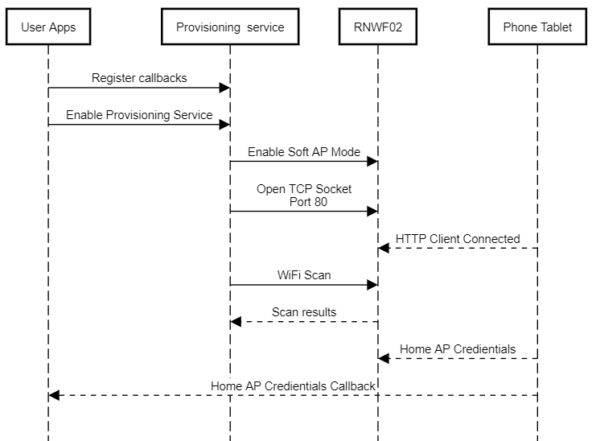

# Provisioning Service

The provisioning service helps to configure the Wi-Fi interface credentials. It supports TCP tunnel and Web server based provisioning services. It implements or handles all the required AT commands to start the module in Access Point mode and open up a TCP tunnel or serve a HTML web page to receive the Wi-Fi credentials. The provisioning service call API syntax is provided below:

``` {#CODEBLOCK_GL5_RSC_PYB .language-c}
SYS_RNWF_RESULT_t SYS_RNWF_PROV_SrvCtrl(SYS_RNWF_PROV_SERVICE_t request, void *input)
```

[**Provisioning Service Configuration in MCC**](../../RNWF_wifi/docs/readme.md)

The provisioning service provides the following options for the user:

|Options|Inputs|Remarks|
|:------|:-----|:------|
|`SYS_RNWF_PROV_ENABLE`|None|Enables the provisioning service|
|`SYS_RNWF_PROV_DISABLE`|None|Disables the provisioning service|
|`SYS_RNWF_PROV_SET_CALLBACK`|Callback handler|Registers the application callback function to report the<br /> provisioning status|

The following list captures the provisioning service callback event codes and their arguments

|Event|Response Components|Remarks|
|:----|-------------------|:------|
|`SYS_RNWF_PROV_COMPLTE`|[Mode, SSID, Passphrase, Security, Autoenable](GUID-778EDFC5-BB8C-4743-A9F2-645F8ECFA886.md#GUID-C433C18F-7BA2-4669-A99E-26AD05CF3ABE)|Provisioning complete and returns the provisioned Access Point<br /> credentials. User application can store it securely for auto<br /> reconnection on every boot up|
|`SYS_RNWF_PROV_FAILURE`|None|Provisioning failure|

The provisioning service sequence is provided below:



Following example code showcases the use of provisioning service

<br />

``` {#CODEBLOCK_XH1_KBW_XYB .language-c}
/*
    Provisioning application
*/

#include <string.h>
#include <stdio.h>
#include <stddef.h>                    
#include <stdbool.h>                    
#include <stdlib.h>                    

/* This section lists the other files that are included in this file.*/
#include "app.h"
#include "user.h"
#include "definitions.h"      
#include "configuration.h"
#include "system/debug/sys_debug.h"
#include "system/inf/sys_rnwf_interface.h"
#include "system/net/sys_rnwf_net_service.h"
#include "system/sys_rnwf_system_service.h"
#include "system/wifi/sys_rnwf_wifi_service.h"
#include "system/wifiprov/sys_rnwf_provision_service.h"


/* DMAC Channel Handler Function */
static void APP_RNWF_usartDmaChannelHandler ( DMAC_TRANSFER_EVENT event, uintptr_t contextHandle)
{
    if (event == DMAC_TRANSFER_EVENT_COMPLETE)
    {
        g_isUARTTxComplete = true;
    }
}

/* Application Wifi Callback Handler function */
static void SYS_RNWF_WIFI_CallbackHandler ( SYS_RNWF_WIFI_EVENT_t event, uint8_t *p_str)
{      
    switch(event)
    {   
        /* Wi-Fi connected event code*/
        case SYS_RNWF_CONNECTED:
        {
            SYS_CONSOLE_PRINT("Wi-Fi Connected    \r\n");
            break;
        }
        
        /* Wi-Fi disconnected event code*/
        case SYS_RNWF_DISCONNECTED:
        {
            SYS_CONSOLE_PRINT("Wi-Fi Disconnected\nReconnecting... \r\n");
            SYS_RNWF_WIFI_SrvCtrl(SYS_RNWF_STA_CONNECT, NULL);
            break;
        }
        
        /* Wi-Fi DHCP complete event code*/
        case SYS_RNWF_IPv4_DHCP_DONE:
        {
            SYS_CONSOLE_PRINT("IPv4 DHCP Done...%s \r\n",&p_str[2]); 
            break;
        }
        
        /* Wi-Fi IPv6 DHCP complete event code*/
        case SYS_RNWF_IPv6_DHCP_DONE:
        {
            SYS_CONSOLE_PRINT("IPv6 DHCP Done...%s \r\n",&p_str[2]); 
            break;
        }
        
        default:
        {
            break;   
        }
    }    
}

/* Application Wifi Provision Callback handler */
static void SYS_RNWF_WIFIPROV_CallbackHandler ( SYS_RNWF_PROV_EVENT_t event, uint8_t *p_str)
{
    switch(event)
    {
        /**<Provisionging complete*/
        case SYS_RNWF_PROV_COMPLTE:
        {
            SYS_RNWF_PROV_SrvCtrl(SYS_RNWF_PROV_DISABLE, NULL);
            SYS_RNWF_WIFI_SrvCtrl(SYS_RNWF_WIFI_SET_CALLBACK, SYS_RNWF_WIFI_CallbackHandler);
            
            // Application can save the configuration in NVM
            SYS_RNWF_WIFI_SrvCtrl(SYS_RNWF_SET_WIFI_PARAMS, (void *)p_str);     
            break;
        }    
        
        /**<Provisionging Failure*/
        case SYS_RNWF_PROV_FAILURE:
        {
            break;
        }
        
        default:
        {
            break;
        }
    } 
}


/* Application Initialization function */
void APP_Initialize ( void )
{
    /* Place the App state machine in its initial state. */
    g_appData.state = APP_STATE_INITIALIZE;
}


/* Maintain the application's state machine. */
void APP_Tasks ( void )
{
    switch(g_appData.state)
    {
        /* Application's state machine's initial state. */
        case APP_STATE_INITIALIZE:
        {
            DMAC_ChannelCallbackRegister(DMAC_CHANNEL_0, APP_RNWF_usartDmaChannelHandler, 0);
            SYS_RNWF_IF_Init();
            
            g_appData.state = APP_STATE_REGISTER_CALLBACK;
            break;
        }
        
        /* Register the necessary callbacks */
        case APP_STATE_REGISTER_CALLBACK:
        {

            // Enable Provisioning Mode
            SYS_RNWF_PROV_SrvCtrl(SYS_RNWF_PROV_ENABLE, NULL);
            SYS_RNWF_PROV_SrvCtrl(SYS_RNWF_PROV_SET_CALLBACK, (void *)SYS_RNWF_WIFIPROV_CallbackHandler);
            
            g_appData.state = APP_STATE_TASK;
            break;
        }
        
        /* Run Event handler */
        case APP_STATE_TASK:
        {
            SYS_RNWF_IF_EventHandler();
            break;
        }
        default:
        {
            break;
        }
    }
}

/*******************************************************************************
 End of File
 */


```
