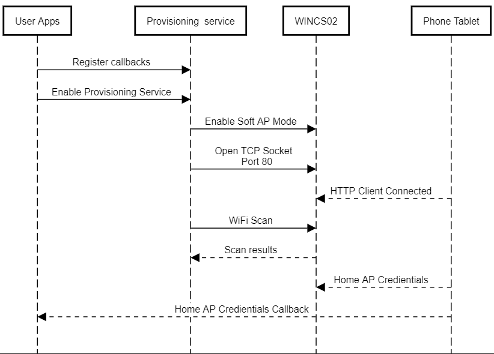

# Provisioning Service

<br />

The provisioning service helps to configure the Wi-Fi interface credentials. It supports TCP tunnel and Web server based provisioning services. It implements or handles all the required AT commands to start the module in Access Point mode and open up a TCP tunnel or serve a HTML web page to receive the Wi-Fi credentials. The provisioning service call API syntax is provided below:

``` {#GUID-3B61E392-ACFA-4AF0-871F-B5478535EF2C_CODEBLOCK_GL5_RSC_PYB}
SYS_WINCS_RESULT_t SYS_WINCS_PROV_SrvCtrl(SYS_WINCS_PROV_SERVICE_t request, void *input);
```

[**Provisioning Service Configuration in MCC**](https://onlinedocs.microchip.com/oxy/GUID-92FEB3A1-C10F-47DF-BF88-C06521800526-en-US-1/GUID-CE9CEDFD-5FD4-4BC4-AB96-17647C430816.html#GUID-CE9CEDFD-5FD4-4BC4-AB96-17647C430816__GUID-63799930-4AE7-47C4-AF9F-0EC46895DC81)

The provisioning service provides the following options for the user:

|Options|Inputs|Remarks|
|-------|------|-------|
|`SYS_WINCS_PROV_ENABLE`|None|Enables the provisioning service|
|`SYS_WINCS_PROV_DISABLE`|None|Disables the provisioning service|
|`SYS_WINCS_PROV_SET_CALLBACK`|Callback handler|Registers the application callback function to report the<br /> provisioning status|

The following list captures the provisioning service callback event<br /> codes and their arguments

|Event|Response Components|Remarks|
|-----|-------------------|-------|
|`SYS_WINCS_PROV_COMPLTE`|[Mode, SSID, Passphrase, Security, Autoenable](https://onlinedocs.microchip.com/oxy/GUID-92FEB3A1-C10F-47DF-BF88-C06521800526-en-US-1/GUID-778EDFC5-BB8C-4743-A9F2-645F8ECFA886.html#GUID-778EDFC5-BB8C-4743-A9F2-645F8ECFA886__GUID-C433C18F-7BA2-4669-A99E-26AD05CF3ABE)|Provisioning complete and returns the provisioned Access<br /> Point credentials. User application can store it securely<br /> for auto reconnection on every boot up|
|`SYS_WINCS_PROV_FAILURE`|None|Provisioning failure|

<br />

The provisioning service sequence is provided below:

<br />



<br />

Following example code showcases the use of provisioning service

``` {#GUID-3B61E392-ACFA-4AF0-871F-B5478535EF2C_CODEBLOCK_XH1_KBW_XYB}
*/\*
    Provisioning application
\*/*
#include <stdint.h>
#include <stdbool.h>
#include <stddef.h>
#include <stdlib.h>
#include <time.h>
#include "configuration.h"
#include "driver/driver_common.h"

#include "app_wincs02.h"
#include "system/system_module.h"
#include "system/console/sys_console.h"
#include "system/wifi/sys_wincs_wifi_service.h"
#include "system/sys_wincs_system_service.h"
#include "system/net/sys_wincs_net_service.h"
#include "system/wifiprov/sys_wincs_provision_service.h"

APP_DATA appData;


/* TODO:  Add any necessary callback functions.
*/

void SYS_WINCS_WIFI_CallbackHandler(SYS_WINCS_WIFI_EVENT_t event, uint8_t *p_str)
{
            
    switch(event)
    {
        /* SNTP UP event code*/
        case SYS_WINCS_SNTP_UP:
        {            
            SYS_CONSOLE_PRINT("[APP] : SNTP UP \r\n"); 
            break;
        }
        break;

        /* Wi-Fi connected event code*/
        case SYS_WINCS_CONNECTED:
        {
            SYS_CONSOLE_PRINT("[APP] : Wi-Fi Connected    \r\n");
            break;
        }
        
        /* Wi-Fi disconnected event code*/
        case SYS_WINCS_DISCONNECTED:
        {
            SYS_CONSOLE_PRINT("[APP] : Wi-Fi Disconnected\nReconnecting... \r\n");
            SYS_WINCS_WIFI_SrvCtrl(SYS_WINCS_WIFI_STA_CONNECT, NULL);
            break;
        }
        
        /* Wi-Fi DHCP complete event code*/
        case SYS_WINCS_DHCP_DONE:
        {         
            SYS_CONSOLE_PRINT("[APP] : DHCP IPv4 : %s\r\n", p_str);
            break;
        }
        
        case SYS_WINCS_DHCP_IPV6_LOCAL_DONE:
        {
            SYS_CONSOLE_PRINT("[APP] : DHCP IPv6 Local : %s\r\n", p_str);
            break;
        }
        
        case SYS_WINCS_DHCP_IPV6_GLOBAL_DONE:
        {
            SYS_CONSOLE_PRINT("[APP] : DHCP IPv6 Global: %s\r\n", p_str);
            break;
        }
        
        /* Wi-Fi scan indication event code*/
        case SYS_WINCS_SCAN_INDICATION:
        {
            break;
        } 
        
        /* Wi-Fi scan complete event code*/
        case SYS_WINCS_SCAN_DONE:
        {
            break;
        }
        
        default:
        {
            break;
        }
    }    
}


/* Application Wifi Provision Callback handler */
static void SYS_WINCS_WIFIPROV_CallbackHandler ( SYS_WINCS_PROV_EVENT_t event, uint8_t *p_str)
{
    switch(event)
    {
        /**<Provisionging complete*/
        case SYS_WINCS_PROV_COMPLTE:
        {
            SYS_WINCS_PROV_SrvCtrl(SYS_WINCS_PROV_DISABLE, NULL);
            SYS_WINCS_WIFI_SrvCtrl(SYS_WINCS_WIFI_SET_CALLBACK, SYS_WINCS_WIFI_CallbackHandler);
            
            // Application can save the configuration in NVM
            SYS_WINCS_WIFI_SrvCtrl(SYS_WINCS_WIFI_SET_PARAMS, (void *)p_str); 
            SYS_WINCS_WIFI_SrvCtrl(SYS_WINCS_WIFI_STA_CONNECT, NULL);
            break;
        }    
        
        /**<Provisionging Failure*/
        case SYS_WINCS_PROV_FAILURE:
        {
            break;
        }
        
        default:
        {
            break;
        }
    }
    
}

/* Application Initialization function */
void APP_WINCS02_Initialize ( void )
{
    /* Place the App state machine in its initial state. */
    appData.state = APP_STATE_WINCS_INIT;

}


void APP_WINCS02_Tasks ( void )
{

    /* Check the application's current state. */
    switch ( appData.state )
    {
        /* Application's initial state. */
       case APP_STATE_WINCS_INIT:
        {
            SYS_STATUS status;
            SYS_WINCS_WIFI_SrvCtrl(SYS_WINCS_WIFI_GET_DRV_STATUS, &status);

            if (SYS_STATUS_READY == status)
            {
                appData.state = APP_STATE_WINCS_OPEN_DRIVER;
            }
            
            break;
        }
        
        case APP_STATE_WINCS_OPEN_DRIVER:
        {
            DRV_HANDLE wdrvHandle = DRV_HANDLE_INVALID;
            SYS_WINCS_WIFI_SrvCtrl(SYS_WINCS_WIFI_OPEN_DRIVER, &wdrvHandle);
            
            SYS_WINCS_WIFI_SrvCtrl(SYS_WINCS_WIFI_GET_DRV_HANDLE, &wdrvHandle);
            appData.state = APP_STATE_WINCS_DEVICE_INFO;
            break;
        }
        
        case APP_STATE_WINCS_DEVICE_INFO:
        {
            APP_DRIVER_VERSION_INFO drvVersion;
            APP_FIRMWARE_VERSION_INFO fwVersion;
            APP_DEVICE_INFO devInfo;
            SYS_WINCS_RESULT_t status = SYS_WINCS_BUSY;
            
            status = SYS_WINCS_SYSTEM_SrvCtrl(SYS_WINCS_SYSTEM_SW_REV,&fwVersion);
            
            if(status == SYS_WINCS_PASS)
            {
                status = SYS_WINCS_SYSTEM_SrvCtrl(SYS_WINCS_SYSTEM_DEV_INFO, &devInfo);
            }
            
            if(status == SYS_WINCS_PASS)
            {
                status = SYS_WINCS_SYSTEM_SrvCtrl (SYS_WINCS_SYSTEM_DRIVER_VER, &drvVersion);
            }
            
            if(status == SYS_WINCS_PASS)
            {
                char buff[30];
                SYS_CONSOLE_PRINT("WINC: Device ID = %08x\r\n", devInfo.id);
                for (int i=0; i<devInfo.numImages; i++)
                {
                    SYS_CONSOLE_PRINT("%d: Seq No = %08x, Version = %08x, Source Address = %08x\r\n", i, devInfo.image[i].seqNum, devInfo.image[i].version, devInfo.image[i].srcAddr);
                }
                
                SYS_CONSOLE_PRINT("Firmware Version: %d.%d.%d ", fwVersion.version.major, fwVersion.version.minor, fwVersion.version.patch);
                strftime(buff, sizeof(buff), "%X %b %d %Y", localtime((time_t*)&fwVersion.build.timeUTC));
                SYS_CONSOLE_PRINT(" [%s]\r\n", buff);
                SYS_CONSOLE_PRINT("Driver Version: %d.%d.%d\r\n\r\n", drvVersion.version.major, drvVersion.version.minor, drvVersion.version.patch);
                
                appData.state = APP_STATE_WINCS_SET_CALLBACK;
            }
            break;
        }
        
        case APP_STATE_WINCS_SET_CALLBACK:
        {
            // Enable Provisioning Mode
            SYS_WINCS_PROV_SrvCtrl(SYS_WINCS_PROV_ENABLE, NULL);
            SYS_WINCS_PROV_SrvCtrl(SYS_WINCS_PROV_SET_CALLBACK, (void *)SYS_WINCS_WIFIPROV_CallbackHandler);
            
            appData.state = APP_STATE_WINCS_SERVICE_TASKS;
            break;
        }
        
        case APP_STATE_WINCS_SERVICE_TASKS:
        {

            break;
        }

        /* The default state should never be executed. */
        default:
        {
            /* TODO: Handle error in application's state machine. */
            break;
        }
    }
}


/*******************************************************************************
 End of File
 */
```


