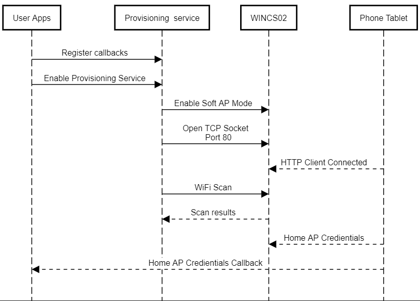

# Provisioning Service

<br />

The provisioning service helps to configure the Wi-Fi interface credentials. It supports TCP tunnel and Web server based provisioning services. It implements or handles all the required AT commands to start the module in Access Point mode and open up a TCP tunnel or serve a HTML web page to receive the Wi-Fi credentials. The provisioning service call API syntax is provided below:

``` {#GUID-3B61E392-ACFA-4AF0-871F-B5478535EF2C_CODEBLOCK_GL5_RSC_PYB}
SYS_WINCS_RESULT_t SYS_WINCS_PROV_SrvCtrl(SYS_WINCS_PROV_SERVICE_t request, SYS_WINCS_PROV_HANDLE_t provHandle);
```

[**Provisioning Service Configuration in MCC**](https://onlinedocs.microchip.com/oxy/GUID-92FEB3A1-C10F-47DF-BF88-C06521800526-en-US-1/GUID-CE9CEDFD-5FD4-4BC4-AB96-17647C430816.html#GUID-CE9CEDFD-5FD4-4BC4-AB96-17647C430816__GUID-63799930-4AE7-47C4-AF9F-0EC46895DC81)

The provisioning service provides the following options for the user:

|Options|Inputs|Remarks|
|-------|------|-------|
|`SYS_WINCS_PROV_ENABLE`|None|Enables the provisioning service|
|`SYS_WINCS_PROV_DISABLE`|None|Disables the provisioning service|
|`SYS_WINCS_PROV_SET_CALLBACK`|Callback handler|Registers the application callback function to report the provisioning status|

The following list captures the provisioning service callback event codes and their arguments

|Event|Response Components|Remarks|
|-----|-------------------|-------|
|`SYS_WINCS_PROV_COMPLTE`|[SYS_WINCS_WIFI_PARAM_t structure](https://onlinedocs.microchip.com/oxy/GUID-92FEB3A1-C10F-47DF-BF88-C06521800526-en-US-1/GUID-778EDFC5-BB8C-4743-A9F2-645F8ECFA886.html#GUID-778EDFC5-BB8C-4743-A9F2-645F8ECFA886__GUID-C433C18F-7BA2-4669-A99E-26AD05CF3ABE)|Provisioning complete and returns the provisioned Access Point credentials. User application can store it securely for auto reconnection on every boot up|
|`SYS_WINCS_PROV_FAILURE`|None|Provisioning failure|

<br />

The provisioning service sequence is provided below:

<br />



<br />

Following example code showcases the use of provisioning service

``` {#GUID-3B61E392-ACFA-4AF0-871F-B5478535EF2C_CODEBLOCK_XH1_KBW_XYB}
/*******************************************************************************
  MPLAB Harmony Application Source File

  Company:
    Microchip Technology Inc.

  File Name:
    app_wincs02.c

  Summary:
    This file contains the source code for the MPLAB Harmony application.

  Description:
    This file contains the source code for the MPLAB Harmony application.  It
    implements the logic of the application's state machine and it may call
    API routines of other MPLAB Harmony modules in the system, such as drivers,
    system services, and middleware.  However, it does not call any of the
    system interfaces (such as the "Initialize" and "Tasks" functions) of any of
    the modules in the system or make any assumptions about when those functions
    are called.  That is the responsibility of the configuration-specific system
    files.
 *******************************************************************************/

// *****************************************************************************
// *****************************************************************************
// Section: Included Files
// *****************************************************************************
// *****************************************************************************

#include <stdint.h>
#include <stdbool.h>
#include <stddef.h>
#include <stdlib.h>
#include <time.h>

/* This section lists the other files that are included in this file.
 */
#include "configuration.h"
#include "driver/driver_common.h"
#include "app_wincs02.h"
#include "system/system_module.h"
#include "system/console/sys_console.h"
#include "system/wifi/sys_wincs_wifi_service.h"
#include "system/sys_wincs_system_service.h"
#include "system/net/sys_wincs_net_service.h"
#include "system/wifiprov/sys_wincs_provision_service.h"
// *****************************************************************************
// *****************************************************************************
// Section: Global Data Definitions
// *****************************************************************************
// *****************************************************************************

// *****************************************************************************
/* Application Data

  Summary:
    Holds application data

  Description:
    This structure holds the application's data.

  Remarks:
    This structure should be initialized by the APP_Initialize function.

    Application strings and buffers are be defined outside this structure.
*/

APP_DATA g_appData;

// *****************************************************************************
// *****************************************************************************
// Section: Application Callback Functions
// *****************************************************************************
// *****************************************************************************

/* TODO:  Add any necessary callback functions.
*/

// *****************************************************************************
// Application Wi-Fi Callback Handler
//
// Summary:
//    Handles Wi-Fi events.
//
// Description:
//    This function handles various Wi-Fi events and performs appropriate actions.
//
// Parameters:
//    event - The type of Wi-Fi event
//    wifiHandle - Handle to the Wi-Fi event data
//
// Returns:
//    None.
//
// Remarks:
//    None.
// *****************************************************************************
void SYS_WINCS_WIFI_CallbackHandler
(
    SYS_WINCS_WIFI_EVENT_t event,         // The type of Wi-Fi event
    SYS_WINCS_WIFI_HANDLE_t wifiHandle    // Handle to the Wi-Fi event data
)
{
            
    switch(event)
    {
        /* Set regulatory domain Acknowledgment */
        case SYS_WINCS_WIFI_REG_DOMAIN_SET_ACK:
        {
            // The driver generates this event callback twice, hence the if condition 
            // to ignore one more callback. This will be resolved in the next release.
            static bool domainFlag = false;
            if( domainFlag == false)
            {
                SYS_CONSOLE_PRINT("Set Reg Domain -> SUCCESS\r\n");
                g_appData.state = APP_STATE_WINCS_ENABLE_PROV;
                domainFlag = true;
            }
            
            break;
        } 
        
        /* SNTP UP event code*/
        case SYS_WINCS_WIFI_SNTP_UP:
        {            
            SYS_CONSOLE_PRINT("[APP] : SNTP UP \r\n"); 
            break;
        }
        break;

        /* Wi-Fi connected event code*/
        case SYS_WINCS_WIFI_CONNECTED:
        {
            SYS_CONSOLE_PRINT(TERM_GREEN"[APP] : Wi-Fi Connected    \r\n"TERM_RESET);
            break;
        }
        
        /* Wi-Fi disconnected event code*/
        case SYS_WINCS_WIFI_DISCONNECTED:
        {
            SYS_CONSOLE_PRINT(TERM_RED"[APP] : Wi-Fi Disconnected\nReconnecting... \r\n"TERM_RESET);
            break;
        }
        
        /* Wi-Fi DHCP complete event code*/
        case SYS_WINCS_WIFI_DHCP_IPV4_COMPLETE:
        {         
            SYS_CONSOLE_PRINT("[APP] : DHCP IPv4 : %s\r\n", (uint8_t *)wifiHandle);
            break;
        }
        
        case SYS_WINCS_WIFI_DHCP_IPV6_LOCAL_COMPLETE:
        {
            SYS_CONSOLE_PRINT("[APP] : DHCP IPv6 Local : %s\r\n", (uint8_t *)wifiHandle);
            break;
        }
        
        case SYS_WINCS_WIFI_DHCP_IPV6_GLOBAL_COMPLETE:
        {
            SYS_CONSOLE_PRINT("[APP] : DHCP IPv6 Global: %s\r\n", (uint8_t *)wifiHandle);
            break;
        }
        
        default:
        {
            break;
        }
    }    
}

// *****************************************************************************
/**
 * @brief Callback handler for WiFi provisioning events.
 *
 * This function is called whenever a WiFi provisioning event occurs. It handles
 * the event based on the type of event received and the provisioning handle.
 *
 * @param event The WiFi provisioning event that occurred. This is of type
 *              SYS_WINCS_PROV_EVENT_t and indicates the specific event.
 * @param provHandle The handle associated with the provisioning event. This is
 *                   of type SYS_WINCS_PROV_HANDLE_t and is used to identify
 *                   the specific provisioning instance.
 */
// *****************************************************************************

static void SYS_WINCS_WIFIPROV_CallbackHandler 
( 
    SYS_WINCS_PROV_EVENT_t event, 
    SYS_WINCS_PROV_HANDLE_t provHandle
)
{
    switch(event)
    {
        /**<Provisionging complete*/
        case SYS_WINCS_PROV_COMPLETE:
        {
            SYS_WINCS_PROV_SrvCtrl(SYS_WINCS_PROV_DISABLE, NULL);
//            SYS_WINCS_WIFI_SrvCtrl(SYS_WINCS_WIFI_SET_CALLBACK, SYS_WINCS_WIFI_CallbackHandler);
            
            // Connect to the received AP configurations
            SYS_WINCS_WIFI_SrvCtrl(SYS_WINCS_WIFI_SET_PARAMS, (SYS_WINCS_WIFI_HANDLE_t)provHandle);
            
            //If autoConnect is false 
            //SYS_WINCS_WIFI_SrvCtrl(SYS_WINCS_WIFI_STA_CONNECT, NULL);
            break;
        }    
        
        /**<Provisionging Failure*/
        case SYS_WINCS_PROV_FAILURE:
        {
            break;
        }
        
        default:
        {
            break;
        }
    }
    
}


// *****************************************************************************
// *****************************************************************************
// Section: Application Local Functions
// *****************************************************************************
// *****************************************************************************


/* TODO:  Add any necessary local functions.
*/


// *****************************************************************************
// *****************************************************************************
// Section: Application Initialization and State Machine Functions
// *****************************************************************************
// *****************************************************************************

// *****************************************************************************
// Application Initialization Function
//
// Summary:
//    Initializes the application.
//
// Description:
//    This function initializes the application's state machine and other
//    parameters.
//
// Parameters:
//    None.
//
// Returns:
//    None.
//
// Remarks:
//    None.
// *****************************************************************************

void APP_WINCS02_Initialize ( void )
{
    /* Place the App state machine in its initial state. */
    g_appData.state = APP_STATE_WINCS_PRINT;


    /* TODO: Initialize your application's state machine and other
     * parameters.
     */
}


// *****************************************************************************
// Application Tasks Function
//
// Summary:
//    Executes the application's tasks.
//
// Description:
//    This function implements the application's state machine and performs
//    the necessary actions based on the current state.
//
// Parameters:
//    None.
//
// Returns:
//    None.
//
// Remarks:
//    None.
// *****************************************************************************
void APP_WINCS02_Tasks ( void )
{

    /* Check the application's current state. */
    switch ( g_appData.state )
    {
        // State to print Message 
        case APP_STATE_WINCS_PRINT:
        {
            SYS_CONSOLE_PRINT(TERM_YELLOW"########################################\r\n"TERM_RESET);
            SYS_CONSOLE_PRINT(TERM_CYAN"       WINCS02 Wi-Fi Easy Config demo\r\n"TERM_RESET);
            SYS_CONSOLE_PRINT(TERM_YELLOW"########################################\r\n"TERM_RESET);
            
            g_appData.state = APP_STATE_WINCS_INIT;
            break;
        }
        
        /* Application's initial state. */
       case APP_STATE_WINCS_INIT:
        {
            SYS_STATUS status;
            SYS_WINCS_WIFI_SrvCtrl(SYS_WINCS_WIFI_GET_DRV_STATUS, &status);

            if (SYS_STATUS_READY == status)
            {
                g_appData.state = APP_STATE_WINCS_OPEN_DRIVER;
            }
            
            break;
        }
        
        case APP_STATE_WINCS_OPEN_DRIVER:
        {
            DRV_HANDLE wdrvHandle = DRV_HANDLE_INVALID;
            // Open the Wi-Fi driver
            if (SYS_WINCS_FAIL ==  SYS_WINCS_WIFI_SrvCtrl(SYS_WINCS_WIFI_OPEN_DRIVER, &wdrvHandle))
            {
                g_appData.state = APP_STATE_WINCS_ERROR;
                break;
            }

            // Get the driver handle
            SYS_WINCS_WIFI_SrvCtrl(SYS_WINCS_WIFI_GET_DRV_HANDLE, &wdrvHandle);
            g_appData.state = APP_STATE_WINCS_DEVICE_INFO;
            break;
        }
        
        case APP_STATE_WINCS_DEVICE_INFO:
        {
            APP_DRIVER_VERSION_INFO drvVersion;
            APP_FIRMWARE_VERSION_INFO fwVersion;
            APP_DEVICE_INFO devInfo;
            SYS_WINCS_RESULT_t status = SYS_WINCS_BUSY;

            // Get the firmware version
            status = SYS_WINCS_SYSTEM_SrvCtrl(SYS_WINCS_SYSTEM_SW_REV, &fwVersion);

            if(status == SYS_WINCS_PASS)
            {
                // Get the device information
                status = SYS_WINCS_SYSTEM_SrvCtrl(SYS_WINCS_SYSTEM_DEV_INFO, &devInfo);
            }

            if(status == SYS_WINCS_PASS)
            {
                // Get the driver version
                status = SYS_WINCS_SYSTEM_SrvCtrl(SYS_WINCS_SYSTEM_DRIVER_VER, &drvVersion);
            }

            if(status == SYS_WINCS_PASS)
            {
                char buff[30];
                // Print device information
                SYS_CONSOLE_PRINT("WINC: Device ID = %08x\r\n", devInfo.id);
                for (int i = 0; i < devInfo.numImages; i++)
                {
                    SYS_CONSOLE_PRINT("%d: Seq No = %08x, Version = %08x, Source Address = %08x\r\n", 
                            i, devInfo.image[i].seqNum, devInfo.image[i].version, devInfo.image[i].srcAddr);
                }

                // Print firmware version
                SYS_CONSOLE_PRINT(TERM_CYAN "Firmware Version: %d.%d.%d ", fwVersion.version.major,
                        fwVersion.version.minor, fwVersion.version.patch);
                strftime(buff, sizeof(buff), "%X %b %d %Y", localtime((time_t*)&fwVersion.build.timeUTC));
                SYS_CONSOLE_PRINT(" [%s]\r\n", buff);

                // Print driver version
                SYS_CONSOLE_PRINT("Driver Version: %d.%d.%d\r\n"TERM_RESET, drvVersion.version.major, 
                        drvVersion.version.minor, drvVersion.version.patch);
                
                g_appData.state = APP_STATE_WINCS_SET_REG_DOMAIN;
            }
            break;
        }
        
        case APP_STATE_WINCS_SET_REG_DOMAIN:
        {
            
            // Set the callback handler for Wi-Fi events
            SYS_WINCS_WIFI_SrvCtrl(SYS_WINCS_WIFI_SET_CALLBACK, SYS_WINCS_WIFI_CallbackHandler);

            SYS_CONSOLE_PRINT(TERM_YELLOW"[APP] : Setting REG domain to " TERM_UL "%s\r\n"TERM_RESET ,SYS_WINCS_WIFI_COUNTRYCODE);
            // Set the regulatory domain
            if (SYS_WINCS_FAIL == SYS_WINCS_WIFI_SrvCtrl(SYS_WINCS_WIFI_SET_REG_DOMAIN, SYS_WINCS_WIFI_COUNTRYCODE))
            {
                g_appData.state = APP_STATE_WINCS_ERROR;
                break;
            }
            g_appData.state = APP_STATE_WINCS_SERVICE_TASKS;
            break;
        }
        
        case APP_STATE_WINCS_ENABLE_PROV:
        {
            // Enable Provisioning Mode
            SYS_WINCS_PROV_SrvCtrl(SYS_WINCS_PROV_SET_CALLBACK, (void *)SYS_WINCS_WIFIPROV_CallbackHandler);
            
            if (SYS_WINCS_FAIL == SYS_WINCS_PROV_SrvCtrl(SYS_WINCS_PROV_ENABLE, NULL))
            {
                g_appData.state = APP_STATE_WINCS_ERROR;
                break;
            }
            g_appData.state = APP_STATE_WINCS_SERVICE_TASKS;
            break;
        }
        
        case APP_STATE_WINCS_SERVICE_TASKS:
        {

            break;
        }
        
        case APP_STATE_WINCS_ERROR:
        {
            SYS_CONSOLE_PRINT(TERM_RED"[APP_ERROR] : ERROR in Application "TERM_RESET);
            g_appData.state = APP_STATE_WINCS_SERVICE_TASKS;
            break;
        }

        /* The default state should never be executed. */
        default:
        {
            /* TODO: Handle error in application's state machine. */
            break;
        }
    }
}


/*******************************************************************************
 End of File
 */
```


